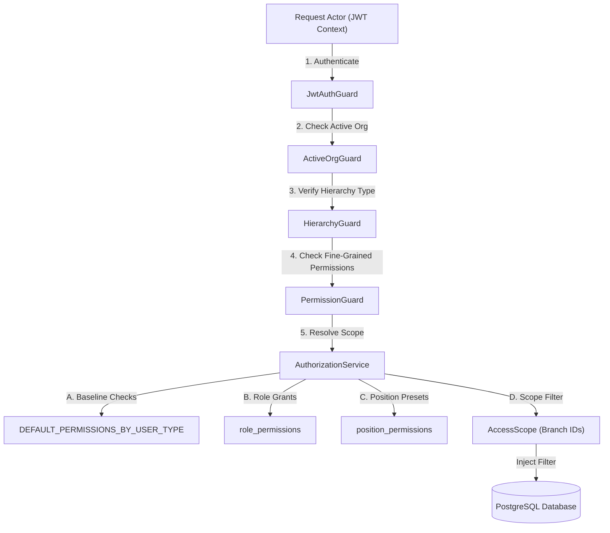

# Role Access Matrix & RBAC Specification

This document provides a comprehensive specification and analysis of the user types, roles, permissions, access scopes, hierarchy, and authorization rules implemented in the HRMS application.

---

## Executive Summary

The HRMS authorization model uses a **dual-engine approach** that overlays a structural tenant/branch-scoped hierarchy on top of a classic Role-Based Access Control (RBAC) and Position-Based Access Control system:

1. **User Types (Hierarchy & Scope System):** Defines the structural authority rank (from 0 to 4) and controls baseline data visibility and multi-tenant/branch boundaries.
2. **Roles & Positions (RBAC System):** Fine-grained resource permissions (`${module}:${action}`) granted to users via tenant-scoped Roles or Job Positions.
3. **Workflow Approvals System:** Dynamic branch-scoped roles (`branch_hr`, `branch_manager`) resolved on-the-fly during multi-step approval cycles.

### Major Findings & RBAC Inconsistencies

During our comprehensive codebase audit, several critical security and implementation gaps were identified:
* **Insecure / Open Controllers:** Key administration, finance, and payment controllers (including `UserController`, `RoleController`, `PositionController`, `FinanceController`, `GstController`, `LeaveController`, `PayrollPaymentController`, and `BankAccountController`) rely *exclusively* on `JwtAuthGuard` and **completely omit** the `PermissionGuard` and `@RequirePermission()` checks. This leaves high-privilege endpoints exposed to any authenticated user under the active organization.
* **Unused Guard:** The `BranchAccessGuard` is defined but never referenced in any controller.
* **Privilege Escalation Risk:** The `EmployeeController.findOne()` (GET `/employees/:id`) endpoint checks for `hr.employees:view` but fails to enforce branch-scoped restrictions. Consequently, branch-scoped admins can view the profile details of any employee in the tenant.
* **Registry vs. Seed Mismatches:** There are 16 permissions in the codebase registry that are not seeded in the database, and 17 permissions seeded in the database that do not exist in the codebase registry (dead permissions).
* **Migration Bug:** `065_organization_profile_extended.sql` attempts to assign permissions to a non-existent role named `'org_admin'` (which is a UserType, not a Role in the database) and omits the mandatory `tenant_id` column.

---

## 1. User Types (Hierarchical Ranks & Access Scopes)

User Types represent the core hierarchy ranks and data access scopes. The system rank determines assignment capabilities, where a lower rank represents more privilege.

**The `tenant_admin` tier has been removed.** Organization Admin is now the highest business-level role beneath Super Admin, scoped to exactly one organization (no multi-org admins).

These user types are defined in [user-hierarchy.constants.ts](file:///c:/Users/amann/Spinach/HMS/backend/src/shared/user-hierarchy.constants.ts) and backed by database schemas in [079_user_hierarchy_types.sql](file:///c:/Users/amann/Spinach/HMS/backend/migrations/079_user_hierarchy_types.sql) and [093_remove_tenant_admin_promote_org_admin.sql](file:///c:/Users/amann/Spinach/HMS/backend/migrations/093_remove_tenant_admin_promote_org_admin.sql).

| User Type | Rank | Access Scope | Description & Code Origin |
| :--- | :---: | :--- | :--- |
| **Super Admin** | `0` | **Global** (All Tenants) | Bypasses all restrictions. Configured globally via the `users.is_super_admin` flag. Originates from [016_multi_org.sql](file:///c:/Users/amann/Spinach/HMS/backend/migrations/016_multi_org.sql). Exclusively controls organization lifecycle: create, delete, suspend/activate, assign/reassign Organization Admin, view all organizations, platform-wide settings. |
| **Organization Admin** | `1` | **Single Organization** | The highest organizational authority, directly beneath Super Admin. Managed via `user_tenants` with `user_type = 'org_admin'`; the org's single designated admin is also pointed to directly by `tenants.organization_admin_user_id`. Full visibility over all branches within their one assigned organization — cannot access any other organization's data. |
| **Branch Admin** | `2` | **Branch-Scoped** (Multiple Mapped Branches) | Restricted to branches mapped under [branch_user_access](file:///c:/Users/amann/Spinach/HMS/backend/migrations/048_branch_user_access.sql). Requires $\ge 1$ branch mapping. |
| **Admin** | `3` | **Branch-Scoped** (Exactly 1 Mapped Branch) | Restricted to exactly one branch mapped under [branch_user_access](file:///c:/Users/amann/Spinach/HMS/backend/migrations/048_branch_user_access.sql). |
| **Employee** | `4` | **Self-Service / Self-Only** | Default baseline type. Restricted to their own records via `/me` endpoints, plus baseline portal permissions. |

### Organization Ownership Mapping

Added in [093_remove_tenant_admin_promote_org_admin.sql](file:///c:/Users/amann/Spinach/HMS/backend/migrations/093_remove_tenant_admin_promote_org_admin.sql) to make "who administers this org" a direct, queryable fact rather than something only derivable by scanning `user_tenants`:

| Column (on `tenants`) | Purpose |
| :--- | :--- |
| `organization_admin_user_id` | The single user currently designated as this organization's Organization Admin (nullable — an org can exist with no admin assigned yet). |
| `assigned_by_super_admin` | The Super Admin user who made the current assignment, for audit purposes. |

This pointer is written exclusively by `UserHierarchyService.setUserAccess()` (the same single write path used for all hierarchy/scope changes) whenever a Super Admin sets a target user's type to `org_admin` — assigning a new admin automatically demotes whoever previously held the pointer for that org. Non-super-admins can never reach this code path: `getManageableTypes()` only offers strictly-lower-rank types to assign, so an `org_admin` can never grant `org_admin` to anyone.

### Baseline Default Permissions
Baseline permissions are hardcoded and layered underneath role/position permissions. Defined via `DEFAULT_PERMISSIONS_BY_USER_TYPE` in [permissions.constants.ts](file:///c:/Users/amann/Spinach/HMS/backend/src/shared/permissions.constants.ts):

* **Admin-Tier (Ranks 0 to 3):** Evaluated as `'*'` (Wildcard), meaning they inherit all permission strings. Scoping constraints (branch restrictions) are enforced separately via query filters or services.
* **Employee (Rank 4):** Receives a minimal portal baseline:
  * `hr.attendance:view`
  * `hr.leave:view`
  * `hr.leave:create`
  * `hr.payroll:view`
  * `schedules:view`
  * `documents:view`
  * `notifications:view`
  * `approvals:view`

---

## 2. RBAC Roles & Position Presets

### A. Seeded System Roles
Seeded inside [seed.ts](file:///c:/Users/amann/Spinach/HMS/backend/scripts/seed.ts) and tenant-scoped in the `roles` table:

1. **Super Admin:** Mapped to all 76 seeded permissions in `seed.ts`.
2. **HR Manager:** HR operations role.
3. **Finance Manager:** Accounting and finance role.
4. **Employee:** Standard baseline employee role.

The previously-seeded **Tenant Admin** Role (a Role record, distinct from the removed `tenant_admin` user_type) is no longer created or assigned by `seed.ts`. Pre-existing `Tenant Admin` role rows and their historical `role_permissions`/`user_roles` are left in the database for audit continuity but are otherwise inert.

### B. Job Position Presets
Positions are tenant-scoped and map to users via `user_positions`. Permission sets are mapped to positions using presets defined in [position.service.ts](file:///c:/Users/amann/Spinach/HMS/backend/src/modules/platform/services/position.service.ts):

* **Executive / C-Suite:** 
  * *Purpose:* Senior leadership oversight.
  * *Permissions:* `hr.employees:view/export`, `hr.attendance:view/approve/export`, `hr.leave:view/approve/export`, `hr.payroll:view/approve/export`, `hr.compliance:view`, `hr.recruitment:view/approve`, `finance.invoices:view/approve`, `finance.bills:view/approve`, `finance.budgets:view/approve`, `platform.users:view`, `platform.roles:view`.
* **Manager / Supervisor:** 
  * *Purpose:* Team leads, branch managers.
  * *Permissions:* `hr.employees:view`, `hr.attendance:view/approve`, `hr.leave:view/approve`, `hr.payroll:view`, `platform.templates:view`.
* **Human Resources:** 
  * *Purpose:* Comprehensive HR management.
  * *Permissions:* Full employee (`view/create/edit/delete/export`), attendance (`view/create/edit/approve/export`), leave (`view/create/edit/approve/export`), payroll (`view/approve/export`), compliance (`view/create/export`), recruitment (`view/create/edit/approve`), and platform templates (`view/create/edit/delete`).
* **Finance / Accounting:** 
  * *Purpose:* Billing, invoicing, cashbook, payroll payments.
  * *Permissions:* Full finance invoices (`view/create/edit/approve/export`), bills (`view/create/approve`), cashbook (`view/create`), budgets (`view/create/approve`), GST returns (`view/create/export`), payroll (`view/export`), and payment administration (`payroll:view_payments`, `payroll:manage_bank_details`, `payroll:view_bank_details`).
* **Operations:** 
  * *Purpose:* Basic operational shifts.
  * *Permissions:* `hr.employees:view`, `hr.attendance:view/create`, `hr.leave:view/create`.
* **Compliance / Legal:** 
  * *Purpose:* Compliance monitoring.
  * *Permissions:* `hr.compliance:view/create/export`, `gst.returns:view/create/export`, `hr.employees:view`.
* **Employee / Staff:** 
  * *Purpose:* Self-service portal.
  * *Permissions:* `hr.attendance:view`, `hr.leave:view/create`, `hr.payroll:view`.

---

## 3. Workflow Approval Roles

Approvals in the system are driven by dynamic chains configured per branch and workflow type inside the `branch_approval_chains` table (originating in [051_branch_approval_chains.sql](file:///c:/Users/amann/Spinach/HMS/backend/migrations/051_branch_approval_chains.sql)).

Instead of hardcoded user IDs, steps specify required roles that are dynamically resolved at runtime in [approval-engine.service.ts](file:///c:/Users/amann/Spinach/HMS/backend/src/modules/approvals/services/approval-engine.service.ts#L761-L788):

### Dynamic Workflow Roles
1. **`branch_hr`:** Mapped to branch-level users assigned the `branch_hr` role in the active branch's [branch_user_access](file:///c:/Users/amann/Spinach/HMS/backend/migrations/048_branch_user_access.sql).
2. **`branch_manager`:** Mapped to branch-level users assigned the `branch_manager` role in [branch_user_access](file:///c:/Users/amann/Spinach/HMS/backend/migrations/048_branch_user_access.sql).
3. **`org_admin`:** Solved as a bypass check (via `isOrgAdmin()` check). Users holding `is_org_admin = true` on `user_tenants` or having the system role `org_admin` can approve this step. (`tenant_admin` always set `is_org_admin = true` too, so its removal does not change approval behavior — this bypass already covered it.)

### Workflow Types Checked (19 Types)
* `leave`, `expense`, `reimbursement`, `transfer`, `payroll`, `attendance_correction`, `manual_attendance`, `overtime`, `shift_change`, `biometric_device`, `onboarding`, `exit_clearance`, `ff_settlement`, `salary_revision`, `role_change`, `policy_change`, `vendor_approval`, `fine_deduction`, `payroll_payment`.

---

## 4. Permission Matrix

The following table represents the complete list of permission registry strings defined in [permissions.constants.ts](file:///c:/Users/amann/Spinach/HMS/backend/src/shared/permissions.constants.ts). 

### Legend
* **Wildcard (`*`)**: Inherits all permissions by default at the code level.
* **C (Confirmed)**: Checked and enforced on endpoints using `@RequirePermission(...)` in the controller.
* **I (Inferred / Insecure)**: Declared in constants, but **not protected** by guards on its respective controller endpoints.
* **E (Employee Default)**: Part of the baseline employee permission array.

| Module | Permission String | Super Admin | Organization Admin | Branch Admin | Employee | Enforcement File Reference |
| :--- | :--- | :---: | :---: | :---: | :---: | :--- |
| **HR Employees** | `hr.employees:view` | `*` | `*` | **C** | **E** | [employee.controller.ts](file:///c:/Users/amann/Spinach/HMS/backend/src/modules/hr/controllers/employee.controller.ts#L39) |
| | `hr.employees:create` | `*` | `*` | **C** | | [employee.controller.ts](file:///c:/Users/amann/Spinach/HMS/backend/src/modules/hr/controllers/employee.controller.ts#L50) |
| | `hr.employees:edit` | `*` | `*` | **C** | | [employee.controller.ts](file:///c:/Users/amann/Spinach/HMS/backend/src/modules/hr/controllers/employee.controller.ts#L259) |
| | `hr.employees:delete` | `*` | `*` | **C** | | [employee.controller.ts](file:///c:/Users/amann/Spinach/HMS/backend/src/modules/hr/controllers/employee.controller.ts#L300) |
| | `hr.employees:export` | `*` | `*` | **I** | | None |
| **HR Attendance** | `hr.attendance:view` | `*` | `*` | **C** | **E** | [attendance.controller.ts](file:///c:/Users/amann/Spinach/HMS/backend/src/modules/hr/controllers/attendance.controller.ts#L26) |
| | `hr.attendance:create` | `*` | `*` | **I** | | None |
| | `hr.attendance:edit` | `*` | `*` | **I** | | None |
| | `hr.attendance:approve` | `*` | `*` | **C** | | [attendance.controller.ts](file:///c:/Users/amann/Spinach/HMS/backend/src/modules/hr/controllers/attendance.controller.ts#L122) |
| | `hr.attendance:export` | `*` | `*` | **I** | | None |
| **HR Leave** | `hr.leave:view` | `*` | `*` | **I** | **E** | [leave.controller.ts](file:///c:/Users/amann/Spinach/HMS/backend/src/modules/hr/controllers/leave.controller.ts) *(Missing)* |
| | `hr.leave:create` | `*` | `*` | **I** | **E** | [leave.controller.ts](file:///c:/Users/amann/Spinach/HMS/backend/src/modules/hr/controllers/leave.controller.ts) *(Missing)* |
| | `hr.leave:edit` | `*` | `*` | **I** | | [leave.controller.ts](file:///c:/Users/amann/Spinach/HMS/backend/src/modules/hr/controllers/leave.controller.ts) *(Missing)* |
| | `hr.leave:approve` | `*` | `*` | **I** | | [leave.controller.ts](file:///c:/Users/amann/Spinach/HMS/backend/src/modules/hr/controllers/leave.controller.ts) *(Missing)* |
| | `hr.leave:export` | `*` | `*` | **I** | | None |
| **HR Payroll** | `hr.payroll:view` | `*` | `*` | **C** | **E** | [payroll.controller.ts](file:///c:/Users/amann/Spinach/HMS/backend/src/modules/hr/controllers/payroll.controller.ts#L28) |
| | `hr.payroll:create` | `*` | `*` | **C** | | [payroll.controller.ts](file:///c:/Users/amann/Spinach/HMS/backend/src/modules/hr/controllers/payroll.controller.ts#L60) |
| | `hr.payroll:edit` | `*` | `*` | **C** | | [payroll.controller.ts](file:///c:/Users/amann/Spinach/HMS/backend/src/modules/hr/controllers/payroll.controller.ts#L38) |
| | `hr.payroll:approve` | `*` | `*` | **C** | | [payroll.controller.ts](file:///c:/Users/amann/Spinach/HMS/backend/src/modules/hr/controllers/payroll.controller.ts#L82) |
| | `hr.payroll:export` | `*` | `*` | **I** | | None |
| **Payroll Payouts** | `payroll:view_payments` | `*` | `*` | **I** | | [payroll-payment.controller.ts](file:///c:/Users/amann/Spinach/HMS/backend/src/modules/hr/controllers/payroll-payment.controller.ts) *(Missing)* |
| | `payroll:process_payment` | `*` | `*` | **I** | | [payroll-payment.controller.ts](file:///c:/Users/amann/Spinach/HMS/backend/src/modules/hr/controllers/payroll-payment.controller.ts) *(Missing)* |
| | `payroll:retry_payment` | `*` | `*` | **I** | | [payroll-payment.controller.ts](file:///c:/Users/amann/Spinach/HMS/backend/src/modules/hr/controllers/payroll-payment.controller.ts) *(Missing)* |
| | `payroll:reverse_payment` | `*` | `*` | **I** | | [payroll-payment.controller.ts](file:///c:/Users/amann/Spinach/HMS/backend/src/modules/hr/controllers/payroll-payment.controller.ts) *(Missing)* |
| | `payroll:manage_bank_details` | `*` | `*` | **I** | | [bank-account.controller.ts](file:///c:/Users/amann/Spinach/HMS/backend/src/modules/hr/controllers/bank-account.controller.ts) *(Missing)* |
| | `payroll:view_bank_details` | `*` | `*` | **I** | | [bank-account.controller.ts](file:///c:/Users/amann/Spinach/HMS/backend/src/modules/hr/controllers/bank-account.controller.ts) *(Missing)* |
| **HR Compliance** | `hr.compliance:view` | `*` | `*` | **I** | | [compliance.controller.ts](file:///c:/Users/amann/Spinach/HMS/backend/src/modules/hr/controllers/compliance.controller.ts) *(Missing)* |
| | `hr.compliance:create` | `*` | `*` | **I** | | [compliance.controller.ts](file:///c:/Users/amann/Spinach/HMS/backend/src/modules/hr/controllers/compliance.controller.ts) *(Missing)* |
| | `hr.compliance:export` | `*` | `*` | **I** | | None |
| **HR Recruitment**| `hr.recruitment:view` | `*` | `*` | **I** | | [recruitment.controller.ts](file:///c:/Users/amann/Spinach/HMS/backend/src/modules/recruitment/controllers/recruitment.controller.ts) *(Missing)* |
| | `hr.recruitment:create` | `*` | `*` | **I** | | [recruitment.controller.ts](file:///c:/Users/amann/Spinach/HMS/backend/src/modules/recruitment/controllers/recruitment.controller.ts) *(Missing)* |
| | `hr.recruitment:edit` | `*` | `*` | **I** | | [recruitment.controller.ts](file:///c:/Users/amann/Spinach/HMS/backend/src/modules/recruitment/controllers/recruitment.controller.ts) *(Missing)* |
| | `hr.recruitment:approve` | `*` | `*` | **I** | | [recruitment.controller.ts](file:///c:/Users/amann/Spinach/HMS/backend/src/modules/recruitment/controllers/recruitment.controller.ts) *(Missing)* |
| **Finance Invoices**| `finance.invoices:view` | `*` | `*` | **I** | | [finance.controller.ts](file:///c:/Users/amann/Spinach/HMS/backend/src/modules/finance/controllers/finance.controller.ts) *(Missing)* |
| | `finance.invoices:create` | `*` | `*` | **I** | | [finance.controller.ts](file:///c:/Users/amann/Spinach/HMS/backend/src/modules/finance/controllers/finance.controller.ts) *(Missing)* |
| | `finance.invoices:edit` | `*` | `*` | **I** | | [finance.controller.ts](file:///c:/Users/amann/Spinach/HMS/backend/src/modules/finance/controllers/finance.controller.ts) *(Missing)* |
| | `finance.invoices:approve` | `*` | `*` | **I** | | [finance.controller.ts](file:///c:/Users/amann/Spinach/HMS/backend/src/modules/finance/controllers/finance.controller.ts) *(Missing)* |
| | `finance.invoices:export` | `*` | `*` | **I** | | None |
| **Finance Bills** | `finance.bills:view` | `*` | `*` | **I** | | [finance.controller.ts](file:///c:/Users/amann/Spinach/HMS/backend/src/modules/finance/controllers/finance.controller.ts) *(Missing)* |
| | `finance.bills:create` | `*` | `*` | **I** | | [finance.controller.ts](file:///c:/Users/amann/Spinach/HMS/backend/src/modules/finance/controllers/finance.controller.ts) *(Missing)* |
| | `finance.bills:approve` | `*` | `*` | **I** | | [finance.controller.ts](file:///c:/Users/amann/Spinach/HMS/backend/src/modules/finance/controllers/finance.controller.ts) *(Missing)* |
| **Finance Cashbook**| `finance.cashbook:view` | `*` | `*` | **I** | | [finance.controller.ts](file:///c:/Users/amann/Spinach/HMS/backend/src/modules/finance/controllers/finance.controller.ts) *(Missing)* |
| | `finance.cashbook:create`| `*` | `*` | **I** | | [finance.controller.ts](file:///c:/Users/amann/Spinach/HMS/backend/src/modules/finance/controllers/finance.controller.ts) *(Missing)* |
| **Finance Budgets** | `finance.budgets:view` | `*` | `*` | **I** | | [finance.controller.ts](file:///c:/Users/amann/Spinach/HMS/backend/src/modules/finance/controllers/finance.controller.ts) *(Missing)* |
| | `finance.budgets:create`| `*` | `*` | **I** | | [finance.controller.ts](file:///c:/Users/amann/Spinach/HMS/backend/src/modules/finance/controllers/finance.controller.ts) *(Missing)* |
| | `finance.budgets:approve`| `*` | `*` | **I** | | [finance.controller.ts](file:///c:/Users/amann/Spinach/HMS/backend/src/modules/finance/controllers/finance.controller.ts) *(Missing)* |
| **Finance Vendors** | `finance.vendors:manage`| `*` | `*` | **I** | | [vendor.controller.ts](file:///c:/Users/amann/Spinach/HMS/backend/src/modules/finance/controllers/vendor.controller.ts) *(Missing)* |
| **GST Returns** | `gst.returns:view` | `*` | `*` | **I** | | [gst.controller.ts](file:///c:/Users/amann/Spinach/HMS/backend/src/modules/gst/controllers/gst.controller.ts) *(Missing)* |
| | `gst.returns:create` | `*` | `*` | **I** | | [gst.controller.ts](file:///c:/Users/amann/Spinach/HMS/backend/src/modules/gst/controllers/gst.controller.ts) *(Missing)* |
| | `gst.returns:export` | `*` | `*` | **I** | | None |
| **Platform Roles** | `platform.roles:view` | `*` | `*` | **I** | | [role.controller.ts](file:///c:/Users/amann/Spinach/HMS/backend/src/modules/platform/controllers/role.controller.ts) *(Missing)* |
| | `platform.roles:create` | `*` | `*` | **I** | | [role.controller.ts](file:///c:/Users/amann/Spinach/HMS/backend/src/modules/platform/controllers/role.controller.ts) *(Missing)* |
| | `platform.roles:edit` | `*` | `*` | **I** | | [role.controller.ts](file:///c:/Users/amann/Spinach/HMS/backend/src/modules/platform/controllers/role.controller.ts) *(Missing)* |
| | `platform.roles:delete` | `*` | `*` | **I** | | [role.controller.ts](file:///c:/Users/amann/Spinach/HMS/backend/src/modules/platform/controllers/role.controller.ts) *(Missing)* |
| **Platform Users** | `platform.users:view` | `*` | `*` | **I** | | [user.controller.ts](file:///c:/Users/amann/Spinach/HMS/backend/src/modules/platform/controllers/user.controller.ts) *(Missing)* |
| | `platform.users:create` | `*` | `*` | **I** | | [user.controller.ts](file:///c:/Users/amann/Spinach/HMS/backend/src/modules/platform/controllers/user.controller.ts) *(Missing)* |
| | `platform.users:edit` | `*` | `*` | **I** | | [user.controller.ts](file:///c:/Users/amann/Spinach/HMS/backend/src/modules/platform/controllers/user.controller.ts) *(Missing)* |
| | `platform.users:delete` | `*` | `*` | **I** | | [user.controller.ts](file:///c:/Users/amann/Spinach/HMS/backend/src/modules/platform/controllers/user.controller.ts) *(Missing)* |
| **Platform Templates**| `platform.templates:view`| `*` | `*` | **C** | | [template.controller.ts](file:///c:/Users/amann/Spinach/HMS/backend/src/modules/platform/controllers/template.controller.ts#L22) |
| | `platform.templates:create`| `*` | `*` | **C** | | [template.controller.ts](file:///c:/Users/amann/Spinach/HMS/backend/src/modules/platform/controllers/template.controller.ts#L33) |
| | `platform.templates:edit`| `*` | `*` | **C** | | [template.controller.ts](file:///c:/Users/amann/Spinach/HMS/backend/src/modules/platform/controllers/template.controller.ts#L48) |
| | `platform.templates:delete`| `*` | `*` | **C** | | [template.controller.ts](file:///c:/Users/amann/Spinach/HMS/backend/src/modules/platform/controllers/template.controller.ts#L64) |
| | `platform.templates:assign`| `*` | `*` | **C** | | [template.controller.ts](file:///c:/Users/amann/Spinach/HMS/backend/src/modules/platform/controllers/template.controller.ts#L102) |
| **Platform Orgs** | `platform.organizations:view`| `*` | `*` | **I** | | None |
| | `platform.organizations:create`| `*` | `*` | **I** | | None |
| | `platform.organizations:edit`| `*` | `*` | **I** | | None |
| | `platform.organizations:delete`| `*` | `*` | **I** | | None |
| **Org Profile** | `organization_profile:view`| `*` | `*` | **I** | | None |
| | `organization_profile:edit`| `*` | `*` | **I** | | None |
| **Branches** | `branch:view` | `*` | `*` | **I** | | None |
| | `branch:manage` | `*` | `*` | **I** | | None |
| **Schedules** | `schedules:view` | `*` | `*` | **I** | **E** | None |
| | `schedules:create` | `*` | `*` | **I** | | None |
| | `schedules:edit` | `*` | `*` | **I** | | None |
| | `schedules:delete` | `*` | `*` | **I** | | None |
| | `schedules:assign` | `*` | `*` | **I** | | None |
| **Workflow Approvals**| `approvals:view` | `*` | `*` | **I** | **E** | None |
| | `approvals:approve` | `*` | `*` | **I** | | None |
| | `approvals:reject` | `*` | `*` | **I** | | None |
| | `approvals:manage` | `*` | `*` | **I** | | None |
| **Documents** | `documents:view` | `*` | `*` | **C** | **E** | [document.controller.ts](file:///c:/Users/amann/Spinach/HMS/backend/src/modules/platform/controllers/document.controller.ts#L22) |
| | `documents:upload` | `*` | `*` | **C** | | [document.controller.ts](file:///c:/Users/amann/Spinach/HMS/backend/src/modules/platform/controllers/document.controller.ts#L36) |
| | `documents:delete` | `*` | `*` | **C** | | [document.controller.ts](file:///c:/Users/amann/Spinach/HMS/backend/src/modules/platform/controllers/document.controller.ts#L57) |
| **Notifications** | `notifications:view` | `*` | `*` | **C** | **E** | [notifications.controller.ts](file:///c:/Users/amann/Spinach/HMS/backend/src/modules/notifications/controllers/notifications.controller.ts#L27) |
| | `notifications:send` | `*` | `*` | **C** | | [automation.controller.ts](file:///c:/Users/amann/Spinach/HMS/backend/src/modules/automation/controllers/automation.controller.ts#L110) |
| | `notifications:manage` | `*` | `*` | **I** | | None |
| **Reports** | `reports:view` | `*` | `*` | **C** | | [reports.controller.ts](file:///c:/Users/amann/Spinach/HMS/backend/src/modules/reports/reports.controller.ts#L293) |
| | `reports:payroll` | `*` | `*` | **C** | | [reports.controller.ts](file:///c:/Users/amann/Spinach/HMS/backend/src/modules/reports/reports.controller.ts#L383) |
| | `reports:attendance` | `*` | `*` | **C** | | [reports.controller.ts](file:///c:/Users/amann/Spinach/HMS/backend/src/modules/reports/reports.controller.ts#L155) |
| | `reports:export` | `*` | `*` | **I** | | None |
| **Audit Logs** | `audit_logs:view` | `*` | `*` | **C** | | [audit-log.controller.ts](file:///c:/Users/amann/Spinach/HMS/backend/src/modules/platform/controllers/audit-log.controller.ts#L22) |
| | `audit_logs:export` | `*` | `*` | **C** | | [audit-log.controller.ts](file:///c:/Users/amann/Spinach/HMS/backend/src/modules/platform/controllers/audit-log.controller.ts#L33) |

---

## 5. Authorization Mechanisms & Guards

The backend applies guards selectively to endpoints. When a guard is applied to a class, it affects all endpoints unless overridden.

### NestJS Guards Declared
* **`JwtStrategy` / `JwtAuthGuard`:** Extends NestJS passport authentication. Decodes the incoming Bearer JWT token, validates signatures against the key secret, and populates `req.user` with user identity context.
* **`ActiveOrgGuard`:** Applied at the class level on operational modules (such as employee, payroll, and leave). Ensures that `req.user` contains a valid `tenantId`. Super admins must select a tenant first, which generates a token containing `tenantId`.
* **`PermissionGuard`:** Decodes `@RequirePermission(permission, branchParam?)` decorators. It acts as the gatekeeper by verifying access via the `AuthorizationService`.
* **`HierarchyGuard`:** Enforces type limits declared via `@RequireUserType(...)`. Checks if the actor's userType matches the permitted types list.
* **`SuperAdminGuard`:** Hard blocks endpoints to users where `user.isSuperAdmin` is not `true`. Now also guards organization lifecycle endpoints: `POST /organizations` (create), `DELETE /organizations/:id`, `POST /organizations/:id/suspend`, `POST /organizations/:id/activate`.
* **`OrgAdminGuard`:** Verifies if a user is an Organization Admin for the target tenant by querying the `user_tenants` table (`is_org_admin = true` or `user_type = 'org_admin'`).
* **`BranchAccessGuard`:** **DEAD GUARD.** A guard that verifies if the user has active access to the specified branch ID under the `branch_user_access` table. It is defined in code but **never imported or applied to any route**.
* **`ApiKeyOrJwtGuard` / `WsJwtGuard` / `LocalAuthGuard`:** Ancillary auth guards for third-party integrations, WebSockets, and login verification.

### Organization Isolation
* `GET /organizations/:id` (`TenantController.findOne`) now requires the caller to be either `isSuperAdmin` or hold a `user_tenants` membership row for that specific organization id — any other caller receives `403 Forbidden`. Previously this endpoint had no membership check at all, allowing any authenticated user to fetch any other organization's full profile.
* `PUT /organizations/:id` (`TenantController.update`) strips `status`, `organization_admin_user_id`, and `assigned_by_super_admin` from the request body unless the actor is a super admin, even though `OrgAdminGuard` allows that org's own Organization Admin to call this endpoint for ordinary profile fields.
* `POST /organizations/:id/members` (`TenantController.addMember`) no longer accepts an `isOrgAdmin` flag — Organization Admin assignment is exclusively performed through `PATCH /users/:id/access` (`UserHierarchyService.setUserAccess`), which is rank-checked and therefore inherently super-admin-only for the `org_admin` type.

### AccessScope Resolver
Enforced by `UserHierarchyService.getAccessScope()` and checked via `AuthorizationService.checkScope()`:
1. **Global Access Scope (`isGlobalAccess: true`)**: Granted to `super_admin` and `org_admin`. This allows bypassing branch query restrictions.
2. **Branch Access Scope (`isGlobalAccess: false`)**: Granted to `branch_admin` and `admin`. Restricts database queries to their mapped branch IDs.

#### Database SQL Enforcement
Branch access is locked at the database query layer by passing the resolved `AccessScope` object to SQL query builders. It generates statements using the `branchScopeClause` utility defined in [scope.util.ts](file:///c:/Users/amann/Spinach/HMS/backend/src/shared/scope.util.ts):
```typescript
export function branchScopeClause(scope: AccessScope, column: string, paramIndex: number) {
  if (scope.isGlobalAccess) return { clause: 'TRUE', params: [] };
  return { clause: `${column} = ANY($${paramIndex}::uuid[])`, params: [scope.branchIds] };
}
```
This appends `AND e.branch_id = ANY($N::uuid[])` filters directly to queries to ensure users cannot load out-of-scope branch data.

---

## 6. Inconsistencies & Security Vulnerabilities

During analysis of the authorization flow, several deviations from security best practices and implementation errors were found:

### A. Major Controller Vulnerabilities (Missing Permission Guards)
The following controllers declare `@UseGuards(JwtAuthGuard)` but **do not use** `PermissionGuard` and have **no `@RequirePermission` decorators** on their endpoints:
* **[finance.controller.ts](file:///c:/Users/amann/Spinach/HMS/backend/src/modules/finance/controllers/finance.controller.ts):** Any authenticated tenant user can read cashbooks, view and approve vendor bills, edit invoices, approve expenses, and load P&L reports.
* **[gst.controller.ts](file:///c:/Users/amann/Spinach/HMS/backend/src/modules/gst/controllers/gst.controller.ts):** Any authenticated user can read or generate GST returns and edit settings.
* **[payroll-payment.controller.ts](file:///c:/Users/amann/Spinach/HMS/backend/src/modules/hr/controllers/payroll-payment.controller.ts):** Any user can trigger salary payouts, retry payouts, and execute payment reversals.
* **[bank-account.controller.ts](file:///c:/Users/amann/Spinach/HMS/backend/src/modules/hr/controllers/bank-account.controller.ts):** Any user can view, edit, add, or set primary bank accounts for employees.
* **[role.controller.ts](file:///c:/Users/amann/Spinach/HMS/backend/src/modules/platform/controllers/role.controller.ts):** Any authenticated user can create, edit, or delete custom roles, or modify their mapped permissions.
* **[position.controller.ts](file:///c:/Users/amann/Spinach/HMS/backend/src/modules/platform/controllers/position.controller.ts):** Any authenticated user can create/delete job positions and change their mapped permissions.
* **[user.controller.ts](file:///c:/Users/amann/Spinach/HMS/backend/src/modules/platform/controllers/user.controller.ts):** Access configurations (`setAccess` / PUT `:id/roles`) can be requested by any authenticated user. The endpoint checks that the actor's rank is higher than the target user's rank, but lacks general role/permission restrictions on user administration.
* **[leave.controller.ts](file:///c:/Users/amann/Spinach/HMS/backend/src/modules/hr/controllers/leave.controller.ts):** Any user can list all leave requests in the organization, and approve/reject leave requests by hitting `/leaves/requests/:id/approve` or `/leaves/encashment/:id/approve` with arbitrary payloads.
* **[automation.controller.ts](file:///c:/Users/amann/Spinach/HMS/backend/src/modules/automation/controllers/automation.controller.ts):** Endpoints managing background tasks and automation rules (endpoints under `/automation/rules` and `/automation/tasks`) are not protected by permission decorators.

### B. Privilege Escalation in Profile Viewing
* **`EmployeeController.findOne()` (GET `/employees/:id`):** This endpoint requires `hr.employees:view` but does not enforce the caller's branch scope. A manager restricted to Branch A can request and view full details (including bank accounts, salary structures, Aadhaar, PAN) of employees from Branch B.

### C. Unused / Dead Security Components
* **`BranchAccessGuard`:** The file [branch-access.guard.ts](file:///c:/Users/amann/Spinach/HMS/backend/src/modules/auth/guards/branch-access.guard.ts) defines a guard to restrict route parameters to branch mapping context, but this guard is never imported or used.
* **`PermissionController.findAll()`:** Returns an empty array `[]` instead of calling `PositionService.getAllPermissions()`, resulting in a dead/broken endpoint.

### D. Permission Registry Mismatches
16 permissions defined in [permissions.constants.ts](file:///c:/Users/amann/Spinach/HMS/backend/src/shared/permissions.constants.ts) are missing from database seeds in [seed.ts](file:///c:/Users/amann/Spinach/HMS/backend/scripts/seed.ts):
* `payroll:view_payments`, `payroll:process_payment`, `payroll:retry_payment`, `payroll:reverse_payment`, `payroll:manage_bank_details`, `payroll:view_bank_details` *(added via migration 064 but missing from seed)*
* `finance.vendors:manage` *(added via migration 020 but missing from seed)*
* `organization_profile:view`, `organization_profile:edit` *(added via migration 065 but missing from seed)*
* `branch:view`, `branch:manage`, `schedules:assign`, `approvals:manage`, `notifications:manage`, `reports:export`

17 permissions seeded in the database by [seed.ts](file:///c:/Users/amann/Spinach/HMS/backend/scripts/seed.ts) are missing from the codebase constant registry:
* `automation.rules:view`, `automation.rules:create`, `automation.rules:edit`, `automation.rules:delete`
* `billing.plans:view`, `billing.plans:create`, `billing.plans:edit`
* `billing.invoices:view`, `billing.invoices:create`, `billing.invoices:export`
* `developer.api_keys:view`, `developer.api_keys:create`, `developer.api_keys:delete`
* `developer.webhooks:view`, `developer.webhooks:create`, `developer.webhooks:edit`, `developer.webhooks:delete`

### E. Migration Syntax Bug
* In [065_organization_profile_extended.sql](file:///c:/Users/amann/Spinach/HMS/backend/migrations/065_organization_profile_extended.sql#L39-L47):
  ```sql
  INSERT INTO role_permissions (role_id, permission_id)
  SELECT r.id, p.id FROM roles r ... WHERE r.name = 'org_admin'
  ```
  This statement tries to assign permissions to a role named `'org_admin'`. Since `org_admin` is a `user_type`, not a seeded Role name (no Role record is ever named `'org_admin'`), the query inserts 0 rows. Had there been matching rows, this query would have failed at execution time because `tenant_id` is defined as a `NOT NULL` column on the `role_permissions` table but was omitted in this insert. Pre-existing and unrelated to the `tenant_admin` removal; left as-is here, flagged for a future fix.

---

## 7. RBAC & Security Recommendations

To secure the HRMS codebase and resolve the identified vulnerabilities, the following steps are recommended:

1. **Protect Administrative Controllers:**
   Modify administrative, finance, and payment controllers to include `PermissionGuard` and apply the correct `@RequirePermission` decorators.
   *Example for `FinanceController`:*
   ```typescript
   @UseGuards(JwtAuthGuard, ActiveOrgGuard, PermissionGuard)
   @Controller('finance')
   export class FinanceController {
     @Get('summary')
     @RequirePermission(PERMISSIONS.FINANCE_INVOICES_VIEW)
     async getSummary(...) {}
   }
   ```
2. **Apply Branch Scope on Single Employee Retrieval:**
   Enforce branch assertions in [employee.controller.ts](file:///c:/Users/amann/Spinach/HMS/backend/src/modules/hr/controllers/employee.controller.ts) for `findOne`:
   ```typescript
   @Get(':id')
   @RequirePermission(PERMISSIONS.EMPLOYEES_VIEW)
   async findOne(@Req() req: Request, @Param('id') id: string) {
     const user = (req as any).user;
     const tenantId = user.tenantId || user.tenant_id;
     
     // Resolve access scope and enforce check
     const accessScope = await this.userHierarchyService.getAccessScope(user, tenantId);
     const employee = await this.service.findOne(id, tenantId);
     
     if (!isBranchInScope(accessScope, employee.branch_id)) {
       throw new ForbiddenException('Employee is outside your branch scope');
     }
     return { success: true, data: employee, error: null };
   }
   ```
3. **Harmonize Seeds and Registries:**
   Update [seed.ts](file:///c:/Users/amann/Spinach/HMS/backend/scripts/seed.ts) to match the registry in [permissions.constants.ts](file:///c:/Users/amann/Spinach/HMS/backend/src/shared/permissions.constants.ts), and add the missing automation and developer keys permissions to the code constants registry.
4. **Fix SQL Migration Bug:**
   Re-write or patch migration `065` to target `'Super Admin'` (or a real Organization Admin Role, if one is introduced) instead of the non-existent `'org_admin'` role, and include the `tenant_id` field.
5. **Clean up Unused Guards:**
   Apply `BranchAccessGuard` on routes that require specific branch constraints (e.g. shift management, branch details) or remove the dead code to simplify maintenance.

---

## Appendix: Security Architecture Metrics



* **Total user types (hierarchy ranks):** `5`
* **Total seeded system roles:** `4`
* **Total dynamic approval roles:** `3`
* **Total position presets:** `7`
* **Total registered codebase permissions:** `92`
* **Total database seeded permissions:** `76`
* **Total unique permissions across code + seed:** `109`
* **Total authorization guards in codebase:** `10`
* **Total access scope levels:** `2` (Global, Branch Scoped)
