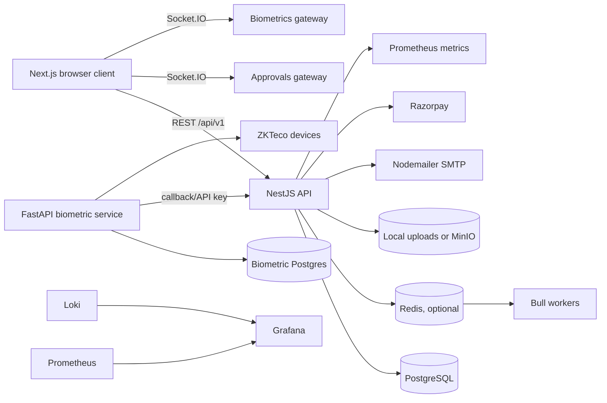
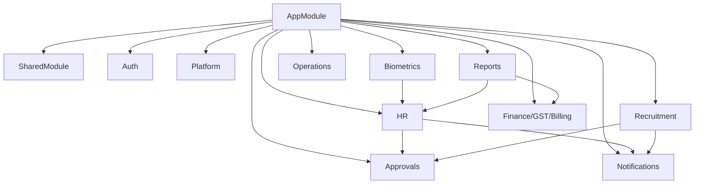
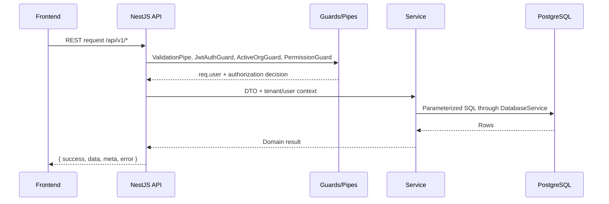
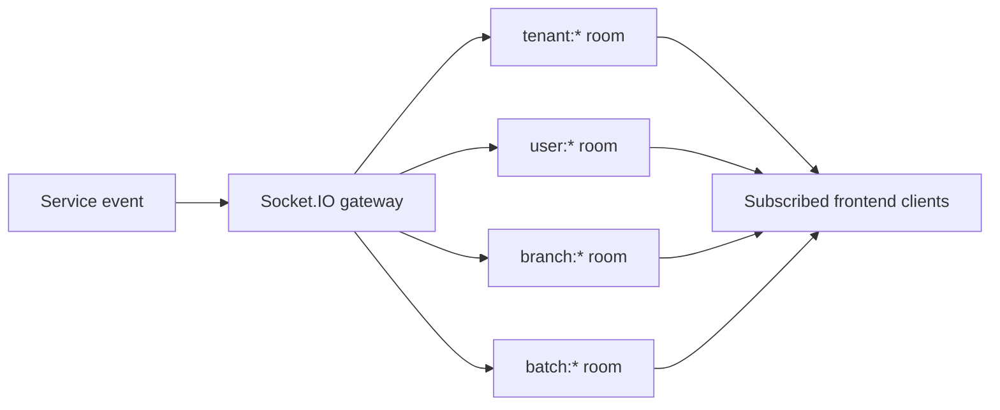

# System Architecture

## Overview

AI-HRMS is implemented as a workspace with a Next.js frontend, a modular NestJS backend, a separate FastAPI biometric service, PostgreSQL persistence, optional Redis-backed Bull queues, S3-compatible object storage through MinIO/local adapters, and a Prometheus/Grafana/Loki monitoring stack.

Current implementation is the source of truth. Items marked "Future Enhancement" are not currently implemented end to end.

## Runtime Architecture

## Repository Structure

| Path | Responsibility |
| --- | --- |
| `frontend/` | Next.js 14 app router UI, route groups, Zustand auth state, React Query, API clients, Socket.IO clients. |
| `backend/` | NestJS API, modules, direct PostgreSQL access through `DatabaseService`, migrations, queues, guards, gateways. |
| `biometric-service/` | FastAPI service for biometric devices, SQLAlchemy models, Alembic migrations, Celery tasks, WebSocket manager. |
| `monitoring/` | Prometheus, Grafana provisioning, dashboards, Promtail config. |
| `grafana/` | Additional Grafana assets. |
| `docs/` | Existing implementation reports and new architecture handbook. |

## Frontend Architecture

The frontend uses Next.js app router with route groups:

| Route group | Current role |
| --- | --- |
| `(auth)` | Customer login, platform login, MFA verification, password reset, registration. |
| `(admin)` | Customer admin dashboard and organization workspace. |
| `(employee)` | Employee self-service portal. |
| `(manager)` | Manager views. |
| `(career)` | Career portal. |
| `(operations)` | Internal platform operations portal. |

State and integration layers:

- `src/store/auth.store.ts` stores access token, selected organization, user type, internal staff state, and routing metadata.
- `src/lib/*-api.ts` files wrap backend REST calls.
- `src/services/approvals-ws.ts` and `src/services/biometrics-ws.ts` connect to Socket.IO gateways.
- `src/components/*` contains module-specific UI and shared UI primitives.
- `src/middleware.ts` uses a non-sensitive portal cookie for early route separation; authoritative authorization remains backend-side.

## Backend Architecture

The backend is a modular NestJS application. `AppModule` wires global configuration, throttling, schedules, optional Bull/Redis, shared infrastructure, health checks, and business modules.

Major modules currently imported:

- `AuthModule`
- `PlatformModule`
- `OperationsModule`
- `HrModule`
- `FinanceModule`
- `GstModule`
- `DashboardModule`
- `BillingModule`
- `IntegrationsModule`
- `BiometricsModule`
- `ApprovalsModule`
- `NotificationsModule`
- `OrganizationRegistrationModule`
- `RecruitmentModule`
- `ExitManagementModule`
- `AssetsModule`
- `ReportsModule`
- `FinesModule`
- `ComplianceModule`
- `HistoricalAttendanceImportModule`
- `SharedModule`
- `HealthModule`

## Biometric Microservice

There are two biometric layers:

1. Backend `BiometricsModule`: trusted terminals, provider registry, ZKTeco/EasyTimePro providers, punch ingestion queue, sync queue, attendance engine integration, WebSocket feed, queue health, DLQ tools.
2. `biometric-service/`: FastAPI service with device APIs, employee/shift/sync APIs, SQLAlchemy models, Alembic migrations, Celery tasks, device client utilities, and callback forwarding to HRMS.

Current provider support in code includes ZKTeco and EasyTimePro. Future device providers should integrate through provider adapters rather than bypassing the provider registry.

## Monitoring Stack

`docker-compose.monitoring.yml` defines:

- Prometheus on `9090`
- Grafana on `3003`
- Loki on `3100`
- Promtail for optional NestJS JSON log shipping from `/var/log/ai-hrms`

The backend exposes health and metrics endpoints through `HealthModule`, including `/api/v1/health`, `/api/v1/health/live`, `/api/v1/health/ready`, `/api/v1/health/metrics`, and `/api/v1/health/web-vitals`.

## Storage Layer

`FileUploadService` supports:

- Local disk uploads under `uploads/` when `STORAGE_DRIVER=local`.
- MinIO/S3-compatible storage when `STORAGE_DRIVER` is not `local`.
- Image validation for branding assets.
- Document validation for compliance/document workflows.
- Signed download URLs for MinIO-backed files.

Future Enhancement: first-class AWS S3 deployment policy, bucket lifecycle policy, object encryption policy, virus scanning, and tenant quota enforcement.

## Redis And Queues

Redis is controlled by `REDIS_ENABLED`. When Redis is disabled, `registerQueues()` provides mock queues so the app starts without queue workers.

Implemented queues:

| Queue | Producer/consumer |
| --- | --- |
| Payroll payout queue | HR payroll payment service and `PayrollPayoutProcessor`. |
| Punch ingestion queue | Biometrics terminal/API/sync producers and `PunchIngestionProcessor`. |
| Biometric sync queue | EasyTimePro scheduler/manual sync and `BiometricSyncProcessor`. |
| Historical attendance import queue | Import execution service and `HistoricalAttendanceImportProcessor`. |

## API Flow And Request Lifecycle

Global runtime behavior:

- CORS is restricted to `FRONTEND_URL` or `http://localhost:3000`.
- Requests use `/api/v1` global prefix.
- `ValidationPipe` whitelists DTO properties and rejects unknown fields.
- `LoggingInterceptor` is registered globally.
- Compression is enabled.
- Swagger is mounted at `/api/docs`.

## Realtime Architecture

Implemented Socket.IO gateways:

- Approvals gateway: user subscriptions, approval updates, resolved events, notification events.
- Biometrics gateway: branch subscription, live punches, queue health, alerts.
- Historical attendance import gateway: batch subscription, progress/completed/failed/monitoring events.

## Risks And Important Notes

- Several existing docs identify controllers with incomplete permission guard coverage. Treat those as current security risks, not as intended architecture.
- Redis is optional at runtime; queue-backed workflows degrade to mock queues when disabled.
- There is no ORM. Services use direct SQL through `DatabaseService`.
- Tenant isolation is implemented in application queries and guards, not PostgreSQL row-level security.

## Future Enhancements

- Dedicated event bus for cross-module domain events.
- Production S3 configuration, retention, encryption, and scanning policies.
- CI/CD pipeline documentation and automated deployment gates.
- Stronger authorization consistency across all controllers.
- Horizontal worker topology for queues.

## Best Practices

- Add backend functionality inside the owning NestJS module.
- Pass tenant, branch, and actor context explicitly into services.
- Use queues for long-running or retryable work.
- Emit realtime events and notifications only after source state commits.
- Keep health, metrics, and slow-query logging enabled in production.
