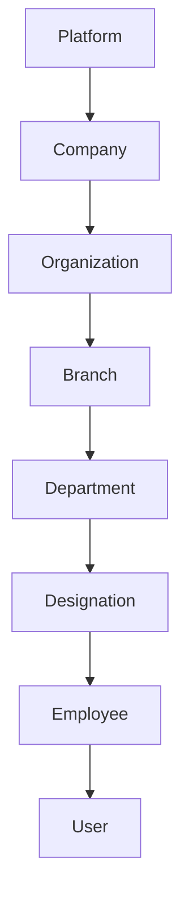
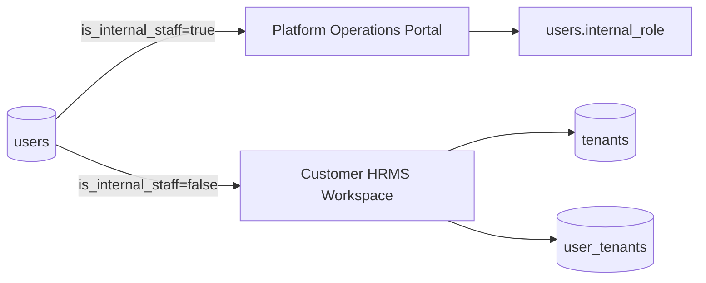
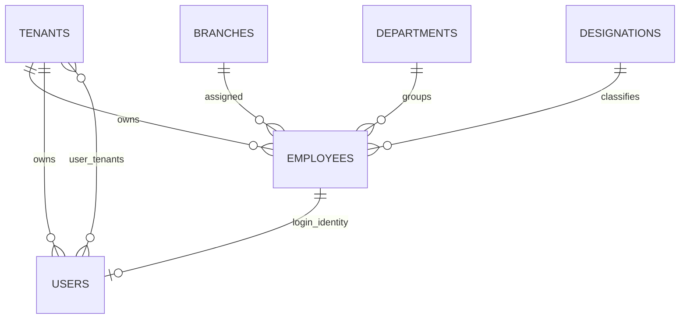
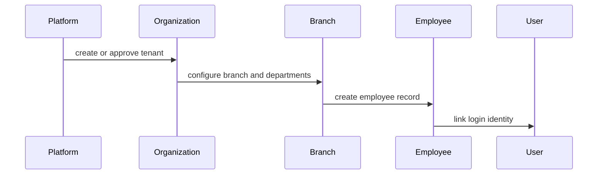

# Business Architecture

## Overview

AI-HRMS models a multi-tenant HRMS platform. The business hierarchy is:

The current implementation stores the tenant/customer organization primarily in `tenants`. Some older naming uses "property" for hotel/property locations and newer migrations introduce `branches`.

## Responsibilities By Level

| Level | Responsibility | Current implementation |
| --- | --- | --- |
| Platform | Operates AI-HRMS itself, internal staff, organization lifecycle, signup offers, platform billing plan definitions. | `OperationsModule`, internal staff flags on `users`, `/operations/*` frontend. |
| Company | Business/legal customer identity. | Represented through tenant/organization profile fields and organization registration. |
| Organization | Tenant boundary for customer HRMS data and configuration. | `tenants`, `user_tenants`, organization profile, registration, subscription data. |
| Branch | Operating location or branch inside an organization. | `branches`, `branch_user_access`, branch analytics, branch-scoped approval chains. |
| Department | Functional team inside a branch or organization. | `departments`, branch-aware migrations, employee links. |
| Designation | Job title/classification. | `designations`; positions are also used for permission presets and user assignments. |
| Employee | HR identity and employment record. | `employees`, lifecycle events, documents, attendance, leave, payroll, exit workflows. |
| User | Login/security identity. | `users`, `user_tenants`, roles, positions, refresh tokens, MFA tables. |

## Platform Vs Customer Workspace

Platform staff and customer users share the `users` table but use different authorization systems:

- Platform staff: `users.is_internal_staff = true`, `users.internal_role`, `OpsPermissionGuard`.
- Customer users: `users.is_internal_staff = false`, `user_tenants.user_type`, customer RBAC, branch scopes.

## Organization Boundary

`tenant_id` is the core data partition key across most business tables. A user can belong to one or more organizations through `user_tenants`, then select an active tenant to receive a JWT containing that tenant context.

## Branch Boundary

Branches are used for:

- User access scope through `branch_user_access`.
- Branch activation/status and plan limits.
- Employee, department, position, finance, attendance, compliance, asset, biometric device, approval, and analytics scoping.

Branch-scoped actors are restricted by service-level query filters and access scope helpers.

## Employee And User Split

Current intent:

- `employees` holds HR/employment data.
- `users` holds authentication/security data.
- `users.employee_id` links a login to an employee when applicable.
- Internal platform staff may not have meaningful customer tenant scope even though the database has legacy placeholder constraints.

## Important Notes

- "Company" is not a standalone dominant table in the inspected implementation; it is represented through tenant/organization profile concepts. Treat a separate company entity as Future Enhancement unless added explicitly.
- `properties` still exist from earlier schema design; `branches` are the current branch-level construct for access scope.
- Designations and positions are related but not identical: designations are HR titles, while positions drive permission presets and assignment behavior.

## Risks

- Inconsistent naming between company, organization, tenant, property, and branch can cause implementation drift.
- Tenant isolation is only as strong as consistent `tenant_id`/branch filtering in services.

## Future Enhancements

- Normalize vocabulary in code and docs: Platform, Organization, Branch, Department, Designation, Employee, User.
- Add a separate company/legal entity model only if multi-company-per-tenant becomes a real requirement.
- Add database-level row-level security if the deployment model requires defense beyond application checks.

## Sequence Diagram

## Best Practices

- Keep employee HR data separate from user authentication data.
- Add branch scope to new operational tables when records are branch-owned.
- Prefer "organization" in new docs and UI for customer tenant behavior.
- Treat a standalone company/legal entity as Future Enhancement until requirements are explicit.
