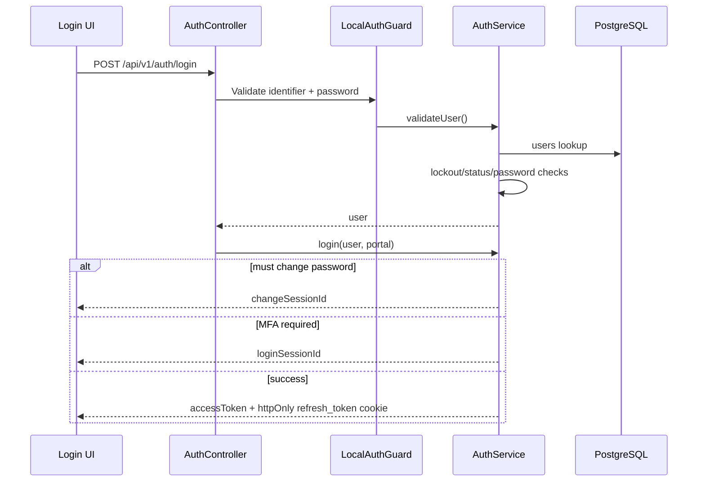
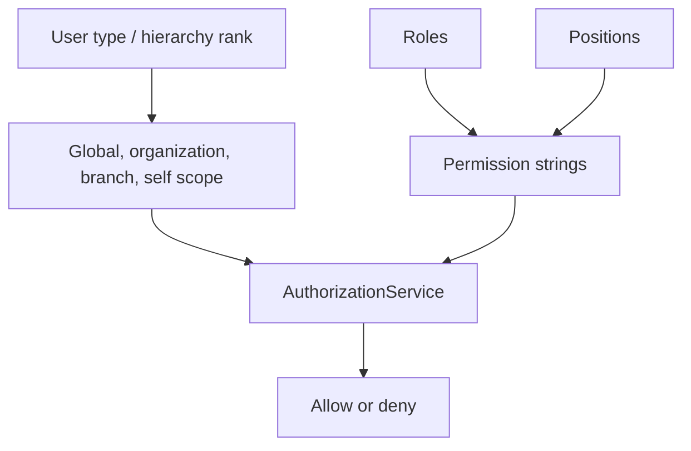
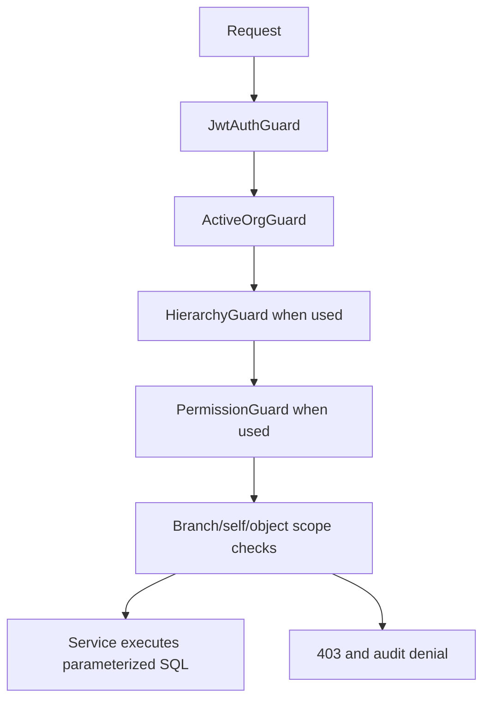

# Authentication And Security

## Overview

Authentication is implemented in `AuthModule` with Passport local/JWT strategies, refresh-token rotation, MFA, password reset, forced first-login password change, account lockout, and portal separation between platform staff and customer HRMS users.

## Login Flow

## JWT

Access tokens are signed with `JWT_SECRET`. `JwtStrategy` validates the bearer token, reloads the user from PostgreSQL, joins `user_tenants` for the selected tenant, and populates:

- `sub`
- `tenantId`
- `email`
- `employeeId`
- `isSuperAdmin`
- `userType`
- `isOrgAdmin`
- `isInternalStaff`
- `internalRole`

Internal staff are forced to `tenantId: null` in the JWT context.

## Refresh Token

Refresh tokens are random values stored as bcrypt hashes in `refresh_tokens`. The raw refresh token is returned as an HTTP-only cookie named `refresh_token`.

Implemented behavior:

- Refresh token rotation on `/auth/refresh`.
- Revocation on logout.
- Session listing and single-session revocation.
- Account lock/password reset invalidates active refresh tokens.
- Tenant selection updates active refresh tokens with selected tenant context.

## Portal Login

There are two frontend login surfaces:

- Customer login posts `portal: "customer"`.
- Platform login posts `portal: "platform"`.

The backend rejects mismatched portal/account type:

- Platform portal requires `users.is_internal_staff = true`.
- Customer portal rejects internal staff.

## Organization Login

Customer users can belong to multiple organizations through `user_tenants`. Login returns available tenants and may auto-select a single tenant. `/auth/select-tenant` verifies membership, writes tenant context into refresh tokens, and issues a new access token.

## Employee Login

Employees use the customer login path. Employee self-service routes use user type/routing behavior and `/employees/me/*` endpoints for self-scoped data.

## MFA

Implemented MFA capabilities:

- TOTP secret generation and QR code.
- TOTP verification to enable MFA.
- Recovery codes.
- Trusted devices via `trusted_device_token` cookie.
- MFA login sessions with 5-minute TTL.
- Failed MFA attempt lockout.
- Activity audit from `audit_logs`.
- Scheduled sweep for expired MFA login sessions.

## Forced Password Change

Bulk-imported or flagged users can be forced through a password change session before token issuance. Password policy validation is performed before updating the stored bcrypt password hash.

## Role And Permission Hierarchy

Customer hierarchy:

| Rank | User type | Scope |
| --- | --- | --- |
| 0 | `super_admin` | Global customer organizations. |
| 1 | `org_admin` | One organization, all branches. |
| 2 | `branch_admin` | Multiple assigned branches. |
| 3 | `admin` | One assigned branch. |
| 4 | `employee` | Self-service. |

Platform hierarchy is separate and uses `internal_role` plus `OPS_PERMISSIONS`.

## RBAC

Customer RBAC uses:

- `roles`
- `permissions`
- `role_permissions`
- `user_roles`
- `positions`
- `position_permissions`
- baseline permissions by user type

`PermissionGuard` reads `@RequirePermission()` metadata and calls `AuthorizationService`.

Important Risk: existing `ROLE_ACCESS_MATRIX.md` documents controllers that currently miss permission decorators. This handbook treats that as a current gap, not an intended security pattern.

## Branch Access

Branch scope is represented through `branch_user_access`. Branch-scoped queries should use `UserHierarchyService` or `scope.util.ts` to inject branch filters.

`BranchAccessGuard` exists, but existing documentation reports it is not applied consistently. Current implementation relies mostly on service-level branch filtering and access-scope helpers.

## Tenant Isolation And IDOR Prevention

Current controls:

- JWT includes active `tenantId`.
- Service queries generally filter by `tenant_id`.
- Branch scope filters restrict branch-scoped actors.
- Object-level services often verify tenant ownership before mutation.
- Audit logging exists for selected access-control denials and actions.

Required practice:

- Every object read/update/delete must validate both `tenant_id` and branch/self scope where applicable.
- Never trust route IDs without reloading ownership from the database.

## API Guards

Implemented guard types include:

- `LocalAuthGuard`
- `JwtAuthGuard`
- `ActiveOrgGuard`
- `PermissionGuard`
- `HierarchyGuard`
- `SuperAdminGuard`
- `OrgAdminGuard`
- `InternalStaffGuard`
- `OpsPermissionGuard`
- `ApiKeyOrJwtGuard`
- `WsJwtGuard`
- `TerminalAuthGuard`

## Security Workflow

## Future Enhancements

- Apply permission guards consistently to every sensitive controller.
- Add automated authorization regression tests.
- Consider database row-level security for tenant-critical tables.
- Add centralized object authorization helper for all route ID lookups.
- Add secret rotation and key management documentation.

## Current Implementation Notes

- Backend portal checks are authoritative; frontend routing is only UX.
- Refresh tokens are stored as bcrypt hashes, and the raw token is held in an HTTP-only cookie.
- MFA, trusted devices, lockout, password reset, and forced password change are implemented.
- Permission enforcement exists but is not uniformly applied across all controllers.

## Risks

- Missing `PermissionGuard` usage can expose sensitive endpoints to under-privileged authenticated users.
- Every route that accepts an entity ID needs object-level tenant/branch/self authorization.
- Branch-scoped actors require query-level filters in addition to route guards.

## Best Practices

- Use `JwtAuthGuard`, `ActiveOrgGuard`, and `PermissionGuard` together for privileged tenant APIs.
- Use internal staff guards only for platform operations APIs.
- Never trust tenant, branch, employee, or user type from the request body.
- Audit sensitive authorization denials and privileged state changes.
