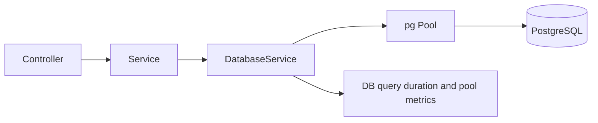
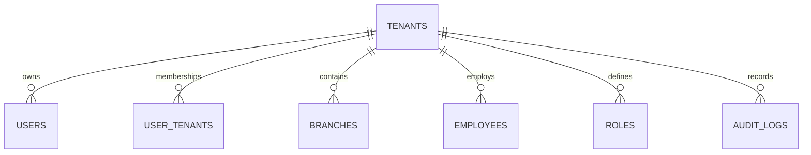
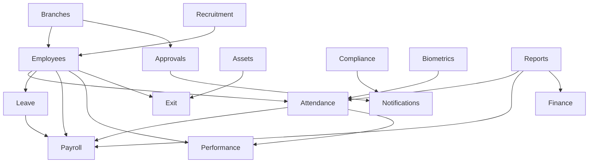

# Database Architecture

## Overview

The backend uses PostgreSQL through the `pg` library and a shared `DatabaseService`. There is no ORM in the current implementation. Schema changes are SQL migrations in `backend/migrations/`, currently numbered through `136`.

## Runtime Database Access

`DatabaseService` provides:

- Connection pooling from `DATABASE_URL`.
- SSL enabled automatically for non-local DB URLs.
- Configurable pool sizes/timeouts.
- Slow query JSON logging through `DATABASE_SLOW_QUERY_MS`.
- Transaction helper with `BEGIN`, `COMMIT`, `ROLLBACK`.
- Prometheus-style pool/query metrics.

## Tenant Model

`tenant_id` is the shared-database partition key. Most domain tables include `tenant_id`, and many unique constraints include tenant scope.

## Organization Model

`tenants` represents customer organizations. Organization registration and approval flows extend organization creation and lifecycle management. `organization_admin_user_id` stores the current assigned organization admin.

## Branch Model

Branches are stored in `branches` and linked from employees, departments, positions, finance tables, biometric devices, assets, compliance tracker items, approval requests, and analytics.

Branch access is represented in `branch_user_access`.

## Shared Database Architecture

The current architecture is a shared database and shared schema. Tenant isolation is enforced by:

- `tenant_id` columns and indexes.
- Application-level query filters.
- Guards and access-scope helpers.
- Membership tables.

Future Enhancement: database-level row-level security can add another enforcement layer.

## Major Tables By Area

| Area | Representative tables |
| --- | --- |
| Core tenancy/auth | `tenants`, `users`, `user_tenants`, `refresh_tokens`, `login_attempts`, `mfa_login_sessions`, `trusted_devices`, `password_reset_tokens`. |
| RBAC | `roles`, `permissions`, `role_permissions`, `user_roles`, `positions`, `position_permissions`, `branch_user_access`. |
| Organization/platform | `branches`, `departments`, `designations`, `cost_centers`, `employment_types`, `employee_groups`, `templates`, `audit_logs`. |
| HR | `employees`, `employee_lifecycle_events`, `employee_documents`, `shift_definitions`, `shift_assignments`, `shift_schedules`. |
| Attendance | `attendance_records`, `attendance_requests`, `break_sessions`, `attendance_audit`, `punch_fingerprints`. |
| Leave | `leave_types`, `leave_balances`, `leave_requests`, `leave_encashment_requests`. |
| Payroll | `salary_structures`, `payroll_runs`, `payslips`, `payroll_attendance_summaries`, `payroll_payments`, `employee_bank_accounts`. |
| Recruitment | `job_postings`, `candidates`, `interviews`, plus later vacancy, JD, pipeline, offer, verification, preboarding, campaign, workforce planning tables. |
| Approvals | `branch_approval_chains`, `approval_requests`, approval fields on business entities. |
| Notifications | `notifications`, `notification_preferences`. |
| Compliance | `compliance_documents`, `compliance_categories`, `compliance_document_versions`, `compliance_policy_acknowledgements`, `compliance_document_requests`, `compliance_tracker_items`. |
| Assets | `asset_types`, `asset_items`, `asset_assignments`. |
| Biometrics | `biometric_devices`, `service_api_keys`, `attendance_terminals`, `biometric_sync_cursors`, `biometric_sync_logs`, provider tables. |
| Historical import | `historical_attendance_import_sources`, `batches`, `staging_rows`, `mapping`, `progress`, `logs`, `audit`. |
| Finance/GST/Billing | `finance_*`, `vendors`, `invoices`, `bills`, `gst_*`, subscription and billing tables. |
| Reports | saved report and report query index infrastructure. |

## Module Relationships

## Migration Strategy

Current strategy:

- SQL migration files in `backend/migrations/`.
- `backend/scripts/migrate.js` runs migrations.
- Migrations are mostly additive with `CREATE TABLE IF NOT EXISTS`, `ALTER TABLE ... ADD COLUMN IF NOT EXISTS`, indexes, and backfills.

Best practice:

- Keep migrations ordered and immutable once applied to shared environments.
- Prefer additive migrations and backfills for production.
- Add indexes near new access patterns.
- Use transactions where a migration has multiple dependent steps.

## Index Strategy

Implemented patterns:

- `tenant_id` indexes on tenant-scoped tables.
- Composite tenant/status/time indexes for dashboards and queues.
- Branch indexes for branch-scoped data.
- Employee indexes for HR/attendance/payroll lookups.
- Date/time indexes for attendance, shifts, leave, reports, and import history.
- GIN tags index on compliance document tags.

## Transaction Strategy

`DatabaseService.transaction()` provides explicit transactional work. Use it for:

- Multi-table state transitions.
- Approval actions that update request and source entity.
- Payroll generation/payment status updates.
- Employee conversion from recruitment.
- Exit orchestration.
- Historical import commit/rollback.

## Backup Readiness

Current repo does not include a complete database backup workflow. Deployment docs mention Google Drive backups as a desired architecture topic, but no implementation was found.

Future Enhancement: automated PostgreSQL backups, restore drills, retention policies, encryption, and backup verification.

## Future Database Architecture

- Row-level security for tenant-critical tables.
- Read replicas for analytics/reporting.
- Dedicated queue/worker databases only if contention appears.
- Partitioning for large attendance, notification, audit, and import tables.
- Data archival strategy for old attendance logs and audit records.

## Responsibilities

- PostgreSQL is the transactional source of truth.
- `DatabaseService` owns pooling, query timing, slow-query logging, and transactions.
- Migrations own schema evolution.
- Services own tenant, branch, and object validation before executing SQL.

## Important Notes

- There is no ORM-generated schema model.
- Tenant isolation is implemented in application SQL and guards, not database row-level security.
- Migration files should be treated as operational artifacts once applied.

## Risks

- Missing `tenant_id` or branch filters can cause cross-tenant or cross-branch exposure.
- Heavy reports can pressure the shared transactional database.
- Direct SQL increases review responsibility for every query.

## Best Practices

- Add indexes for new list/report/filter paths.
- Use transactions for multi-table state transitions.
- Include `tenant_id` in tenant-owned uniqueness rules.
- Prefer additive migrations with safe backfills.
