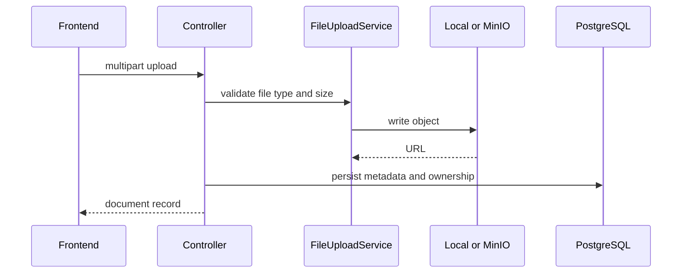
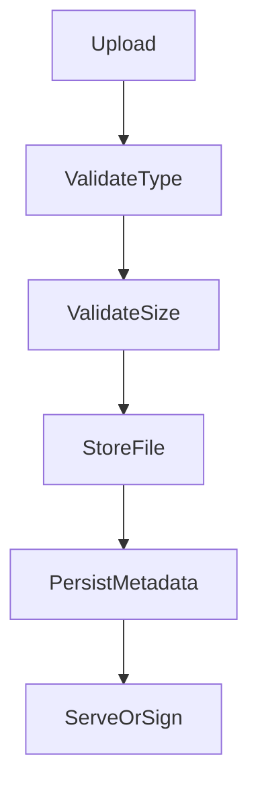

# Storage Architecture

## Overview

The current upload layer is centralized in `FileUploadService`. It supports local disk storage and MinIO/S3-compatible object storage. Upload metadata is persisted by module-specific tables such as `documents`, `employee_documents`, and compliance document/version tables.

## Current Upload Workflow



## File Ownership

Ownership is represented by tenant/module metadata:

- Storage path/key includes `folder/tenantId/uuid.ext`.
- MinIO object metadata includes `tenantId` and `originalFilename`.
- Database rows link files to tenant, employee, entity, document, version, compliance category, or branding context depending on module.

## Storage Abstraction

`FileUploadService` decides storage driver at runtime:

- `STORAGE_DRIVER=local`: local `uploads/` folder served by Express static middleware.
- Any other value: S3-compatible client configured for MinIO endpoint and bucket.

## Local Storage

Current behavior:

- Files are written under `uploads/<folder>/<tenantId>/<uuid.ext>`.
- Backend serves `/uploads/*` only when `STORAGE_DRIVER=local`.
- Local static cache settings use `LOCAL_UPLOADS_CACHE_MAX_AGE`.

Use local storage for development only unless production backup, persistence, and access controls are explicitly designed.

## MinIO

Current behavior:

- Uses AWS SDK `S3Client` with `forcePathStyle: true`.
- Configured by `MINIO_ENDPOINT`, `MINIO_PORT`, `MINIO_BUCKET`, `MINIO_ACCESS_KEY`, `MINIO_SECRET_KEY`, `MINIO_USE_SSL`.
- Returns object URLs in the MinIO bucket path.
- Generates signed download URLs through `getSignedDownloadUrl()`.

## S3 Readiness

The abstraction is S3-compatible, but production AWS S3-specific configuration is not fully documented or implemented in code.

Future Enhancement:

- Dedicated AWS S3 bucket policy.
- Server-side encryption.
- Lifecycle/retention policy.
- Object lock for compliance records where required.
- CloudFront or private VPC endpoint design.

## Metadata Model

Module-level metadata includes:

- File URL/key.
- Tenant ID.
- Entity type and entity ID.
- File MIME type and size.
- Original filename where captured.
- Compliance document category, scope, status, version.
- Employee document expiry fields.
- Audit metadata such as created/updated user where implemented.

## Signed URLs

MinIO download URLs can be signed with a default 300-second expiration. Local disk mode returns the existing public static URL because there is no presign mechanism.

Future Enhancement: signed local proxy downloads or mandatory object-store mode for sensitive production documents.

## Storage Quotas

Storage quota enforcement was not found in `FileUploadService`.

Future Enhancement: tenant storage quotas, per-file policy configuration, quota dashboard, and overage alerts.

## Folder Organization

Current storage key pattern:

```text
<folder>/<tenantId>/<uuid>.<extension>
```

Recommended folder categories:

- `branding`
- `documents`
- `employee-documents`
- `compliance`
- `recruitment`
- `exit`
- `reports`

Only use categories actually wired by a module.

## Document Lifecycle

Current lifecycle is module-dependent:

1. Upload file.
2. Persist metadata.
3. Read metadata.
4. Generate signed URL where supported.
5. Update or version where module supports it.
6. Delete object best-effort when module calls `deleteFile()`.

Compliance includes document versions. Generic versioning is not universal.

## Versioning

Implemented for compliance document versions through compliance migrations/services.

Future Enhancement: object-store native versioning and universal document version model.

## Encryption

Current code does not enforce encryption at upload time.

Future Enhancement: bucket-level server-side encryption, KMS key policy, and optional application-side encryption for highly sensitive files.

## Backup Strategy

No complete object storage backup workflow was found.

Future Enhancement: scheduled bucket replication/backups, restore verification, lifecycle policy, and retention schedule aligned with HR/compliance requirements.

## Flowchart



## Responsibilities

- `FileUploadService` validates and stores file bytes.
- Owning modules validate business ownership and persist metadata.
- Object storage stores bytes; PostgreSQL stores business metadata.

## Relationships

Storage is consumed by branding, platform documents, employee documents, compliance documents, recruitment/exit attachments where wired, and report/export features where applicable.

## Current Implementation Notes

- MinIO mode supports signed download URLs.
- Local mode exposes static URLs and is best treated as development-oriented for sensitive files.

## Risks

- Local static URLs do not provide signed access control.
- Quotas, virus scanning, and universal encryption policies are not implemented.
- Best-effort delete can leave orphaned objects.

## Best Practices

- Validate business ownership before generating download URLs.
- Store URLs/keys and metadata in PostgreSQL, not file bytes.
- Prefer MinIO/S3-compatible storage in production.
- Keep upload keys tenant-scoped.
