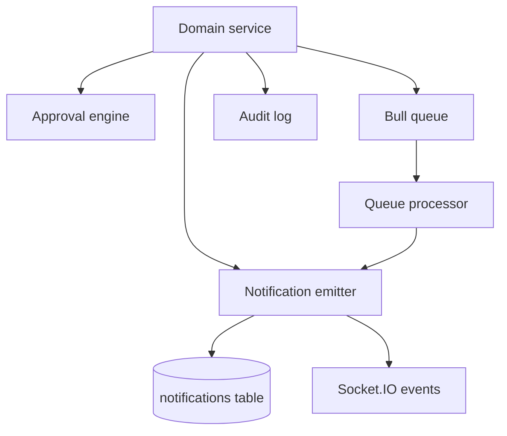
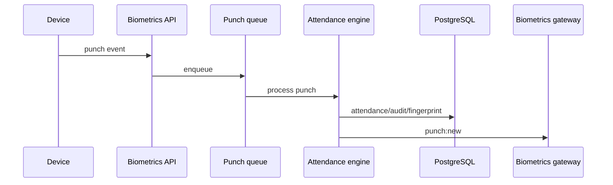

# Event And Integration Architecture

## Overview

AI-HRMS currently uses a pragmatic event model:

- Direct service calls across modules.
- Notification emission through `NotificationEmitterService`.
- Approval workflow events through `ApprovalEngineService` and approval gateway.
- Socket.IO realtime events.
- Bull queues for background processing.
- Scheduled jobs through `@nestjs/schedule`.
- External integrations for Razorpay, SMTP, biometric providers, and the separate biometric service.

There is no dedicated domain event bus yet.

## Cross-Module Events

## Approval Engine

Implemented in `ApprovalsModule`. It supports:

- Inbox/submitted/pending-count/analytics/detail APIs.
- Approve/reject/cancel/escalate APIs.
- Branch approval chains.
- Workflow types including leave, expense, reimbursement, transfer, payroll, attendance correction, manual attendance, overtime, shift change, biometric device, onboarding, exit clearance, FNF settlement, salary revision, role change, policy change, vendor approval, fine deduction, and payroll payment.
- Scheduled escalation checks.
- Approval WebSocket notifications.

## Notification Engine

`NotificationEmitterService` creates in-app notifications and emits realtime events. Domain modules call it directly for relevant events.

## Realtime Events

Implemented gateways:

- Approvals: `approval:new`, `approval:update`, `approval:resolved`, `notification:new`.
- Biometrics: `punch:new`, `queue:health`, `alert`.
- Historical import: `import:progress`, `import:completed`, `import:failed`, `import:monitoring`.

## WebSockets

WebSocket clients subscribe to user, branch, tenant, or batch rooms depending on gateway.

Future Enhancement: consistent WebSocket authentication and room authorization policy for all gateways.

## Queues

Implemented queue-backed workflows:

- Payroll payouts.
- Biometric punch ingestion.
- Biometric provider sync.
- Historical attendance import execution.

Queue behavior:

- Retries and backoff are configured per queue.
- Processors are only registered when Redis is enabled.
- Mock queues allow startup without Redis, but queued work will not execute.

## Historical Import

Historical attendance import has the most complete background workflow:

- Sources/connectors.
- Batches and execution.
- Staging rows.
- Mapping and validation.
- Reconciliation.
- Rebuild and commit.
- Pause/resume/cancel/retry/rollback.
- Monitoring and logs.
- Queue execution.
- WebSocket progress events.

## Attendance Events

Sources include:

- Employee self-service punch endpoints.
- Biometric terminal punch ingestion.
- EasyTimePro/ZKTeco sync.
- Historical import rebuild/commit.
- Attendance correction requests.

Attendance affects payroll summary, performance attendance behavior score, reports, and notifications.

## Payroll Events

Payroll workflows include:

- Payroll runs.
- Payslip generation/access.
- Attendance summary compute/recompute/approve/reject/correction/lock/unlock.
- Payout initiation, retry, reversal, and webhook handling.
- Notifications for attendance summary state transitions.

## Leave Events

Leave supports request create/approve/reject and encashment create/approve/reject. Leave impacts payroll days and reports.

## Recruitment Events

Recruitment modules emit notifications and use approval services for vacancies, job descriptions, offers, probation, and workforce plans. Candidate-to-employee conversion links recruitment into employee onboarding.

## Exit Events

Exit management orchestrates requests, approvals/rejections, checklist, clearance, knowledge transfer, interview, settlement, documents, assets, notifications, and reports.

## Biometric Events

Biometric events flow from device/provider/terminal to queues, attendance engine, audit/fingerprint, notifications, and live dashboards.

## Future Event Bus Architecture

Future Enhancement:

- Introduce a domain event bus abstraction.
- Persist outbox events in PostgreSQL.
- Use workers to publish to Redis Streams, Kafka, or another broker if needed.
- Standardize event schemas, idempotency keys, and retry/dead-letter behavior.
- Decouple notifications and approvals from direct service calls.

## Responsibilities

- Business modules own source-of-truth state.
- Approval engine owns approval state and decision flow.
- Notification engine owns in-app notification persistence and realtime fanout.
- Queues own retryable background execution.
- Gateways own realtime delivery, not business decisions.

## Relationships

Events connect attendance, payroll, leave, recruitment, exit, compliance, biometrics, reports, approvals, and notifications. Most relationships are direct service calls today.

## Current Implementation Notes

- There is no central domain event bus.
- Bull queues are only active with Redis enabled.
- Scheduled jobs are implemented through Nest schedule decorators.

## Risks

- Direct service coupling can make module extraction harder.
- Notification failures are often best-effort and may not be retried.
- Queue-disabled environments do not process background jobs.

## Best Practices

- Make background jobs idempotent.
- Keep source entities authoritative over derived notification/realtime state.
- Use explicit workflow types for approval integration.
- Add audit entries for important state transitions.
