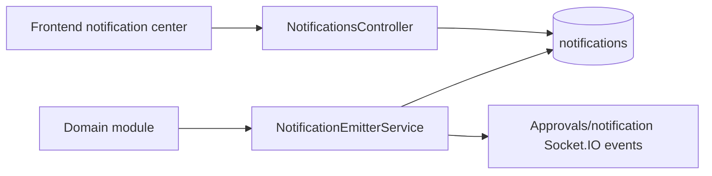
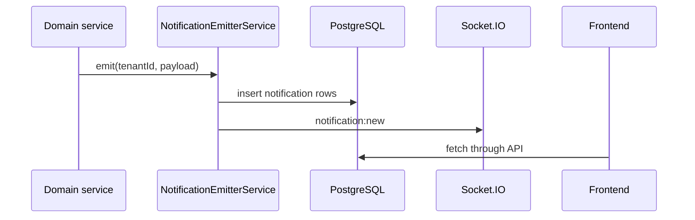

# Notification Architecture

## Overview

Notifications are implemented by `NotificationsModule`, `NotificationEmitterService`, module-specific emitters, scheduled reminder hooks, and realtime gateway integration. The current hard implementation is in-app notification persistence plus realtime events. Email exists through `EmailService` in the auth module and SMTP/Nodemailer dependencies.

## Notification Engine

Current notification API includes notification list/center behavior, preferences, mark-read-like state, and module tabs on the frontend.

## Channels

| Channel | Current status |
| --- | --- |
| In-app | Implemented through notifications table/services and frontend notification center. |
| Realtime | Implemented through Socket.IO notification events in approval gateway and module gateways. |
| Email | Implemented for auth/security emails and Nodemailer available; not a universal notification channel engine. |
| Push | Future Enhancement. |
| SMS | Future Enhancement. |
| WhatsApp | Future Enhancement. |

## Reminder Workflows

Implemented scheduled hooks include:

- Document expiry checks in `NotificationsService`.
- Compliance expiry reminders.
- Interview daily reminders.
- Auth session sweeps and security notifications.
- Biometric stale device alerts.

Future Enhancement: central reminder scheduler with template, channel, and escalation rules.

## Escalations

Approvals include escalation behavior and scheduled checks. Notification escalation outside approvals is module-specific.

Future Enhancement: centralized escalation policies by workflow type, severity, SLA, and branch.

## Notification Preferences

`notification_preferences` exists and is used for per-user/module notification preferences.

Future Enhancement: per-channel preferences, quiet hours, digest configuration, and mandatory security notifications.

## Templates

Current state:

- Email templates are implemented as service methods in `EmailService`.
- Platform templates exist for documents/branding/sidebar access.
- Universal notification templates were not found as a central engine.

Future Enhancement: tenant-scoped notification template registry with variables, localization, and approval before activation.

## Delivery Flow

## Audit Workflow

Notifications themselves are persisted, but not every notification emission is an audit log. Security-sensitive actions such as MFA and access changes write `audit_logs` separately.

## Risks

- Some modules use direct notification emission and some use specialized services, so behavior may be inconsistent.
- Email is not a generalized notification channel.
- SMS/WhatsApp/push are not implemented despite being future architectural targets.

## Best Practices

- Emit notifications after the database state transition succeeds.
- Include `tenantId`, target user IDs, source module, priority, and actionable context.
- Avoid notification-only state changes; the source table should remain authoritative.
- Keep security emails best-effort where user response should not block on SMTP.

## Future Enhancements

- Central channel router.
- Template engine.
- Delivery log table per channel.
- Retry and dead-letter for external channels.
- Digest and escalation scheduler.

## Responsibilities

- Domain modules decide when a notification is needed.
- `NotificationEmitterService` persists and emits notification events.
- `NotificationsService` manages notification center reads, preferences, and scheduled reminders.
- Frontend notification components render and filter user-facing notifications.

## Relationships

Notifications depend on auth users, tenant context, source modules, preferences, and realtime gateways. Approvals and compliance are frequent producers.

## Current Implementation Notes

- In-app and realtime notification paths are implemented.
- Email exists for auth/security flows but not as a universal channel.
- Push, SMS, and WhatsApp are future channels.
