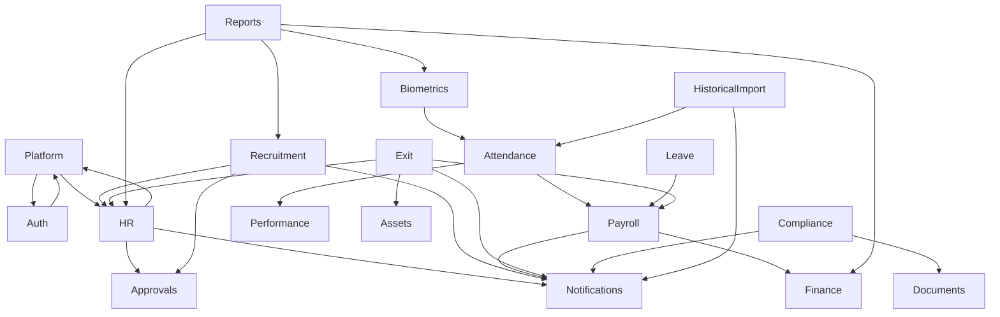
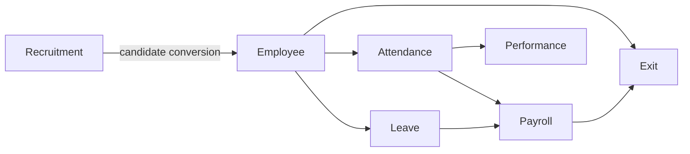
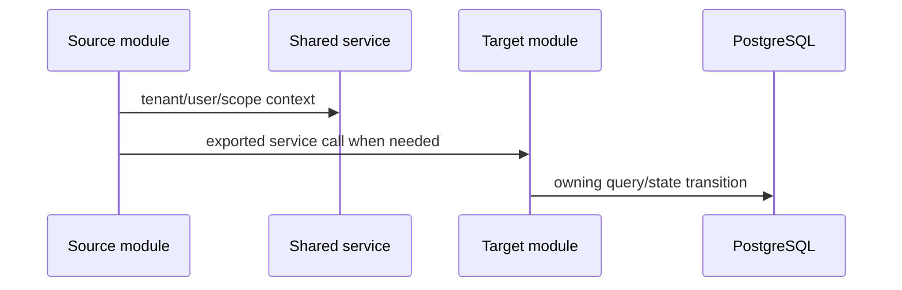

# Module Dependencies

## Overview

This document maps major module dependencies in the current implementation. Dependencies are based on module imports, service calls, shared tables, queue/realtime interactions, and workflow coupling.

## High-Level Dependency Map

## Dependency Chains

### Recruitment -> Employee -> Attendance -> Leave -> Payroll -> Performance -> Exit

## Module Dependency Table

| Module | Depends on | Used by | Notes |
| --- | --- | --- | --- |
| Auth | Database, Platform authorization/audit, notifications, email | All protected modules | Issues JWT, refresh tokens, MFA, portal separation. |
| Platform | Auth, shared database, file upload | HR, approvals, reports, operations | Owns tenants, branches, departments, users, roles, positions, templates, audit logs. |
| Operations | Auth internal staff guards, platform/org services | Platform staff frontend | Owns internal staff, organization operations, platform reports, org lifecycle. |
| HR/Employee | Platform, Auth, Notifications, Approvals | Attendance, Leave, Payroll, Performance, Exit, Reports | Core employee record and lifecycle. |
| Attendance | Employee, Shift, Approvals, Notifications, Biometrics | Payroll, Performance, Reports | Manual and biometric attendance records and corrections. |
| Shift | Employee, Branch | Attendance, Reports | Shift definitions, assignments, schedules. |
| Leave | Employee, Approvals | Payroll, Reports | Leave balances, requests, encashment. |
| Payroll | Employee, Attendance, Leave, Notifications, Razorpay | Finance, Exit, Reports | Runs, payslips, attendance summaries, payouts. |
| Performance | Employee, Attendance | Reports | KRA/KPI/cycles/reviews and attendance behavior scoring. |
| Recruitment | Platform, Employee, Approvals, Notifications | Reports, Employee conversion | Vacancy/JD/candidate/interview/offer/preboarding workflows. |
| Approvals | Platform, Notifications, WebSocket | HR, Recruitment, Exit, Finance-like approvals | Branch chain and approval request engine. |
| Notifications | Database, WebSocket | Most modules | In-app/realtime notification center. |
| Biometrics | Integrations, HR attendance, Platform, Notifications, Redis queues | Reports, Attendance | Devices, providers, terminals, sync, live feed. |
| Historical Import | Attendance, Notifications, Redis queue, WebSocket | Reports/attendance history | Import legacy attendance and reconcile. |
| Compliance | Platform docs/storage, Notifications, Approvals for policies | Reports, employee compliance | Categories, documents, requests, tracker, policy ack. |
| Assets | Employee, Exit | Exit management | Asset types/items/assignments/returns. |
| Exit Management | Employee, Payroll, Assets, Notifications, Approvals | Reports | Resignation/offboarding, clearance, settlement, documents. |
| Finance | Platform, Payroll where relevant | Reports, GST | Accounts, journal, expenses, invoices, bills, payments, cashbook, budgets, reimbursements, vendors. |
| GST | Finance/invoices | Reports | GST settings, invoices, returns, summary. |
| Billing | Platform/subscription | Operations/customer billing UI | Plan catalog, modules, features, resources, subscriptions, invoices. |
| Reports | HR, Attendance, Payroll, Finance, Recruitment, Biometrics | Frontend reporting | Aggregates module data and saved reports. |

## Shared Infrastructure Dependencies

- `DatabaseService`: used by all data modules.
- `FileUploadService`: branding, documents, compliance, employee docs, module-specific uploads.
- `NotificationEmitterService`: event-to-notification bridge.
- `AuditLogService`: access/security/business audit.
- `UserHierarchyService` and `AuthorizationService`: customer access control.
- `registerQueues()`: queue abstraction with mock fallback.

## Risks

- Direct service imports can create circular dependency pressure; Nest `forwardRef()` is already used in several modules.
- Some cross-module flows are implemented as direct calls rather than events, making future decomposition harder.
- Reporting depends on many table contracts and indexes.

## Best Practices For New Module Dependencies

- Prefer using exported services from module boundaries.
- Keep data ownership clear: do not update another module's tables without an owning service or a documented transaction.
- Emit notifications after state commits.
- Add approval integration through `ApprovalsModule` rather than custom approval tables.
- Add reports through `ReportsModule` services instead of ad hoc dashboard SQL in the frontend.

## Future Enhancements

- Domain event/outbox abstraction.
- Dependency graph tests or architecture linting.
- Dedicated read models for reports and dashboards.

## Sequence Diagram

## Responsibilities

- Source modules own their business workflows.
- Shared services own cross-cutting infrastructure.
- Target modules should expose services instead of forcing unrelated modules to duplicate their SQL.

## Current Implementation Notes

- `forwardRef()` is used where circular module imports already exist.
- Reports intentionally read from many module tables.
- Notifications and approvals are common cross-module integrations.
