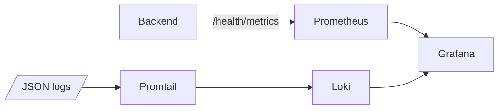
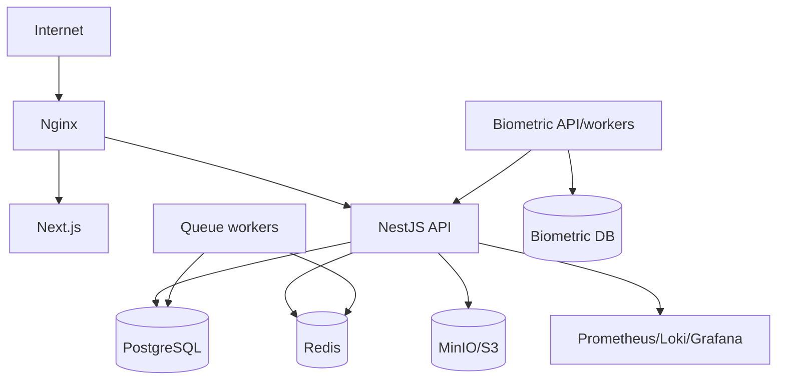
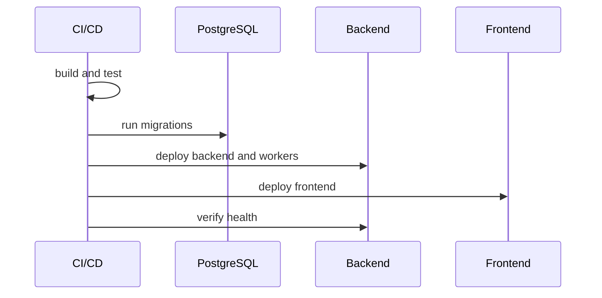

# Deployment Architecture

## Overview

The repository supports separate frontend, backend, biometric service, and monitoring runtimes. Production deployment is not fully codified in one compose file for the whole platform, so this document distinguishes current implementation from recommended production architecture.

## Frontend Deployment

Current implementation:

- Next.js 14 app in `frontend/`.
- Scripts: `npm run build --workspace=frontend`, `npm run start --workspace=frontend`.
- Uses `NEXT_PUBLIC_*` style API configuration where implemented in frontend env files.

Recommended production:

- Build static/server output in CI.
- Run behind Nginx or platform ingress.
- Serve both customer and platform portals from the same Next.js deployment unless subdomain separation is added.

## Backend Deployment

Current implementation:

- NestJS app in `backend/`.
- Scripts: `npm run build --workspace=backend`, `npm run start:prod --workspace=backend`.
- API prefix: `/api/v1`.
- Swagger: `/api/docs`.
- Health/metrics endpoints: `/api/v1/health/*`.

Required environment:

- `DATABASE_URL`
- `JWT_SECRET`
- `FRONTEND_URL`
- Redis variables when Redis is enabled.
- Storage variables for MinIO/local.
- SMTP variables for email where used.
- Razorpay variables for payroll payment/webhook flows.

## Biometric Deployment

Current implementation:

- FastAPI service in `biometric-service/`.
- `Dockerfile` and `docker-compose.yml` exist.
- Alembic migrations define biometric service schema.
- Celery task files exist for heartbeat/sync jobs.

Recommended production:

- Run API and Celery workers separately.
- Place device network access behind controlled firewall/VPN.
- Configure callbacks to backend with API key authentication.

## Redis

Redis is optional for backend startup, but required for real queue processing. Without Redis, queues become mock queues and processors are not registered.

Production should run Redis as a managed or containerized service with persistence, memory policy, authentication, monitoring, and backups as required.

## PostgreSQL

Current backend uses one PostgreSQL database for the NestJS app. The biometric service has its own SQLAlchemy/Alembic schema and can use its own database URL.

Production requirements:

- Managed PostgreSQL or hardened self-hosted instance.
- Automated backups.
- Pool size tuned through `DATABASE_POOL_MAX`.
- Slow query threshold through `DATABASE_SLOW_QUERY_MS`.

## S3 / MinIO

Current storage supports local disk and MinIO/S3-compatible object store. Production should prefer object storage over local disk.

Future Enhancement: AWS S3 policy, encryption, lifecycle, replication, and scanning.

## Google Drive Backups

No current implementation was found for Google Drive backups.

Future Enhancement: backup exporter with encryption, retention, service account permissions, and restore testing.

## Prometheus, Grafana, Loki

`docker-compose.monitoring.yml` deploys:

- Prometheus
- Grafana
- Loki
- Promtail

## Nginx

No production Nginx config was found in the repository.

Recommended:

- TLS termination.
- Route `/api/*` to backend.
- Route frontend paths to Next.js.
- WebSocket upgrade support for Socket.IO.
- Upload size limits aligned with `FileUploadService`.
- Security headers.

## Docker

Current Docker assets:

- `biometric-service/Dockerfile`
- `biometric-service/docker-compose.yml`
- `docker-compose.monitoring.yml`

Future Enhancement: full production compose/Kubernetes manifests for frontend, backend, Redis, PostgreSQL, workers, biometric service, and monitoring.

## Scaling

### Horizontal Scaling

- Frontend can scale statelessly.
- Backend can scale horizontally when Redis queues, database pool sizing, and WebSocket sticky/session behavior are handled.
- Queue workers should scale separately from API instances.
- Biometric sync workers should scale with provider rate limits and idempotency.

### Vertical Scaling

- Increase backend CPU/memory for heavy reports/payroll/attendance imports.
- Increase database CPU/RAM/IOPS for reporting and attendance-heavy tenants.
- Increase Redis memory for queue backlog.

## Production Environment

Recommended production topology:

## Future Enhancements

- CI/CD pipeline with migration gates.
- Blue/green or rolling deployment strategy.
- Dedicated queue worker deployment.
- Managed secrets store.
- Production Nginx/Ingress config committed to infra repository.

## Sequence Diagram

## Responsibilities

- Frontend serves portals and UI.
- Backend serves REST/WebSocket APIs and queue producers.
- Workers process background queues.
- PostgreSQL stores transactional state.
- Redis stores queue state.
- Object storage stores uploads.
- Monitoring observes health, metrics, and logs.

## Current Implementation Notes

- Full production orchestration is not present in the repository.
- Monitoring compose exists.
- Biometric service has Docker assets.

## Risks

- API replicas without DB pool planning can exhaust database connections.
- WebSocket scaling may require sticky sessions or adapter configuration.
- Local storage mode is risky for production documents.

## Best Practices

- Deploy API and workers separately.
- Run migrations before deploying code that depends on them.
- Keep secrets outside source-controlled env files.
- Verify health endpoints after deployment.
