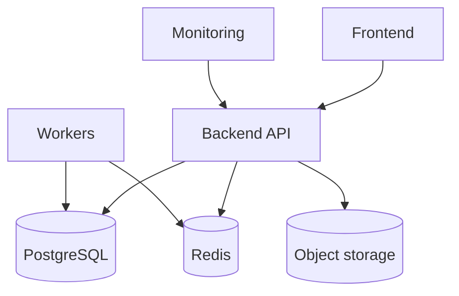
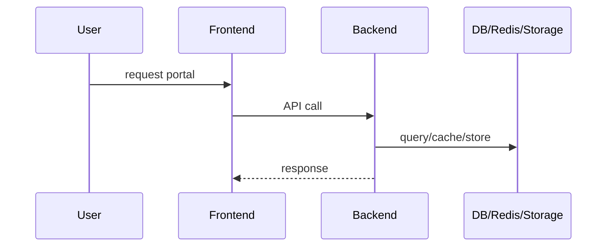

# Infrastructure Architecture

## Overview

Infrastructure is partially codified through Node workspace scripts, biometric service Docker files, monitoring Docker Compose, env examples, and runtime configuration in code. Full production infrastructure as code was not found.

## Server Architecture

Recommended runtime separation:

- Frontend server: Next.js app.
- Backend API server: NestJS API.
- Queue workers: NestJS processors with Redis enabled.
- Biometric API server: FastAPI.
- Biometric workers: Celery tasks.
- PostgreSQL.
- Redis.
- Object storage: MinIO or S3.
- Monitoring: Prometheus, Grafana, Loki, Promtail.

## Environment Variables

Known variable categories:

| Category | Examples |
| --- | --- |
| Backend API | `PORT`, `FRONTEND_URL`, `NODE_ENV`, `JWT_SECRET`, `RESPONSE_COMPRESSION_THRESHOLD_BYTES`. |
| Database | `DATABASE_URL`, `DATABASE_POOL_MAX`, `DATABASE_POOL_IDLE_TIMEOUT_MS`, `DATABASE_POOL_CONNECTION_TIMEOUT_MS`, `DATABASE_SLOW_QUERY_MS`. |
| Redis | `REDIS_ENABLED`, `REDIS_HOST`, `REDIS_PORT`, `REDIS_PASSWORD`. |
| Storage | `STORAGE_DRIVER`, `MINIO_ENDPOINT`, `MINIO_PORT`, `MINIO_BUCKET`, `MINIO_ACCESS_KEY`, `MINIO_SECRET_KEY`, `MINIO_USE_SSL`, `LOCAL_UPLOADS_CACHE_MAX_AGE`. |
| Monitoring | `GRAFANA_PASSWORD`, `GRAFANA_ROOT_URL`, log file path for Promtail. |
| External services | SMTP/email configuration, Razorpay credentials, biometric provider credentials. |

## Secrets

Secrets should include JWT secret, database credentials, Redis password, MinIO/S3 keys, SMTP credentials, Razorpay keys, biometric provider credentials, and internal service API keys.

Current code reads secrets from environment variables. A managed secrets store is a Future Enhancement.

## Configuration

Configuration is split across:

- `.env.example` files.
- Nest `ConfigModule`.
- Direct `process.env` reads.
- Frontend env files.
- Docker compose env interpolation.

Future Enhancement: central configuration schema validation at startup.

## CI/CD Assumptions

No complete CI/CD pipeline was found.

Recommended pipeline:

1. Install dependencies.
2. Lint and type-check frontend/backend.
3. Run tests.
4. Build frontend/backend.
5. Build biometric Docker image.
6. Run migrations with approval gate.
7. Deploy API, workers, frontend, biometric service.
8. Verify health endpoints and smoke tests.

## Caching

Current caching:

- Redis provider and permissions cache are present.
- Shift cache exists in biometrics.
- Next.js/client-side React Query caches API reads in the frontend.

Future Enhancement: documented cache TTLs and invalidation policy.

## Connection Pooling

Backend uses `pg.Pool`. Pool metrics are exported through the metrics service. Pool size should be tuned per deployment and number of API/worker replicas.

## Performance Optimization

Current performance features:

- Response compression.
- Slow query logging.
- Query duration metrics.
- Pool metrics.
- Report-specific indexes and dashboard indexes.
- Queue-based heavy processing for payroll payouts, biometric ingestion, and historical import.

Recommended:

- Add database query plans for slow reports.
- Use read replicas for analytics if needed.
- Keep heavy imports out of request threads.

## Monitoring

Implemented:

- Health endpoints.
- Metrics endpoint.
- Prometheus/Grafana/Loki compose.
- Promtail optional log shipping.
- Web vitals ingestion endpoint.

Future Enhancement:

- Alertmanager.
- SLO dashboards.
- Synthetic checks.
- Queue depth alerts.
- Database backup and replication alerts.

## Logging

Backend writes structured slow-query JSON and uses Nest logging. Promtail is configured to ship logs from a host log directory if mounted.

Recommended:

- Standardize JSON logging for all requests and errors.
- Include correlation/request IDs.
- Redact secrets and PII.

## Disaster Recovery

Current repository does not include a complete DR runbook.

Recommended DR plan:

- PostgreSQL automated backups and point-in-time restore.
- Object storage backup/replication.
- Redis queue recovery strategy.
- Documented RPO/RTO.
- Quarterly restore tests.
- Secrets recovery process.

## Future Enhancements

- Infrastructure as code.
- Secrets manager integration.
- Startup configuration validation.
- Alerting and incident runbooks.
- DR drills and backup verification.

## Architecture Diagram

## Sequence Diagram

## Responsibilities

- Application code owns configuration requirements and health checks.
- Infrastructure owns runtime placement, secrets, backups, monitoring, and scaling.
- Database/storage owners must validate restore paths.

## Current Implementation Notes

- Monitoring compose is present.
- Secrets manager and CI/CD are not implemented in this repo.
- Database pooling is implemented in code and controlled by env vars.

## Risks

- Missing backup/restore runbooks can cause data loss.
- Direct env-variable usage without schema validation can allow misconfigured production starts.
- Shared database load can affect all modules.

## Best Practices

- Validate configuration at startup.
- Separate API and worker scaling.
- Keep production env files out of version control.
- Test restores, not only backups.
