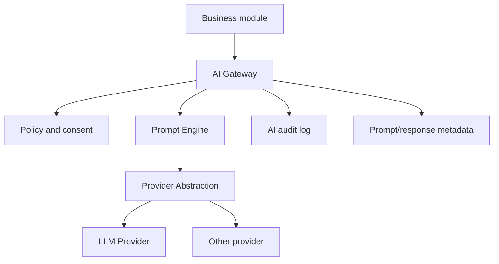
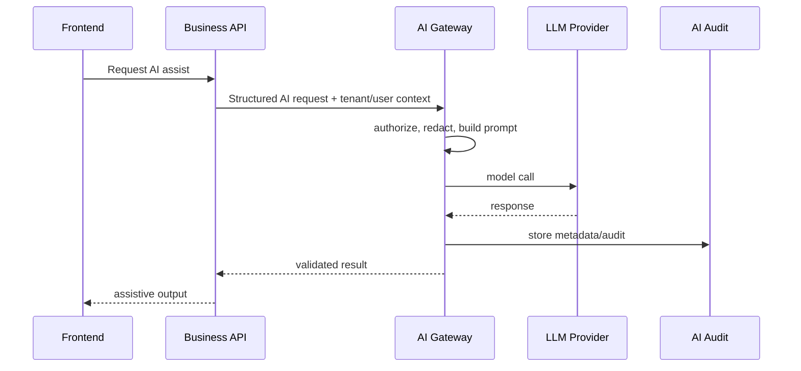

# AI-Ready Architecture

## Overview

This document describes future AI architecture only. No AI implementation is currently assumed by this handbook. AI features should integrate through explicit services and permissions, not by embedding model calls directly inside controllers or business logic.

## Principles

- AI must be opt-in by tenant/module.
- AI must not bypass RBAC, branch scope, tenant isolation, audit, or data retention rules.
- Prompts and model responses should be auditable where they affect business decisions.
- Human approval is required for employment-impacting decisions.
- PII minimization and redaction should be default.

## Target AI Architecture

## AI Gateway

Future Enhancement:

- Central service for all AI calls.
- Enforces tenant settings, permissions, rate limits, and consent.
- Applies data redaction.
- Adds audit and cost tracking.
- Blocks direct provider calls from business modules.

## Prompt Engine

Future Enhancement:

- Versioned prompts.
- Tenant/module prompt overrides with approval.
- Prompt input schemas.
- Output validation with Zod/class-validator-like schemas.
- Safety filters for employment decisions.

## Provider Abstraction

Future Enhancement:

- Provider-neutral interface.
- Model selection policy.
- Timeout/retry/circuit breaker.
- Cost and latency metrics.
- Fallback rules.

## LLM Providers

Future Enhancement:

- OpenAI provider.
- Optional alternate providers.
- Embeddings provider for search/semantic matching.
- Provider credentials through secrets manager.

## Recruitment AI

Future Enhancement:

- Job description drafting.
- Candidate summary and resume parsing assist.
- Interview question suggestions.
- Offer letter drafting.

Important: AI must not auto-reject or auto-rank candidates without human review and audit.

## Performance AI

Future Enhancement:

- Review summary assistant.
- Attendance behavior insight explanation.
- KPI narrative drafting.

Important: AI should support reviewers, not replace final ratings.

## Compliance AI

Future Enhancement:

- Policy summarization.
- Document classification.
- Expiry/risk explanation.
- Checklist generation.

Important: legal/compliance outputs need disclaimers and human approval.

## Training AI

Future Enhancement:

- Training plan suggestions.
- Skill gap summaries.
- Quiz/content generation.

## Analytics AI

Future Enhancement:

- Natural-language report query assistant.
- Trend explanation.
- Dashboard narrative generation.

## Data Controls

Future Enhancement:

- Tenant AI enablement flag.
- Per-module AI permissions.
- Prompt/response retention policy.
- PII redaction pipeline.
- Human override and feedback loop.

## Integration Pattern

## Responsibilities

- Business modules request AI assistance but do not call providers directly.
- AI Gateway enforces policy, consent, rate limits, tenant settings, and audit.
- Prompt Engine owns prompt templates and output schemas.
- Provider Abstraction owns model/provider-specific calls.

## Relationships

Future AI features should connect to recruitment, performance, compliance, training, and analytics through the gateway while reusing existing auth, tenant, branch, audit, and notification architecture.

## Current Implementation

No production AI gateway, prompt engine, provider abstraction, or AI modules were identified in the current codebase. Everything in this document is Future Enhancement by design.

## Risks

- AI outputs can introduce bias, hallucination, or privacy leakage.
- Direct model calls from modules would bypass audit and tenant policy.
- Employment-impacting AI decisions can create legal and ethical exposure.

## Best Practices

- Keep humans in control for HR decisions.
- Store prompt metadata and decision context for audit.
- Minimize PII in model input.
- Validate structured outputs before use.
