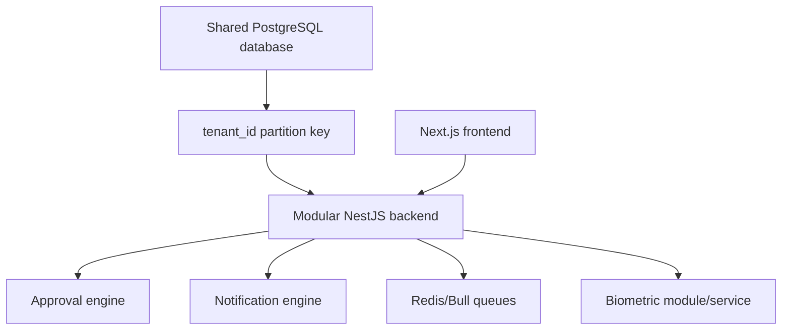
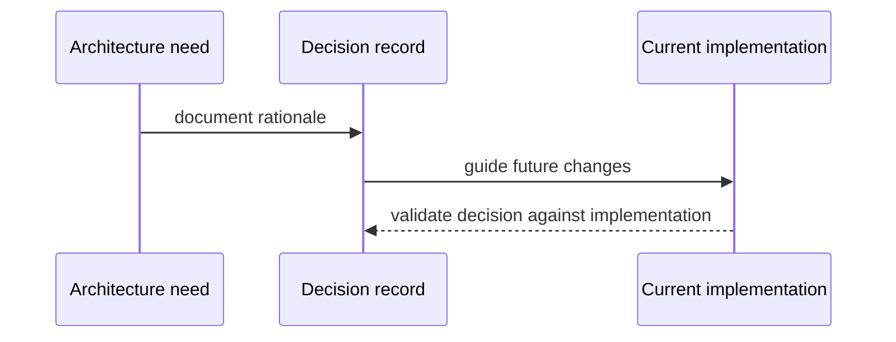

# Architecture Decisions

## ADR-001: Shared Database

Status: Accepted

Decision: Use a shared PostgreSQL database and shared schema for all customer organizations.

Rationale:

- Simpler operations for a multi-module HRMS.
- Easier cross-module reporting.
- Lower cost than database-per-tenant.
- Existing migrations and services are built around `tenant_id`.

Consequences:

- Every query must enforce tenant isolation.
- Security depends on consistent application filters unless row-level security is added.

Future migration plan: add row-level security or split heavy tenants only if scale/compliance requires it.

## ADR-002: `tenant_id` As Partition Key

Status: Accepted

Decision: Store `tenant_id` on most business tables and include it in unique constraints/indexes.

Rationale:

- Direct tenant filtering.
- Tenant-scoped uniqueness.
- Works with shared schema and reporting.

Consequences:

- Missing tenant filters create IDOR risk.
- Cross-tenant platform operations need deliberate guard paths.

## ADR-003: Approval Engine

Status: Accepted

Decision: Use a central approval engine and branch approval chains for multi-step workflows.

Rationale:

- Avoids duplicating approval logic in leave, payroll, recruitment, exit, finance, and compliance.
- Allows dynamic branch roles such as branch HR and branch manager.
- Supports inbox, analytics, escalation, realtime updates.

Consequences:

- Business modules must integrate consistently with `approval_requests`.
- Approval state and source entity state must remain synchronized.

## ADR-004: Notification Engine

Status: Accepted

Decision: Use `NotificationEmitterService` and `NotificationsModule` for cross-module in-app/realtime notifications.

Rationale:

- Common notification center.
- Realtime user feedback.
- Shared persistence and preferences.

Consequences:

- External channels are not yet universal.
- Direct emission patterns should be standardized over time.

## ADR-005: Biometric Microservice And Backend Biometrics Module

Status: Accepted

Decision: Keep biometric device integration isolated through a dedicated FastAPI service and a backend biometrics module.

Rationale:

- Device integrations have different runtime/network needs than core HRMS.
- Python ecosystem is useful for device clients and Celery tasks.
- Backend module owns HRMS attendance integration, queues, normalization, audit, and realtime UI.

Consequences:

- Requires service API keys/callback contracts.
- Needs clear ownership between biometric service DB and HRMS DB.

## ADR-006: Modular NestJS Backend

Status: Accepted

Decision: Use NestJS modules by business domain.

Rationale:

- Clear module boundaries.
- Guards/interceptors/pipes support enterprise API concerns.
- Bull, schedules, WebSockets, Swagger, and validation integrate well.

Consequences:

- Circular dependencies must be managed carefully.
- Direct SQL requires discipline in service layer.

## ADR-007: Next.js Frontend

Status: Accepted

Decision: Use Next.js app router for customer, employee, manager, career, auth, and operations portals.

Rationale:

- One frontend deployment can host multiple portal experiences.
- Route groups map well to security/UX boundaries.
- React Query/Zustand support rich dashboards and stateful workflows.

Consequences:

- Backend remains authoritative for authorization.
- Middleware can only use non-sensitive hints, not localStorage JWT.

## ADR-008: PostgreSQL

Status: Accepted

Decision: Use PostgreSQL as primary relational datastore.

Rationale:

- Strong relational fit for HR/payroll/workflow data.
- Transaction support.
- JSONB flexibility where needed.
- Mature indexing and reporting support.

Consequences:

- Large report queries need careful indexing and query plans.
- Migration discipline is required.

## ADR-009: Redis

Status: Accepted, optional at runtime

Decision: Use Redis for Bull queues and Redis-backed cache/queue behavior, while allowing local startup without Redis through mock queues.

Rationale:

- Queue-backed workloads need retries, backoff, concurrency, and DLQ-style inspection.
- Local/dev startup should not fail when Redis is unavailable.

Consequences:

- `REDIS_ENABLED=false` means queued work will not actually process.
- Production must run Redis for payroll payouts, biometric ingestion/sync, and historical imports.

## ADR-010: Future Migration Plans

Status: Proposed

Plans:

- Standardize authorization guard coverage.
- Add domain event/outbox architecture.
- Add row-level security if required.
- Move object storage to production S3/MinIO with encryption and lifecycle policies.
- Separate API and worker deployments.
- Add automated CI/CD and DR runbooks.

## Overview Diagram

## Sequence Diagram

## Responsibilities

- ADRs explain why current architecture exists.
- Developers use ADRs to avoid re-litigating settled choices without new evidence.
- Future migration notes identify where the decision may evolve.

## Relationships

The decisions are connected: shared database requires `tenant_id`; modular NestJS hosts approval/notification engines; Redis enables queues; Next.js consumes backend APIs; biometric integration is isolated for device complexity.

## Important Notes

- ADRs are documentation-only and do not imply that future plans are implemented.
- "Accepted" means the current codebase follows this decision, not that it is irreversible.

## Risks

- Decisions can become stale if architecture changes without updating this file.
- Shared database and direct SQL increase the need for careful security reviews.

## Best Practices

- Add or update an ADR when introducing a new infrastructure pattern.
- Keep ADRs factual and linked to implementation evidence.
- Mark speculative items as proposed or Future Enhancement.
