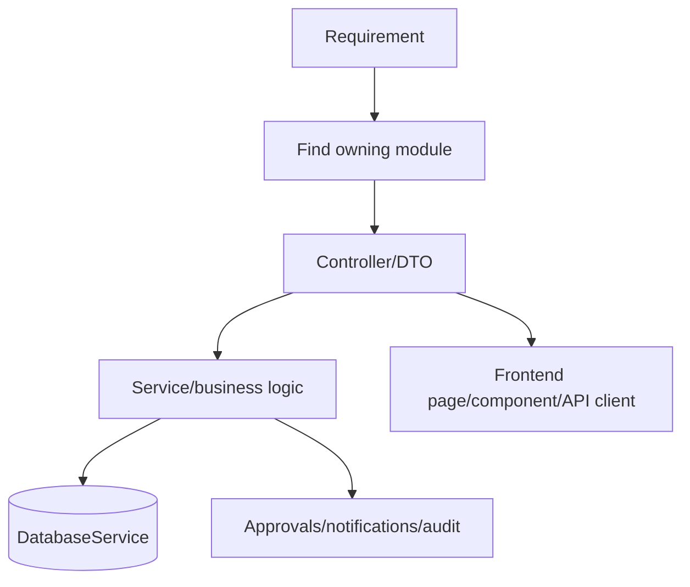
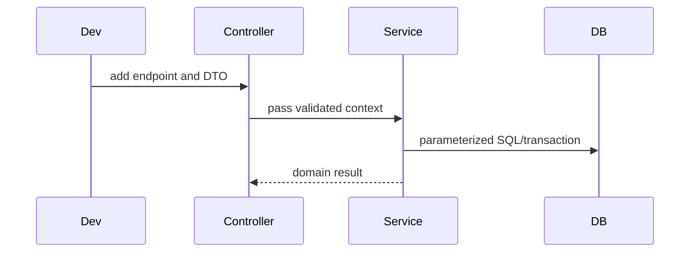

# Developer Guide

## Overview

This guide describes where to extend the current implementation without breaking architecture boundaries.

## Coding Conventions

- Follow existing NestJS module/controller/service structure.
- Keep business logic in services, not controllers.
- Use DTOs with class-validator for external input.
- Use parameterized SQL through `DatabaseService`.
- Keep tenant and branch scope explicit.
- Use existing shared services before adding new infrastructure.
- Do not bypass guards or authorization helpers.

## Folder Structure

| Area | Where |
| --- | --- |
| Backend module | `backend/src/modules/<module>/` |
| Backend controllers | `backend/src/modules/<module>/controllers/` or module root for older modules |
| Backend services | `backend/src/modules/<module>/services/` |
| Backend DTOs | `backend/src/modules/<module>/dto/` |
| Backend migrations | `backend/migrations/` |
| Shared backend utilities | `backend/src/shared/` |
| Frontend pages | `frontend/src/app/<route-group>/...` |
| Frontend components | `frontend/src/components/<module>/` |
| Frontend API clients | `frontend/src/lib/*-api.ts` |
| Frontend stores | `frontend/src/store/` |
| Biometric service | `biometric-service/app/` |

## Where To Add APIs

1. Add or reuse a controller in the owning module.
2. Add DTO validation for request payloads.
3. Add guards:
   - `JwtAuthGuard` for authenticated customer APIs.
   - `ActiveOrgGuard` for tenant-scoped APIs.
   - `PermissionGuard` and `@RequirePermission()` for sensitive actions.
   - Internal staff guards for `/operations` APIs.
4. Delegate to a service.
5. Use `DatabaseService` with parameterized SQL.
6. Return the existing response shape: `{ success, data, meta, error }` where used.

## Where To Add Frontend Pages

- Customer admin: `frontend/src/app/(admin)/dashboard/...`
- Employee self-service: `frontend/src/app/(employee)/...`
- Manager: `frontend/src/app/(manager)/...`
- Platform operations: `frontend/src/app/(operations)/operations/...`
- Auth: `frontend/src/app/(auth)/...`

Add reusable UI under `frontend/src/components/<module>/` and API clients under `frontend/src/lib/`.

## Where To Add Migrations

Add SQL migration files under `backend/migrations/` using the next numeric prefix. Keep migrations additive where possible:

- `CREATE TABLE IF NOT EXISTS`
- `ALTER TABLE ... ADD COLUMN IF NOT EXISTS`
- `CREATE INDEX IF NOT EXISTS`
- Backfills that can be rerun safely where possible

Do not modify old migrations that may already be applied to shared environments unless there is a documented migration-repair plan.

## How To Extend Modules

- Identify the owning module first.
- Reuse exported services from related modules.
- Avoid writing directly to another module's tables unless that is already the established pattern and is wrapped in a transaction.
- Update reports only through `ReportsModule` when adding reportable data.
- Update notifications through `NotificationEmitterService`.
- Update approvals through `ApprovalsModule`.

## How To Add Workflows

1. Model the source entity and states.
2. Define tenant/branch ownership.
3. Add approval request integration if human approval is needed.
4. Add notifications for state transitions.
5. Add audit log entries for sensitive state changes.
6. Add report impact if the workflow changes operational metrics.
7. Add failure scenarios and retry/idempotency behavior.

## How To Write Services

- Accept tenant/user context explicitly.
- Validate ownership before mutation.
- Use transactions for multi-table changes.
- Keep SQL readable and parameterized.
- Return domain objects, not HTTP responses.
- Keep side effects ordered: commit data first, then emit notifications/realtime events.

## How To Add Notifications

- Use `NotificationEmitterService`.
- Include tenant, target users, title, message, type, priority, and source module.
- Treat email/SMS/WhatsApp/push as Future Enhancement unless integrating an implemented channel.

## How To Add Approvals

- Reuse approval workflow types and branch approval chains.
- Create an `approval_requests` record through the approval engine.
- Keep source entity status synchronized with approval status.
- Emit approval notifications.
- Handle cancellation/escalation where relevant.

## How To Add Audit Logs

- Use `AuditLogService`.
- Log actor, tenant, entity type, entity ID, action, old/new values, IP/user-agent where available.
- Log access denials for sensitive authorization failures.
- Do not store secrets in audit values.

## Validation And Verification

Before merging:

- Run backend tests relevant to touched modules.
- Run frontend tests when UI changes.
- Run build/type-check commands.
- Verify migrations apply cleanly.
- Verify tenant/branch authorization manually for sensitive endpoints.

## Current Known Risks To Respect

- Some controllers are documented as missing complete permission guards. Do not copy that pattern.
- `BranchAccessGuard` exists but is not the universal enforcement mechanism.
- Queue-backed workflows require Redis in production.
- Storage local mode should not be treated as production-secure for sensitive documents.

## Architecture Diagram

## Sequence Diagram

## Important Notes

- This guide documents current conventions; it does not authorize source changes for this documentation task.
- Existing behavior should be preserved unless a future task explicitly requests implementation work.

## Best Practices

- Make the smallest change that solves the problem.
- Add tests when changing shared behavior or security-sensitive flows.
- Prefer existing helpers over new abstractions.
- Update this handbook when adding new architecture patterns.

## Future Enhancements

- Add module scaffolding templates.
- Add architecture lint rules for guards and module boundaries.
- Add endpoint authorization checklist to pull request templates.
