# Enterprise SaaS Architecture

## Overview

This document is the official Enterprise SaaS Architecture Handbook for the AI-HRMS platform. It describes the current SaaS implementation, portal separation, tenancy model, lifecycle flows, billing/subscription model, storage strategy, security boundaries, and enterprise scalability direction.

Current implementation is the source of truth. Anything planned but not implemented is explicitly marked as **Future Enhancement**.

## 1. Platform Overview

### Overview

AI-HRMS is a multi-tenant hotel workforce management platform implemented as:

- A Next.js frontend with separate portal route groups.
- A modular NestJS backend API.
- A separate FastAPI biometric service.
- A shared PostgreSQL database.
- Optional Redis/Bull queues.
- Local or MinIO/S3-compatible object storage.
- Prometheus/Grafana/Loki monitoring.

### Purpose

The SaaS platform supports internal platform operations, customer organization management, HRMS operations, employee self-service, manager workflows, recruitment/career entry, attendance, payroll, leave, performance, compliance, assets, reports, billing, and biometric attendance.

### Current Implementation

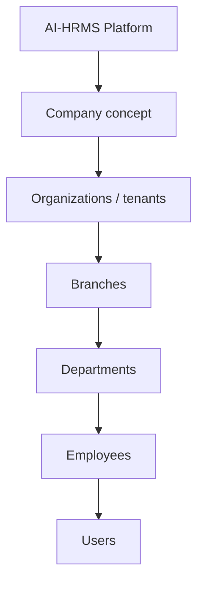

Important implementation note: "Company" is a SaaS/business concept in this document. In the current codebase, the dominant persisted customer boundary is `tenants` / organizations. A separate standalone company entity was not identified.

### Architecture Diagram

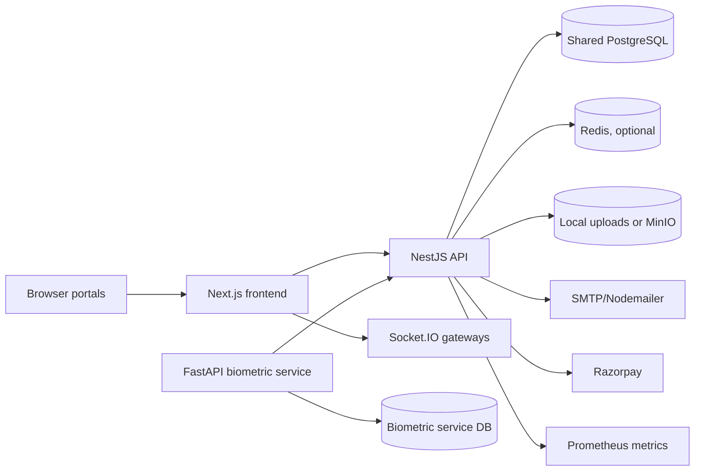

### Responsibilities

- Platform operates the SaaS product and internal operations portal.
- Customer organizations operate their HRMS workspaces.
- Branches provide local operating scope.
- Employees use self-service workflows.

### Strengths

- Modular backend.
- Shared database with `tenant_id` isolation.
- Portal separation between internal platform staff and customer users.
- Optional Redis queue processing.
- Monitoring stack present.

### Limitations

- Company is not a first-class persisted model in the inspected implementation.
- Dedicated database/schema per enterprise customer is not implemented.
- Training and AI modules are not implemented as current runtime modules.

### Future Enhancements

- First-class company/legal entity model if multi-organization company ownership is required.
- Tenant registry and database routing.
- Dedicated database/schema/storage for enterprise customers.
- Regional and multi-region deployments.

## 2. Platform Vs Customer Architecture

### Overview

AI-HRMS separates user experiences into five portal categories.

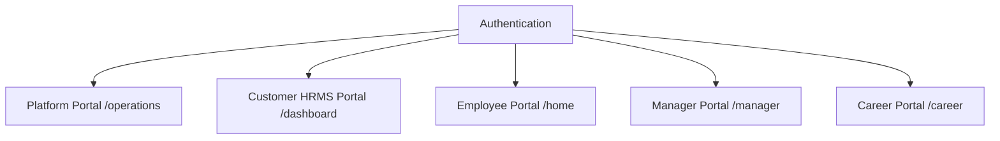

### Current Implementation

| Portal | Purpose | Users | Authentication | Features | Navigation | Responsibilities |
| --- | --- | --- | --- | --- | --- | --- |
| Platform Portal | Internal SaaS operations. | Internal staff and platform super admin. | `/platform-login`, `portal=platform`, `is_internal_staff=true`. | Organizations, staff, reports, offers, plan definition operations where wired. | Operations sidebar filtered by ops permissions. | Platform-owned lifecycle, staff, plans, reports. |
| Customer HRMS Portal | Customer admin workspace. | Super admin, org admin, branch admin, admin. | Customer login, active tenant selection. | HR, payroll, attendance, recruitment, compliance, assets, reports, finance, settings. | Dashboard sidebar filtered by hierarchy and template access. | Customer HRMS operations. |
| Employee Portal | Self-service. | Employees. | Customer login and employee user type. | Attendance, leave, payslips, profile, shifts, documents, exit, notifications. | Employee layout/navigation. | Self-service HR workflows. |
| Manager Portal | Manager views. | Managers/supervisors where route access is granted. | Customer login. | Manager-specific views. | Manager route group. | Team workflow visibility. |
| Career Portal | Candidate-facing entry. | Candidates/public applicants. | Public/candidate flow where implemented. | Career opportunities/application surfaces. | Career route group. | Recruitment entry point. |

### Sequence Diagram

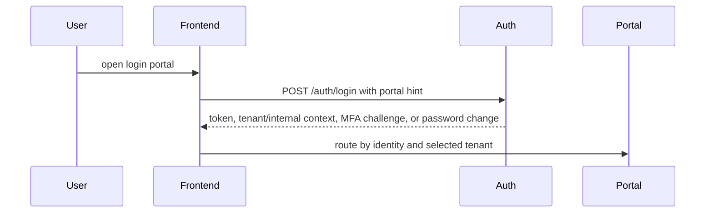

### Strengths

- Platform/customer separation is enforced server-side through portal checks.
- Internal platform roles use a separate permission registry.
- Customer hierarchy and branch scope are separate from platform operations roles.

### Limitations

- Platform and customer portals share one frontend deployment.
- Middleware uses a non-sensitive portal cookie as a UX routing hint, not an authorization boundary.

### Future Enhancements

- Dedicated platform/customer subdomains.
- Stronger portal-specific deployment policy.
- SSO/IdP integration for enterprise customers.

## 3. Platform User Hierarchy

### Overview

AI-HRMS has two distinct identity families:

- Platform/internal staff identities.
- Customer HRMS identities.

Candidates are recruitment participants and are not equivalent to authenticated HRMS users unless converted/invited.

### Current Implementation

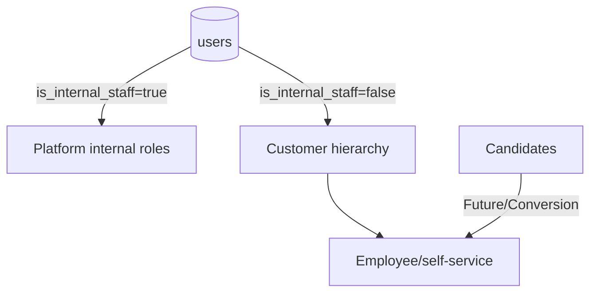

### Role Matrix

| User type | Current implementation | Scope | Can do | Cannot do |
| --- | --- | --- | --- | --- |
| Platform Super Admin | `users.internal_role = platform_super_admin`. | Platform-wide operations. | Bypass ops permissions, manage platform-owned operations such as internal staff where implemented. | Should not act as customer HRMS identity unless separately assigned customer membership. |
| Platform Operations Staff | Internal staff roles through `internal_role`. | Platform portal only. | Operate assigned platform areas based on ops permissions. | Access customer HRMS data as a customer user. |
| Finance Staff | `finance_executive` / `finance_manager`. | Platform finance operations. | Manage platform billing plans where ops permission grants it. | Customer payroll/finance without customer identity. |
| Support Staff | `customer_support_*` / `customer_success_*`. | Platform support/CS operations. | View/manage allowed organization lifecycle/support areas. | Bypass customer tenant RBAC. |
| Sales Staff | `sales_executive` / `sales_manager`. | Platform sales/org lifecycle. | Organization operations where permission grants it. | Customer HRMS module operations. |
| Implementation Team | Not a separate named current role. | Future Enhancement. | Future onboarding/provisioning workflows. | Current implementation does not define this dedicated role. |
| Customer Company Admin | Conceptual SaaS role. | Future/organization ownership. | In current code this is closest to org admin/customer super admin patterns. | Not implemented as a separate company-level persisted identity. |
| Organization Admin | `user_tenants.user_type = org_admin`. | One organization, all branches. | Manage org-wide customer HRMS data. | Access other organizations unless separately assigned. |
| Branch Admin | `user_tenants.user_type = branch_admin` + `branch_user_access`. | Assigned branches. | Manage branch-scoped HRMS operations. | See unrestricted organization-wide data. |
| Manager | Position/role concept, not a top-level `user_type`. | Team/branch depending assignment. | Manager views and approval responsibilities where configured. | Inherit platform/customer authority automatically. |
| Employee | `user_tenants.user_type = employee`. | Self-service. | Use employee portal and self endpoints. | Admin dashboards and organization-wide operations. |
| Candidate | Recruitment candidate records. | Recruitment pipeline/career portal. | Apply/progress through recruitment workflows. | Authenticated HRMS access unless converted/invited. |

### Sequence Diagram

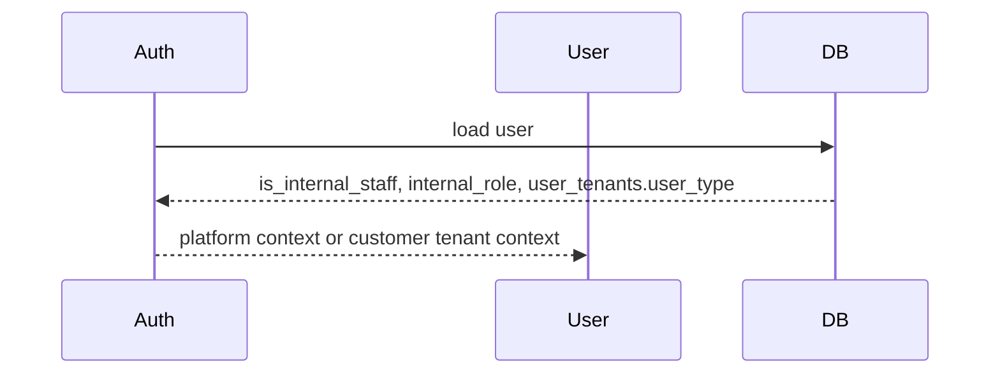

### Strengths

- Internal platform permissions and customer HRMS permissions are separate.
- Organization/branch/customer scopes are explicit.
- Platform portal rejects customer accounts and vice versa.

### Limitations

- Company Admin and Implementation Team are conceptual/future roles, not dedicated implemented user types.
- Manager is not a distinct top-level `user_type` in the same hierarchy as org/branch/admin/employee.

### Future Enhancements

- Dedicated company-level admin model.
- Dedicated implementation/onboarding role.
- More granular support and implementation scopes.

## 4. Company Model

### Overview

The requested enterprise hierarchy is:

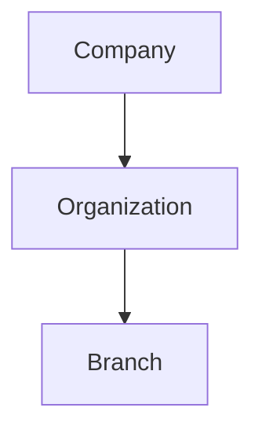

### Purpose

A company model is useful when one customer/legal entity owns multiple organizations or operating entities. It can support consolidated billing, contracts, storage quotas, enterprise reporting, and customer-level administrators.

### Current Implementation

- `tenants` represent organizations/customer workspaces.
- Branches belong to tenants/organizations.
- A first-class `companies` table or company-to-organization ownership model was not identified.
- Company-level behavior is currently represented through tenant/organization profile and billing concepts.

### Sequence Diagram

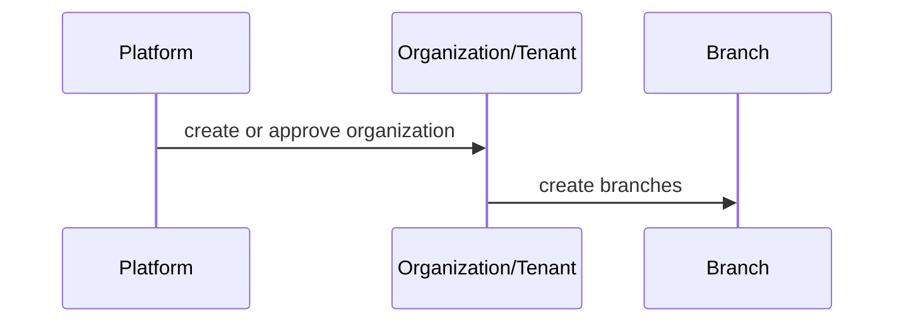

### Responsibilities

- Current organization/tenant owns HRMS data and configuration.
- Current branch owns local operating scope.
- Future company would own enterprise account, contract, billing, and organization grouping.

### Strengths

- Current tenant-first model is simple and direct.
- Organization and branch data are already well represented.

### Limitations

- No current company-level entity, company admin, or consolidated company account.
- Multi-organization customer rollups require future modeling.

### Future Enhancements

- `companies` entity.
- Company-to-organization relationship.
- Company admin role.
- Consolidated billing/subscription and storage allocation.
- Enterprise-level reporting.

## 5. Organization Lifecycle

### Overview

Organization lifecycle includes registration/creation, approval/provisioning, configuration, branch setup, employee creation, and go-live.

### Current Implementation

Organization lifecycle is implemented through platform, operations, organization registration, and tenant services. Billing/subscription and branch plan limits exist, but storage assignment and company-level provisioning are not a complete automated lifecycle.

### Lifecycle Diagram

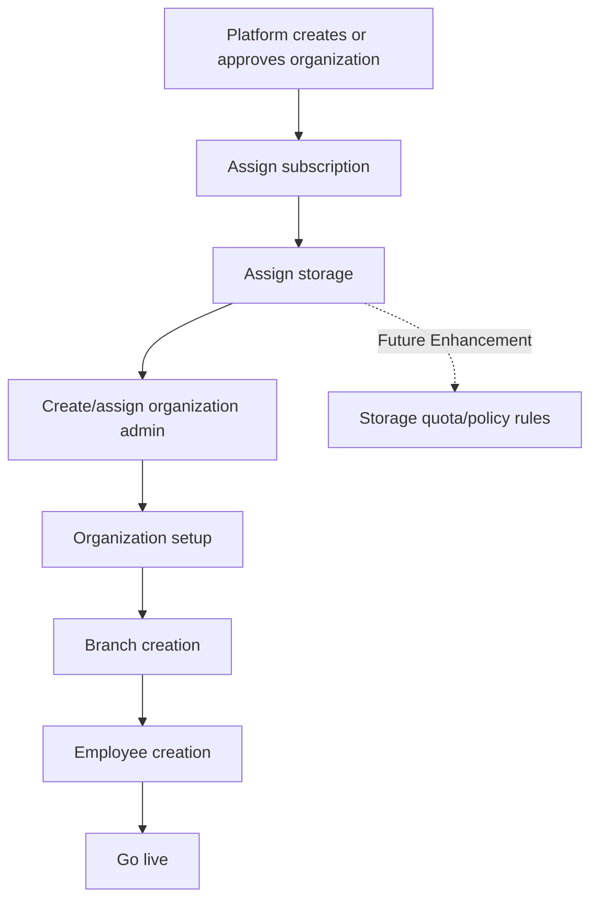

### Sequence Diagram

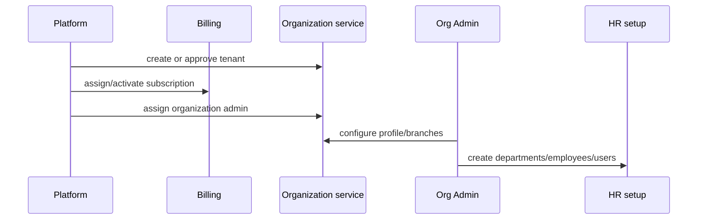

### Responsibilities

- Platform controls creation/approval/lifecycle status.
- Billing controls subscription and plan state.
- Organization admin controls customer-side setup.
- HR admins create employees and operational records.

### Strengths

- Organization registration and lifecycle services exist.
- Operations portal separates platform lifecycle work from customer HRMS work.
- Organization admin assignment is tracked on tenants.

### Limitations

- Company creation is not a first-class current flow.
- Storage assignment rules are not implemented.
- Go-live checklist is not a central module.

### Future Enhancements

- Company onboarding workflow.
- Provisioning checklist.
- Automated storage quota assignment.
- Implementation team handoff workflow.

## 6. Tenant Lifecycle

### Overview

Tenant lifecycle is the state progression for a customer organization.

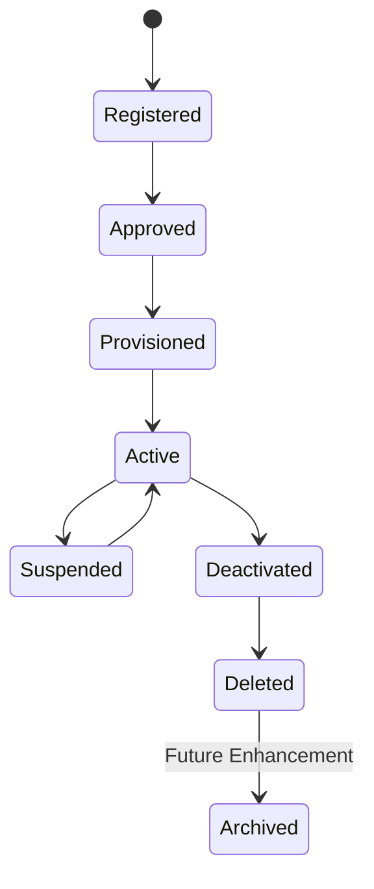

### Purpose

Tenant lifecycle controls when a customer workspace can be used, modified, suspended, restored, or retired.

### Current Implementation

Implemented areas include:

- Organization registration.
- Approval services.
- Operations organization lifecycle services.
- Tenant status/lifecycle fields.
- Activation/suspension/deletion patterns.
- Active organization guard for customer APIs.

### Sequence Diagram

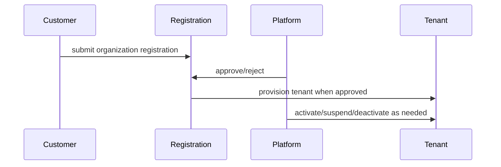

### Responsibilities

- Platform reviews and controls lifecycle.
- Customer admins configure approved tenants.
- Guards prevent inactive or invalid tenant access where applied.

### Strengths

- Registration and approval are separated from day-to-day HRMS work.
- Platform lifecycle is in the operations domain.

### Limitations

- Future archival is not implemented as a complete retained archive system.
- Lifecycle terminology may differ across older migrations and newer services.

### Future Enhancements

- Formal archival state and retention policy.
- Tenant export before deletion.
- Lifecycle event notifications and runbooks.

## 7. Authentication Model

### Overview

Authentication is centralized in the NestJS auth module with portal-aware login, JWT access tokens, refresh-token rotation, tenant selection, MFA, trusted devices, and session revocation.

### Current Implementation

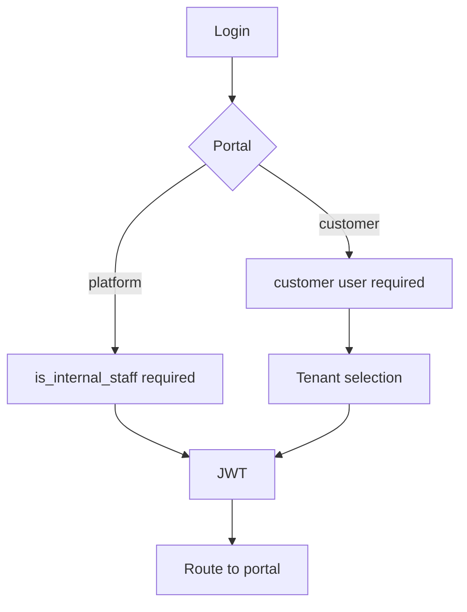

### Sequence Diagram

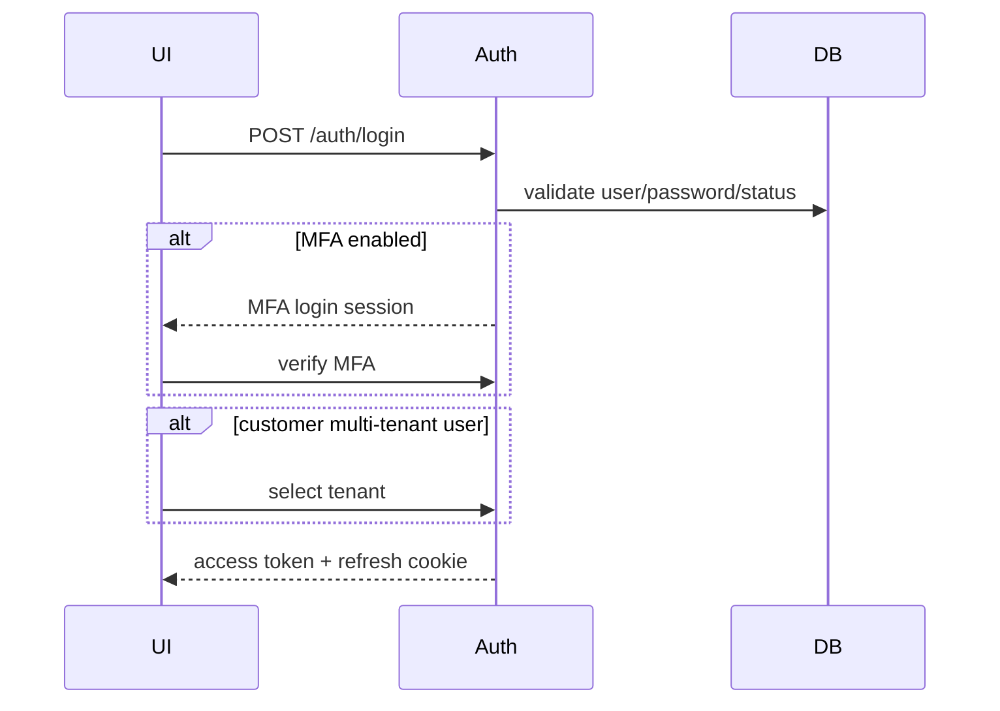

### Covered Login Types

- Platform login: `/platform-login`, internal staff only.
- Organization login: customer login plus tenant selection.
- Employee login: customer login and employee portal routing.
- Branch admin login: customer login with branch-scoped user type.
- Manager login: customer login; manager behavior comes from assignments/roles rather than a dedicated top-level user type.

### Responsibilities

- Auth service validates identity, account state, lockout, MFA, refresh sessions.
- JWT strategy reloads user and active tenant context.
- Frontend routes based on resolved identity.

### Strengths

- Server-side portal mismatch rejection.
- Refresh-token rotation.
- MFA and trusted devices.
- Tenant selection and organization switch.

### Limitations

- SSO/enterprise identity provider support is not implemented.
- Frontend middleware cannot read localStorage JWT; it only uses portal hint cookie.

### Future Enhancements

- Enterprise SSO.
- SAML/OIDC identity provider integration.
- SCIM provisioning.
- Per-tenant auth policy.

## 8. Multi-Tenancy Strategy

### Overview

AI-HRMS currently uses a shared database and shared schema with tenant-level isolation through `tenant_id`.

### Current Implementation

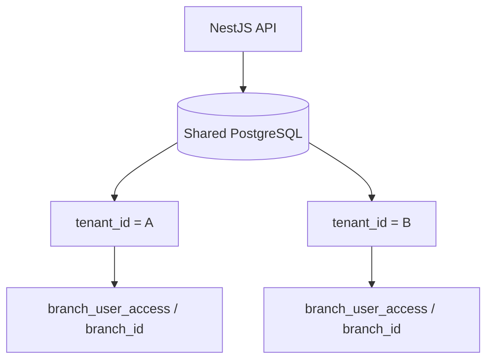

### Isolation Layers

- Tenant isolation: `tenant_id` in tables and queries.
- Branch isolation: `branch_id` and `branch_user_access`.
- Permission isolation: roles, positions, baseline user type permissions, ops permissions.
- Portal isolation: platform internal staff vs customer users.
- Object authorization: service-level ownership checks where implemented.

### Sequence Diagram

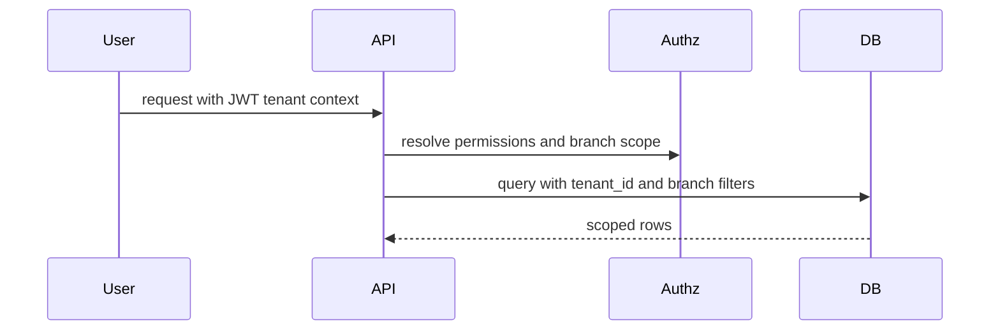

### Strengths

- Cost-efficient shared database.
- Simplifies reporting across modules.
- Tenant-scoped indexes and uniqueness are widely used.
- Branch scope supports hotel/location operations.

### Limitations

- No database-per-tenant routing.
- No schema-per-tenant routing.
- No central tenant registry for database routing.
- Tenant isolation depends on consistent application filters.

### Future Enhancements

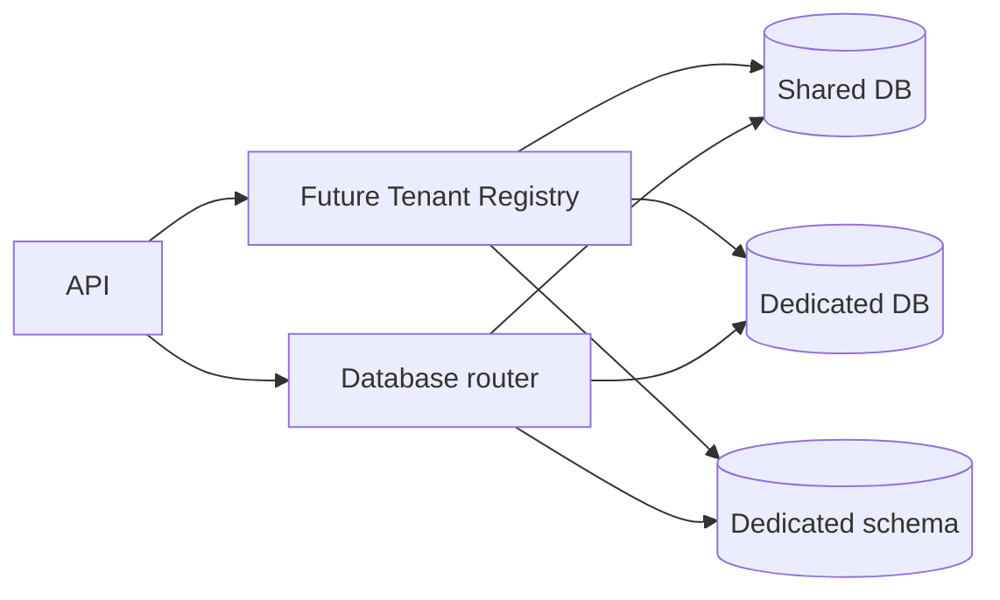

- Dedicated database support.
- Dedicated schema support.
- Hybrid shared/dedicated architecture.
- Tenant registry.
- Database routing.
- Tenant-level residency/region settings.

## 9. Billing And Subscription Architecture

### Overview

Billing supports plan catalog, modules/features/resources, subscriptions, invoices, transactions, and customer subscription actions.

### Current Implementation

Billing endpoints include:

- Plans.
- Modules.
- Features.
- Resources.
- Price calculation.
- Subscription read/subscribe/cancel.
- Invoices and invoice payment.
- Transactions.
- Summary.

Plan definitions and platform-wide catalog mutation are platform-owned where guarded by internal staff operations permissions.

### Billing Flow

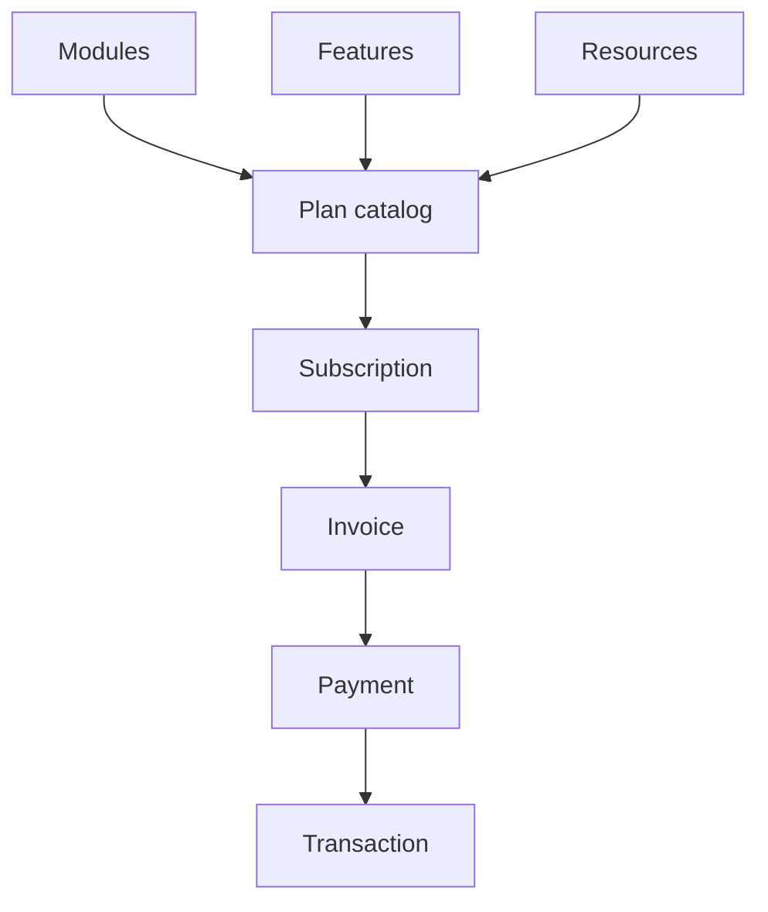

### Sequence Diagram

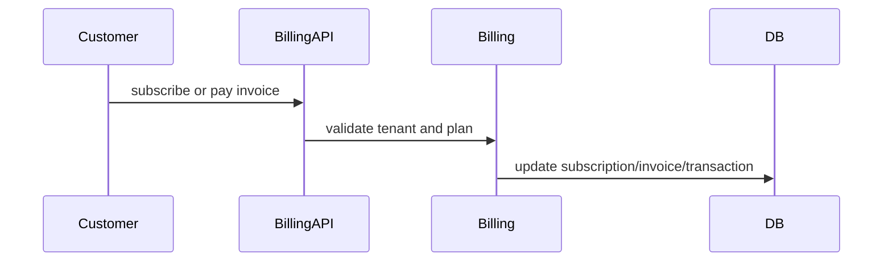

### Responsibilities

- Platform owns plan definitions and catalog.
- Customer owns subscription self-service actions where allowed.
- Billing module owns subscription and invoice state.

### Strengths

- SaaS billing is represented in code and migrations.
- Plan/module/feature/resource concepts exist.
- Branch limits and plan-limit constants exist.

### Limitations

- Storage quota enforcement is not currently implemented.
- Future metered billing is not implemented.
- Enterprise custom plan workflow is not a complete separate module.
- Renewal workflows were not confirmed as complete.

### Future Enhancements

- Metered billing.
- Usage tracking.
- Storage quotas.
- Employee/branch/module overage tracking.
- Custom enterprise plan approval.
- Add-on modules and marketplace billing.

## 10. Feature Licensing

### Overview

Feature licensing is represented through billing modules/features/resources and frontend/access configuration patterns. Not every requested module is implemented.

### Current Implementation

Implemented or represented modules include:

- Core HR.
- Payroll.
- Recruitment.
- Compliance.
- Assets.
- Finance.
- Biometrics.
- Reports.
- Billing.
- Operations.
- Notifications.
- Approvals.
- Exit management.
- Historical attendance import.

Training and AI are Future Enhancement.

### Architecture Diagram

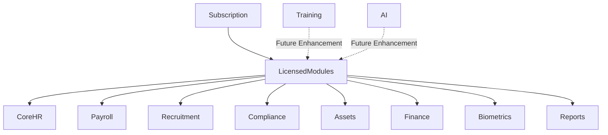

### Sequence Diagram

```mermaid
sequenceDiagram
  participant UI
  participant Billing
  participant Module
  UI->>Billing: load subscription/modules
  Billing-->>UI: licensed capability context
  UI->>Module: show or hide licensed module surfaces
```

### Strengths

- Billing catalog has modules/features/resources.
- Sidebar/template access supports customer-specific UI visibility.

### Limitations

- A universal feature-flag enforcement service was not identified.
- Module licensing enforcement may vary by feature.

### Future Enhancements

- Central feature flag service.
- Module marketplace.
- Add-on purchases.
- AI feature licensing.
- Training module licensing.

## 11. Storage Model

### Overview

Storage is centralized through `FileUploadService`, which supports local disk and MinIO/S3-compatible object storage.

### Current Implementation

```mermaid
flowchart TD
  Upload --> FileUploadService
  FileUploadService -->|STORAGE_DRIVER=local| Local[uploads directory]
  FileUploadService -->|S3 compatible| MinIO[MinIO bucket]
  MinIO --> SignedURL[Signed download URL]
```

### Sequence Diagram

```mermaid
sequenceDiagram
  participant UI
  participant API
  participant Storage
  participant DB
  UI->>API: upload file
  API->>Storage: validate and store
  API->>DB: save metadata and ownership
  API-->>UI: metadata/url
```

### Responsibilities

- `FileUploadService` validates and writes files.
- Owning modules persist business metadata.
- Object storage stores file bytes.

### Strengths

- Tenant-scoped object key pattern.
- MinIO signed downloads.
- Validation for image and document MIME types.

### Limitations

- Storage quotas are not enforced.
- Google Drive backups are not implemented.
- S3 production lifecycle policies are not implemented.
- Local mode does not provide signed URL access control.

### Future Enhancements

- AWS S3 production architecture.
- Per-organization storage quotas.
- Google Drive backup integration.
- Lifecycle/retention policies.
- Virus scanning and encryption policy.

## 12. Platform Responsibilities

### Overview

The platform controls SaaS-level operations, not customer HRMS day-to-day records unless acting through explicit support/operations workflows.

### Current Implementation

Platform responsibilities are implemented across operations, billing, organization registration, and platform modules.

```mermaid
flowchart TD
  Platform --> InternalStaff
  Platform --> OrganizationCreation
  Platform --> BillingPlans
  Platform --> Subscriptions
  Platform --> Support
  Platform --> Monitoring
  Platform --> Reports
  Platform --> Analytics
```

### Responsibilities

Platform controls:

- Internal staff.
- Organization registration approval/lifecycle.
- Organization creation/suspension/activation/deletion paths.
- Billing plan definitions where operations permissions guard them.
- Signup offers.
- Platform reports and analytics.
- Monitoring stack.
- Platform audit and operational visibility.

### Sequence Diagram

```mermaid
sequenceDiagram
  participant Staff
  participant OpsPortal
  participant API
  participant DB
  Staff->>OpsPortal: perform platform action
  OpsPortal->>API: internal staff guarded request
  API->>DB: update platform-owned state
```

### Strengths

- Operations portal is separate from customer dashboard.
- Ops permissions are separate from customer permissions.

### Limitations

- Some desired platform support modules are future or partial.
- Dedicated implementation team role is not current.

### Future Enhancements

- Platform settings center.
- Support ticketing.
- Implementation onboarding workspace.
- Platform notification templates.

## 13. Customer Responsibilities

### Overview

Customer admins operate the HRMS workspace inside their organization/tenant.

### Current Implementation

Customer responsibilities are implemented in customer HRMS modules and dashboard navigation.

```mermaid
flowchart TD
  CustomerAdmin --> OrganizationSettings
  CustomerAdmin --> BranchManagement
  CustomerAdmin --> Employees
  CustomerAdmin --> Attendance
  CustomerAdmin --> Payroll
  CustomerAdmin --> Recruitment
  CustomerAdmin --> Compliance
  CustomerAdmin --> Reports
```

### Responsibilities

Customer organization admins control:

- Organization profile/settings.
- Branch management.
- Departments/designations/positions.
- Employees and users.
- Attendance, leave, payroll, performance.
- Recruitment.
- Compliance and documents.
- Assets.
- Reports.
- Permissions/roles/positions.
- Branding/templates.

### Sequence Diagram

```mermaid
sequenceDiagram
  participant Admin
  participant Dashboard
  participant API
  participant DB
  Admin->>Dashboard: manage HRMS data
  Dashboard->>API: tenant-scoped request
  API->>DB: query/write with tenant_id and scope
```

### Strengths

- Customer HRMS has broad module coverage.
- Tenant and branch scopes are represented.

### Limitations

- Company-level customer admin is not a separate current role.
- Some permission guard coverage is documented elsewhere as inconsistent.

### Future Enhancements

- Company-level admin.
- Stronger centralized feature licensing and permission enforcement.
- Enterprise audit reports.

## 14. Branch Admin Responsibilities

### Overview

Branch admins are customer users scoped to assigned branches through `branch_user_access`.

### Current Implementation

```mermaid
flowchart TD
  BranchAdmin --> BranchScope[Assigned branch IDs]
  BranchScope --> Employees
  BranchScope --> Attendance
  BranchScope --> Leave
  BranchScope --> Reports
  BranchScope --> Assets
  BranchScope --> Performance
```

### Responsibilities

Branch admins can manage or view branch-scoped operations based on permissions:

- Branch employees.
- Attendance.
- Leave workflows.
- Recruitment/HR data where branch-scoped.
- Assets.
- Performance data.
- Branch reports.

### Restrictions

Branch admins cannot:

- Access other branches unless assigned.
- Manage platform operations.
- Act as organization admin unless separately assigned.
- Bypass tenant isolation.

### Sequence Diagram

```mermaid
sequenceDiagram
  participant BranchAdmin
  participant API
  participant Scope
  participant DB
  BranchAdmin->>API: request branch data
  API->>Scope: resolve accessible branch IDs
  API->>DB: query with branch filter
  DB-->>API: scoped rows
```

### Strengths

- Branch access is modeled explicitly.
- Branch-scoped query utilities exist.

### Limitations

- Branch access depends on consistent service-level filtering.
- `BranchAccessGuard` exists but is not the universal enforcement path.

### Future Enhancements

- Consistent branch-scope authorization checklist.
- Automated tests for branch leakage.

## 15. Enterprise Scalability

### Overview

The current shared-database architecture can support multi-tenant SaaS growth, but very large enterprise scale requires future routing, isolation, and regional architecture.

### Current Implementation

Current architecture:

- Shared PostgreSQL.
- Shared backend/frontend deployment.
- Optional Redis queues.
- MinIO/local storage.
- Monitoring stack.

### Scalability Diagram

```mermaid
flowchart TD
  Small[100 organizations] --> Shared[Shared DB/app cluster]
  Medium[1000 organizations] --> ReadReplica[Shared DB + read replicas + workers]
  Large[5000 organizations] --> Hybrid[Hybrid shared/dedicated architecture]
  Hybrid --> DedicatedDB[Dedicated databases]
  Hybrid --> DedicatedStorage[Dedicated storage]
  Hybrid --> DedicatedCompute[Dedicated compute]
  Hybrid --> Regional[Regional deployments]
```

### Sequence Diagram

```mermaid
sequenceDiagram
  participant API
  participant Registry as Future Tenant Registry
  participant DBRouter as Future DB Router
  participant DB
  API->>Registry: resolve tenant placement
  Registry-->>API: shared or dedicated target
  API->>DBRouter: route query
  DBRouter->>DB: execute on selected database
```

### Strengths

- Modular services and queues provide a scaling path.
- Shared DB lowers operational complexity for current scale.
- Metrics and monitoring provide observability foundations.

### Limitations

- Dedicated tenant compute/database/storage is not implemented.
- Regional routing is not implemented.
- HA/DR runbooks are not complete in the repo.

### Future Enhancements

- Support 100/1000/5000 organization tiers with defined infrastructure profiles.
- Dedicated database, storage, and compute for enterprise customers.
- Regional deployments.
- Disaster recovery runbooks.
- High availability topology.
- Backup/restore verification.

## 16. Security Model

### Overview

Security is layered across portal separation, authentication, JWT tenant context, customer RBAC, branch scope, object authorization, audit logging, storage validation, and platform/customer isolation.

### Current Implementation

```mermaid
flowchart TD
  Request --> Portal[Portal separation]
  Portal --> Auth[JWT / refresh / MFA]
  Auth --> Tenant[Tenant context]
  Tenant --> RBAC[RBAC and hierarchy]
  RBAC --> Branch[Branch scope]
  Branch --> ObjectAuth[Object authorization]
  ObjectAuth --> Audit[Audit logging]
```

### Sequence Diagram

```mermaid
sequenceDiagram
  participant User
  participant API
  participant Guard
  participant Service
  participant Audit
  User->>API: request
  API->>Guard: authenticate and authorize
  Guard-->>API: allowed or denied
  API->>Service: execute scoped action
  Service->>Audit: log sensitive action
```

### Responsibilities

- Auth protects identity.
- Guards protect route-level access.
- Services protect object-level ownership.
- Audit logs preserve sensitive actions.
- Storage layer validates file type/size and supports signed URLs for MinIO.

### Strengths

- Portal separation is server-side.
- MFA and refresh-token rotation exist.
- Branch and tenant scopes are modeled.
- Audit logs exist for key security and business events.

### Limitations

- Not all controllers have consistent permission guard coverage.
- Row-level security is not implemented.
- Local storage mode lacks signed URL semantics.

### Future Enhancements

- Database row-level security.
- Consistent authorization regression tests.
- Enterprise SSO/IdP.
- Central object authorization helper.
- Storage encryption/scanning policies.

## 17. Future Roadmap

### Overview

This section lists future enterprise enhancements. These are not current implementation unless explicitly stated elsewhere.

### Roadmap Diagram

```mermaid
flowchart TD
  EnterpriseRoadmap --> DedicatedDB[Dedicated database customers]
  EnterpriseRoadmap --> TenantRegistry[Tenant Registry]
  EnterpriseRoadmap --> HybridRouting[Hybrid database routing]
  EnterpriseRoadmap --> AIGateway[AI Gateway]
  EnterpriseRoadmap --> StorageQuotas[Storage quotas]
  EnterpriseRoadmap --> Marketplace[Marketplace]
  EnterpriseRoadmap --> Plugins[Plugin architecture]
  EnterpriseRoadmap --> Workflows[Workflow marketplace]
  EnterpriseRoadmap --> SSO[Enterprise SSO/IdP]
  EnterpriseRoadmap --> MultiRegion[Multi-region deployment]
  EnterpriseRoadmap --> DR[Disaster recovery]
```

### Future Enhancements

- Dedicated database customers.
- Tenant registry.
- Hybrid database routing.
- AI Gateway.
- Storage quotas.
- Marketplace.
- Plugin architecture.
- Workflow marketplace.
- Enterprise SSO and identity provider integration.
- Multi-region deployment.
- Disaster recovery runbooks.

### Strengths

- Current modular architecture provides a foundation for this roadmap.
- Billing, modules, and portals already exist as extension points.

### Limitations

- These roadmap items require explicit product, infrastructure, and security design before implementation.

## 18. Final Architecture Diagrams

### Platform Architecture

```mermaid
flowchart TD
  PlatformPortal --> OperationsAPI
  OperationsAPI --> Users[(Internal staff)]
  OperationsAPI --> Tenants[(Organizations)]
  OperationsAPI --> Billing[(Plans/subscriptions)]
  OperationsAPI --> Reports[(Platform reports)]
```

### Portal Architecture

```mermaid
flowchart LR
  Auth --> PlatformPortal
  Auth --> CustomerPortal
  Auth --> EmployeePortal
  Auth --> ManagerPortal
  Auth --> CareerPortal
```

### Company Hierarchy

```mermaid
flowchart TD
  Company[Company concept] --> Organization
  Organization --> Branch
  Branch --> Department
  Department --> Employee
```

### Tenant Hierarchy

```mermaid
flowchart TD
  Tenant[Organization / tenant] --> Branch
  Tenant --> Users
  Tenant --> Roles
  Tenant --> Templates
  Branch --> Employees
```

### Authentication Flow

```mermaid
sequenceDiagram
  participant UI
  participant Auth
  participant DB
  UI->>Auth: login
  Auth->>DB: validate
  Auth-->>UI: token or MFA/password challenge
  UI->>Auth: select tenant if needed
  Auth-->>UI: tenant-scoped token
```

### Billing Flow

```mermaid
flowchart TD
  Plan --> Subscription
  Subscription --> Invoice
  Invoice --> Payment
  Payment --> Transaction
```

### Organization Lifecycle

```mermaid
flowchart TD
  Registered --> Approved
  Approved --> Provisioned
  Provisioned --> Active
  Active --> Suspended
  Suspended --> Active
  Active --> Deactivated
  Deactivated --> Deleted
```

### Subscription Lifecycle

```mermaid
stateDiagram-v2
  [*] --> Trial: Future Enhancement where offered
  Trial --> Active
  [*] --> Active
  Active --> PastDue: Future Enhancement
  Active --> Cancelled
  PastDue --> Active
  Cancelled --> [*]
```

### Permission Hierarchy

```mermaid
flowchart TD
  PlatformSuperAdmin --> PlatformRoles
  CustomerSuperAdmin --> OrgAdmin
  OrgAdmin --> BranchAdmin
  BranchAdmin --> Admin
  Admin --> Employee
```

### Storage Architecture

```mermaid
flowchart TD
  API --> FileUploadService
  FileUploadService --> Local
  FileUploadService --> MinIO
  MinIO --> SignedURL
  API --> Metadata[(PostgreSQL metadata)]
```

### Database Architecture

```mermaid
flowchart TD
  API --> SharedDB[(Shared PostgreSQL)]
  SharedDB --> TenantId[tenant_id isolation]
  TenantId --> BranchId[branch_id isolation]
  TenantRegistry -.->|Future Enhancement| DBRouter
  DBRouter -.-> DedicatedDB[(Dedicated DB)]
```

### Module Relationships

```mermaid
flowchart TD
  Platform --> Auth
  Auth --> HR
  HR --> Attendance
  Attendance --> Payroll
  Attendance --> Performance
  Recruitment --> Employee
  Employee --> Exit
  Assets --> Exit
  Compliance --> Documents
  Biometrics --> Attendance
  Approvals --> Notifications
  Reports --> HR
  Reports --> Finance
```

## Final Notes

This document reflects the current architecture and distinguishes planned enterprise capabilities as Future Enhancement. It should be used together with the rest of the architecture handbook in `docs/architecture/` for module-level, workflow-level, database, deployment, security, and developer guidance.
