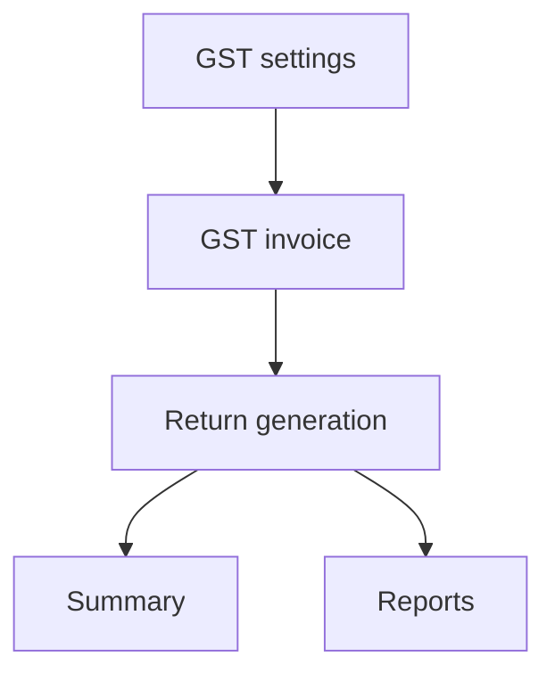
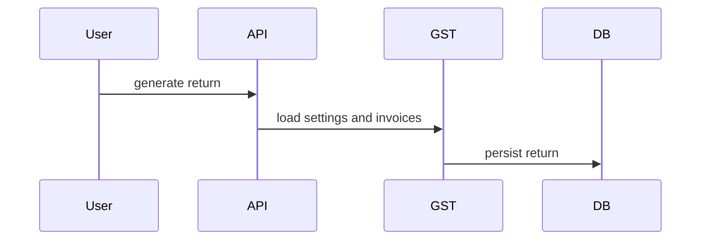

# GST Workflow

## Purpose

Manage GST settings, GST invoices, return generation, and summaries.

## Actors

Finance users, GST/compliance admins, org admins.

## Entry Points

- Backend: `/api/v1/gst/*`.
- Frontend: GST pages/components where wired.

## Business Workflow

## Backend Flow

GST controller/service handles settings, invoices, returns generation, and summary.

## Frontend Flow

Finance/GST UI reads settings, invoices, returns, and summaries.

## Database Interactions

GST migrations define GST settings, invoices/returns, and finance integration tables.

## Approval Workflow

Future Enhancement for return approval before filing.

## Notification Workflow

Future Enhancement for filing reminders, due dates, and return status notifications.

## Audit Workflow

Settings changes, return generation, invoice edits, and export actions should be audited.

## Reports Impact

GST summaries, finance reports, compliance reports.

## Cross-Module Integration

Finance invoices, compliance, reports, notifications.

## Sequence Diagram

## API Endpoints

`/gst/settings`, `/gst/invoices`, `/gst/returns/generate`, `/gst/summary`.

## Important Validations

Tenant, GSTIN/settings validity, invoice date range, duplicate return period, financial data integrity.

## Failure Scenarios

Missing GST settings, invalid invoice data, duplicate return, unauthorized generation.

## Future Enhancements

GST filing integration, return approval workflow, due-date scheduler, and statutory audit reports.
