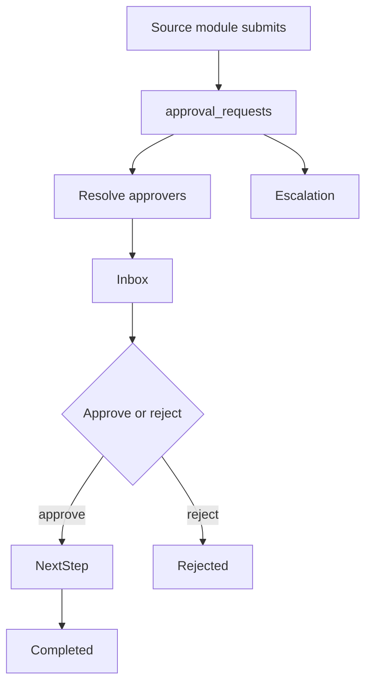
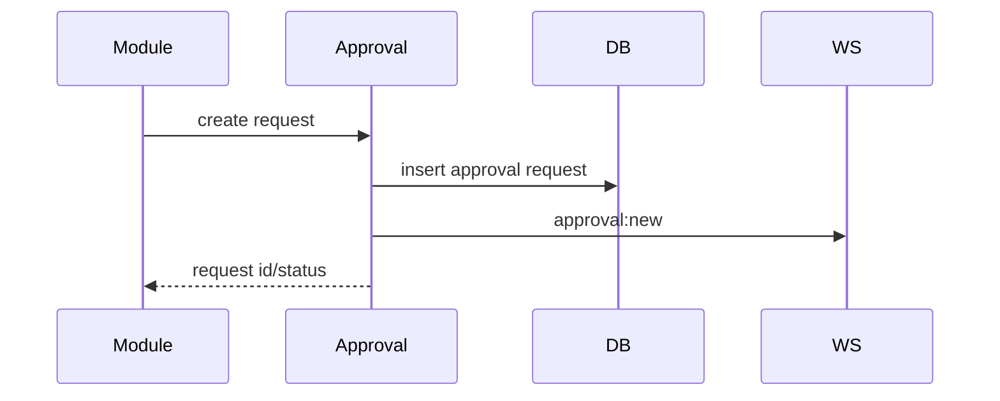

# Approvals Workflow

## Purpose

Provide centralized approval inbox, decisioning, escalation, analytics, and realtime updates for cross-module workflows.

## Actors

Submitters, approvers, admins, branch HR/managers, org admins.

## Entry Points

- Backend: `/api/v1/approvals/*`.
- Frontend: approval inbox, widgets, timelines, reason modals, WebSocket updates.

## Business Workflow

## Backend Flow

Approval engine creates and transitions approval requests, resolves approvers from branch chains/dynamic roles, emits notifications, and broadcasts gateway events.

## Frontend Flow

Approvers use inbox/submitted views and receive realtime updates.

## Database Interactions

Major tables include `approval_requests`, `branch_approval_chains`, related source entity approval fields.

## Approval Workflow

This is the workflow owner. Workflow types cover leave, payroll, attendance, onboarding, exit, vendor, fine, policy, and more.

## Notification Workflow

`ApprovalNotificationService` emits new/update/resolved notification events.

## Audit Workflow

Approval decisions should record actor, reason, state transition, and source entity.

## Reports Impact

Approval analytics, pending counts, workflow bottlenecks.

## Cross-Module Integration

HR, recruitment, exit, finance-like workflows, notifications, platform branch chains.

## Sequence Diagram

## API Endpoints

`/approvals/inbox`, `/approvals/submitted`, `/approvals/pending-count`, `/approvals/analytics`, `/approvals/:id`, `/approvals/:id/approve`, `/reject`, `/cancel`, `/escalate`.

## Important Validations

Tenant, approver identity, current step, status transition, branch chain configuration, duplicate decision prevention.

## Failure Scenarios

No approver found, stale request status, unauthorized decision, escalation target unavailable.

## Future Enhancements

Visual workflow builder, outbox events, approval SLA dashboards, and delegated approval.
