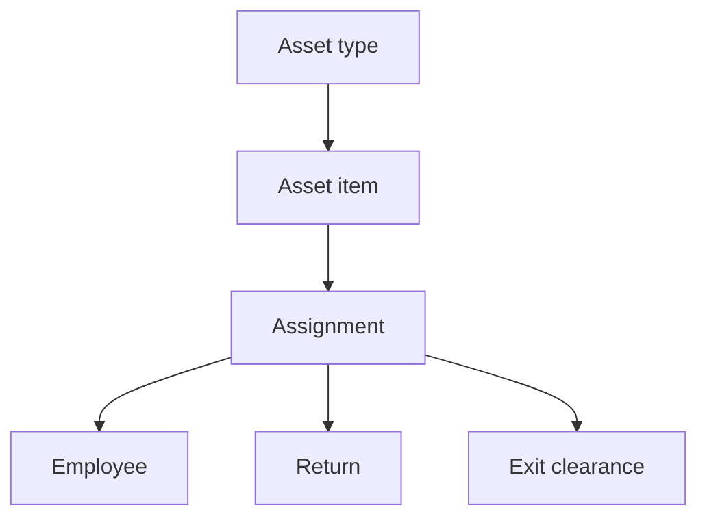
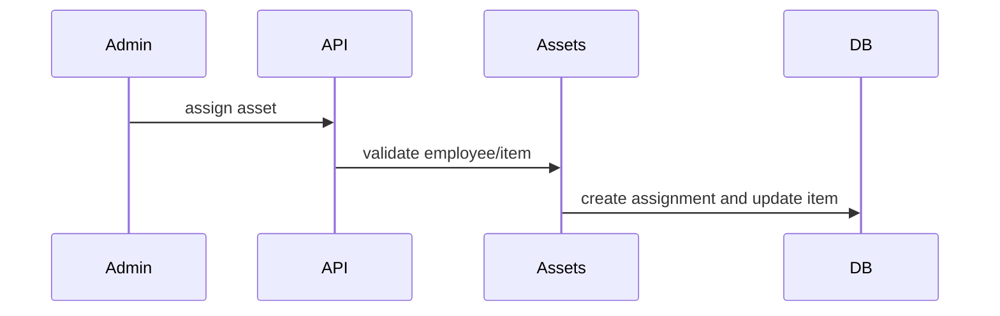

# Assets Workflow

## Purpose

Manage asset types, asset inventory, employee assignments, returns, and exit-linked asset clearance.

## Actors

Asset admins, HR/admins, employees, exit managers.

## Entry Points

- Backend: `/api/v1/assets/*`.
- Frontend: asset components where wired and exit asset views.

## Business Workflow

## Backend Flow

Asset services manage asset types, items, assignments, employee lookup, exit lookup, and return actions.

## Frontend Flow

Asset information appears in asset management and exit clearance flows.

## Database Interactions

Major tables include `asset_types`, `asset_items`, `asset_assignments`.

## Approval Workflow

Future Enhancement for asset issue/write-off approvals.

## Notification Workflow

Future Enhancement for assignment/return reminders. Exit workflows may emit related notifications.

## Audit Workflow

Assignments, returns, lost/damaged status, and exit clearance should be audited.

## Reports Impact

Asset inventory and exit clearance reports.

## Cross-Module Integration

Employees, branches, exit management, notifications, reports.

## Sequence Diagram

## API Endpoints

`/assets/types`, `/assets/items`, `/assets/assignments`, `/assets/assignments/employee/:employeeId`, `/assets/assignments/exit/:exitRequestId`, `/assets/assignments/:id/return`.

## Important Validations

Tenant, branch, asset availability, employee active status, duplicate active assignment, return condition.

## Failure Scenarios

Item already assigned, employee out of scope, return already completed, exit clearance blocked by missing return.

## Future Enhancements

Depreciation, maintenance, asset documents/photos, write-off approval, inventory audit.
