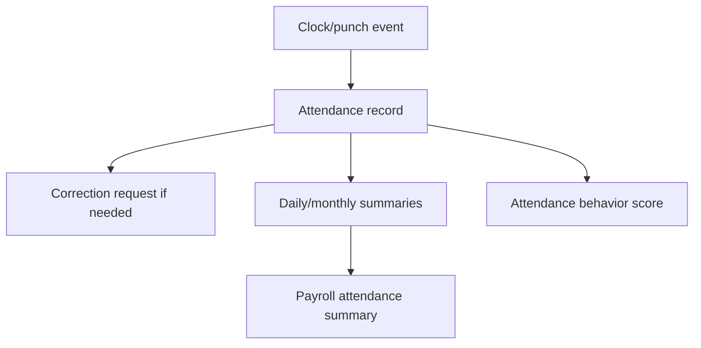

# Attendance Workflow

## Purpose

Track daily employee attendance from manual punches, self-service punches, biometric ingestion, corrections, breaks, and summaries.

## Actors

Employees, admins, branch admins, org admins, biometric terminals/providers, payroll users, report viewers.

## Entry Points

- Backend: `/api/v1/attendance/*`, `/api/v1/employees/me/attendance/*`, biometric punch APIs.
- Frontend: employee attendance pages, admin attendance views, biometric live attendance views.

## Business Workflow



## Backend Flow

Attendance services write/read `attendance_records`, `attendance_requests`, break sessions, and related audit/source fields. Biometric punches are processed through queues and attendance engine.

## Frontend Flow

Employees use self-service attendance views. Admin dashboards use attendance lists, status badges, timelines, summary cards, and live biometric feed components.

## Database Interactions

Major tables include `attendance_records`, `attendance_requests`, `break_sessions`, `attendance_audit`, `punch_fingerprints`, `payroll_attendance_summaries`.

## Approval Workflow

Attendance correction/manual attendance can flow through approval workflow types such as `attendance_correction` and `manual_attendance`.

## Notification Workflow

Attendance engine and payroll summary actions emit notifications for exceptions, corrections, summary approval/rejection, and biometric alerts.

## Audit Workflow

Attendance audit records and platform audit logs are used for punch/correction/security events where implemented.

## Reports Impact

Attendance feeds attendance reports, branch analytics, payroll summaries, performance attendance behavior, shift coverage, and saved reports.

## Cross-Module Integration

Integrates with employees, shifts, biometrics, payroll, performance, reports, approvals, notifications, and historical import.

## Sequence Diagram

```mermaid
sequenceDiagram
  participant Actor
  participant API
  participant Service
  participant DB
  Actor->>API: create/read attendance
  API->>Service: tenant + actor context
  Service->>DB: tenant/branch-scoped SQL
  DB-->>Service: records
  Service-->>API: result
```

## API Endpoints

Representative endpoints: `/attendance`, `/attendance/clock-in`, `/attendance/clock-out`, `/attendance/today`, `/attendance/summary`, `/attendance/requests`, `/attendance/requests/:id/approve`, `/attendance/requests/:id/reject`, `/employees/me/attendance`.

## Important Validations

Validate tenant, employee ownership, branch scope, duplicate daily records, punch order, active break state, and correction status.

## Failure Scenarios

Duplicate punches, out-of-order punches, device offline, Redis disabled, unknown employee mapping, branch-scope denial, payroll period locked.

## Future Enhancements

Unified attendance domain event stream, stronger idempotency across all punch sources, and automated anomaly detection.
