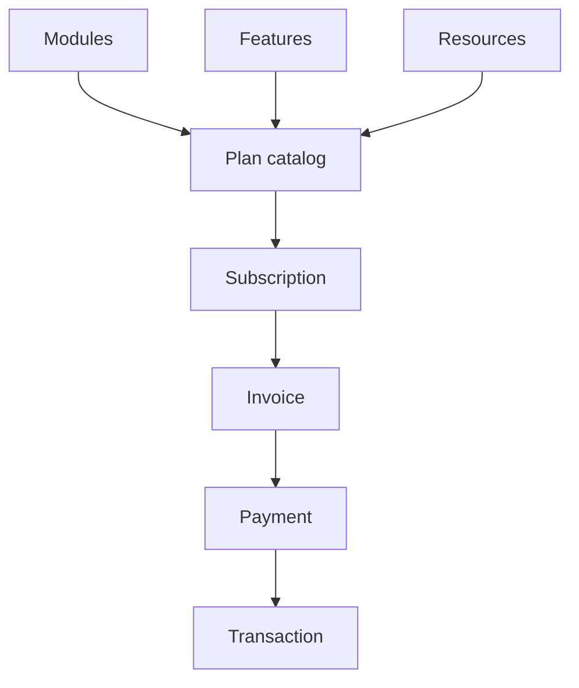
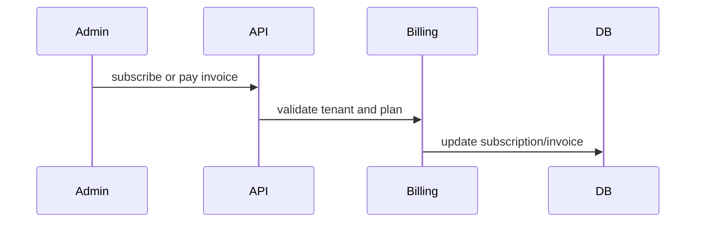

# Billing Workflow

## Purpose

Manage SaaS plan catalog, modules, features, resources, subscription state, invoices, transactions, and customer self-service billing actions.

## Actors

Platform finance/internal staff, customer admins, finance users.

## Entry Points

- Backend: `/api/v1/billing/*`.
- Frontend: customer system billing/settings and platform operations billing plan management where implemented.

## Business Workflow

## Backend Flow

Billing services expose plan/module/feature/resource catalog, price calculation, subscribe/cancel, invoices, payment, transactions, and summary.

## Frontend Flow

Customer admins view plans/subscription and pay invoices. Platform-owned plan mutation belongs in operations permissions.

## Database Interactions

Billing/subscription tables from billing and SaaS migrations.

## Approval Workflow

Future Enhancement for subscription change requests. Current customer self-service subscribe/cancel exists.

## Notification Workflow

Future Enhancement for invoice/payment reminders and subscription lifecycle notifications.

## Audit Workflow

Plan catalog mutation, subscription changes, invoice payment should be audited.

## Reports Impact

Billing summaries, platform finance reporting, customer subscription state.

## Cross-Module Integration

Platform operations, organization lifecycle, finance, notifications.

## Sequence Diagram

## API Endpoints

Representative endpoints: `/billing/plans`, `/billing/modules`, `/billing/features`, `/billing/resources`, `/billing/calculate-price`, `/billing/subscription`, `/billing/subscribe`, `/billing/cancel`, `/billing/invoices`, `/billing/transactions`, `/billing/summary`.

## Important Validations

Tenant, internal staff permission for platform plan mutations, plan active state, invoice ownership, payment idempotency.

## Failure Scenarios

Unauthorized plan mutation, inactive plan, duplicate payment, subscription cancellation conflict.

## Future Enhancements

Subscription operations portal, approval-based plan change requests, metered billing, and dunning workflows.
