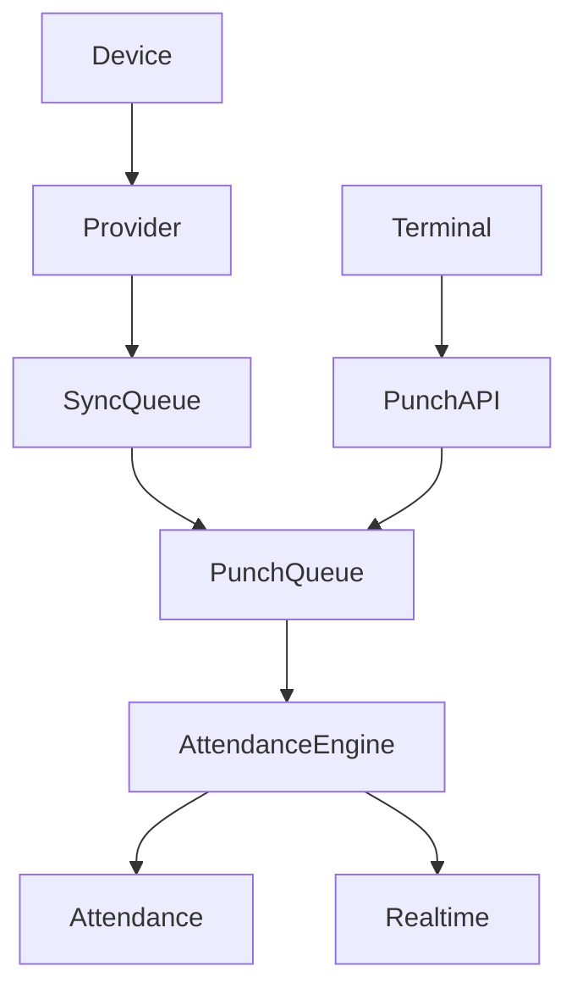
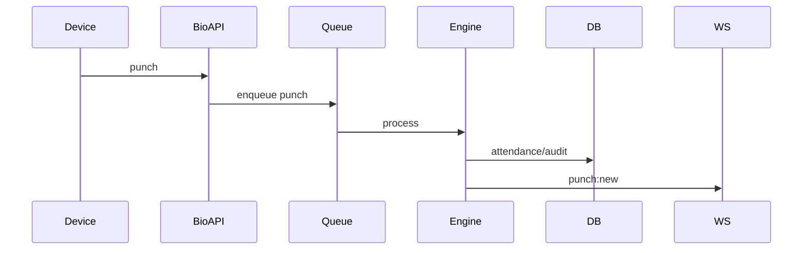

# Biometrics Workflow

## Purpose

Ingest and normalize biometric attendance events from devices, terminals, providers, and external biometric service, then update attendance and realtime dashboards.

## Actors

Biometric devices, terminals, admins, employees, provider schedulers, biometric service.

## Entry Points

- Backend: `/api/v1/biometrics/*`, terminal endpoints.
- Frontend: biometric devices, providers, queue health, DLQ, live attendance, terminals.
- Biometric service: FastAPI device/sync endpoints and callbacks.

## Business Workflow

## Backend Flow

Biometrics module manages provider registry, ZKTeco/EasyTimePro providers, sync cursors, device registry, terminals, API keys, offline buffer, fingerprinting, audit, normalization, queues, and gateway events.

## Frontend Flow

Admin biometric UI shows provider/device state, live punch feed, queue health, DLQ tools, corrections, and terminals.

## Database Interactions

Tables include `biometric_devices`, provider/sync tables, `service_api_keys`, `attendance_terminals`, `punch_fingerprints`, `attendance_audit`, `attendance_records`.

## Approval Workflow

Workflow type `biometric_device` exists for approval engine. Actual use depends on device management paths.

## Notification Workflow

Stale/offline device and attendance engine events emit notifications where implemented.

## Audit Workflow

Punch audit and fingerprint tables support traceability and idempotency.

## Reports Impact

Biometric reports, attendance reports, device health, branch analytics.

## Cross-Module Integration

Attendance, shifts, employees, branches, integrations, notifications, reports, historical import.

## Sequence Diagram

## API Endpoints

Representative endpoints: biometric punch ingestion, providers, devices, sync, queue health, DLQ retry/remove, terminal registration/punch APIs.

## Important Validations

Service API key, terminal auth, tenant, branch, employee mapping, duplicate punch fingerprint, provider cursor, queue health.

## Failure Scenarios

Device offline, provider API failure, Redis disabled, unknown employee, duplicate punch, DLQ backlog, stale terminal.

## Future Enhancements

More provider adapters, stronger device command queue, device certificate authentication, and unified biometric observability dashboard.
