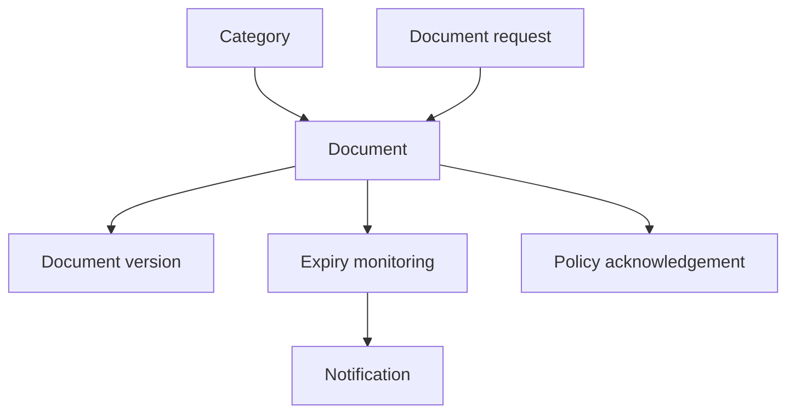
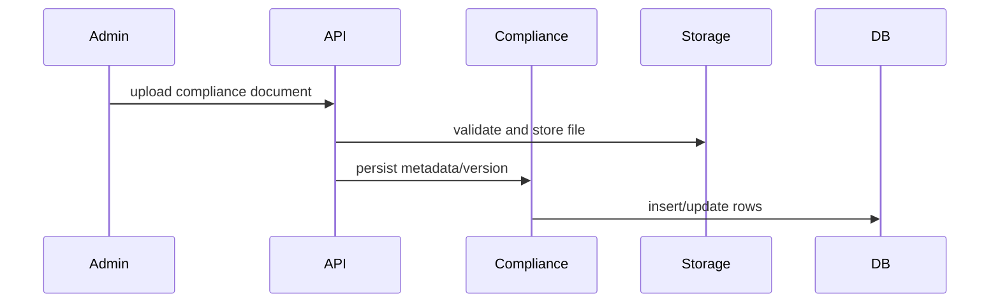

# Compliance Workflow

## Purpose

Manage compliance categories, documents, document requests, policy acknowledgements, tracker items, expiry reminders, and reports.

## Actors

Compliance admins, HR admins, employees, approvers, auditors.

## Entry Points

- Backend: `/api/v1/compliance/*`.
- Frontend: compliance document explorer, drawers, dashboard, tracker, reports.

## Business Workflow

## Backend Flow

Compliance services manage categories, documents, document versions, document requests, policies, tracker, dashboard, reports, and expiry scheduled checks.

## Frontend Flow

Compliance UI provides explorer/detail drawers, upload/edit flows, status badges, tracker, and dashboards.

## Database Interactions

Major tables include `compliance_categories`, `compliance_documents`, `compliance_document_versions`, `compliance_policy_acknowledgements`, `compliance_document_requests`, `compliance_tracker_items`.

## Approval Workflow

Compliance approval service exists. Policy/document approval should use approval engine where configured.

## Notification Workflow

Compliance services emit document request and expiry notifications.

## Audit Workflow

Document upload/version/status/acknowledgement and expiry-critical changes should be audited.

## Reports Impact

Compliance dashboard, compliance reports, expiry reports, policy acknowledgement status.

## Cross-Module Integration

Employees, branches, documents/storage, notifications, approvals, reports.

## Sequence Diagram

## API Endpoints

Representative endpoints: compliance category, document, document request, policy, tracker, dashboard, and report controllers.

## Important Validations

Tenant, branch scope, file type/size, category scope, expiry date, version ownership, employee ownership.

## Failure Scenarios

Invalid file, storage failure, expired document, duplicate category code, missing acknowledgement, unauthorized branch access.

## Future Enhancements

Central policy approval templates, legal hold, object-store retention, and AI-assisted classification through future AI gateway.
