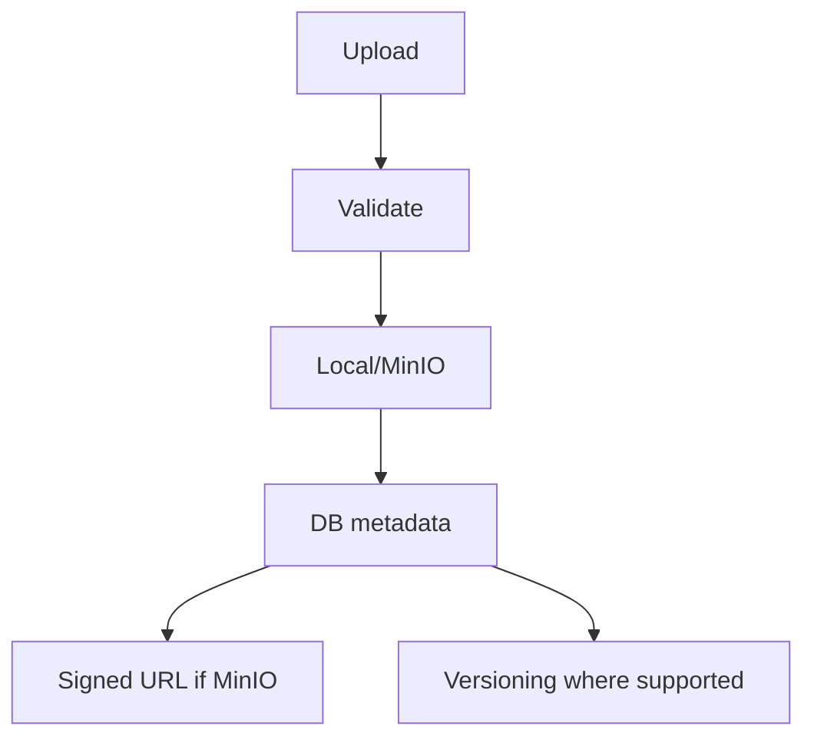
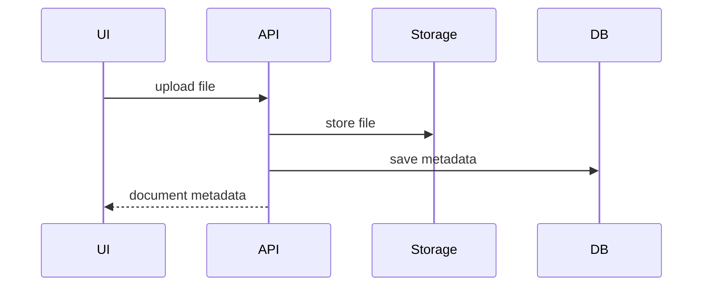

# Documents Workflow

## Purpose

Manage generic, employee, branding, and compliance document storage/metadata.

## Actors

Employees, HR/admins, compliance admins, org admins.

## Entry Points

- Backend: platform document controller, employee document endpoints, compliance document endpoints.
- Frontend: employee documents, compliance explorer, company profile branding uploader.

## Business Workflow

## Backend Flow

Controllers validate ownership and use `FileUploadService` for storage. Compliance has richer document/version/request/policy behavior.

## Frontend Flow

Module-specific uploaders and document views call module API clients.

## Database Interactions

Tables include `documents`, `employee_documents`, `compliance_documents`, `compliance_document_versions`, branding asset tables.

## Approval Workflow

Compliance policy/document approval can integrate with approvals where configured. Generic document approval is Future Enhancement.

## Notification Workflow

Compliance document request/expiry notifications exist. Generic document notifications are Future Enhancement.

## Audit Workflow

Upload, delete, version, and access events should be audited where sensitive.

## Reports Impact

Compliance reports, document expiry, employee document completeness.

## Cross-Module Integration

Storage, employees, compliance, platform branding, exit documents, recruitment attachments.

## Sequence Diagram

## API Endpoints

Representative endpoints: `/documents`, `/employees/:id/documents`, compliance document endpoints, branding upload endpoints.

## Important Validations

Tenant, branch/employee ownership, allowed MIME type, max size, document scope, expiry date.

## Failure Scenarios

Invalid file, storage write failure, metadata write failure after upload, unauthorized download, stale signed URL.

## Future Enhancements

Universal document versioning, virus scanning, encryption, retention, quotas, and access logs.
