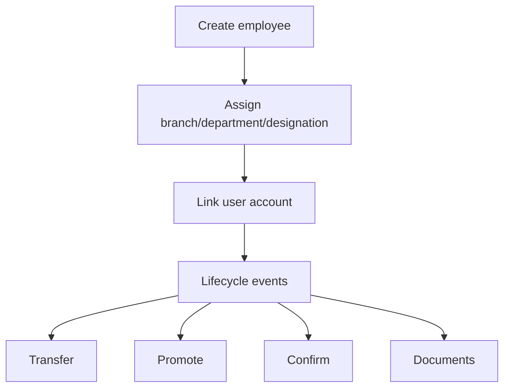
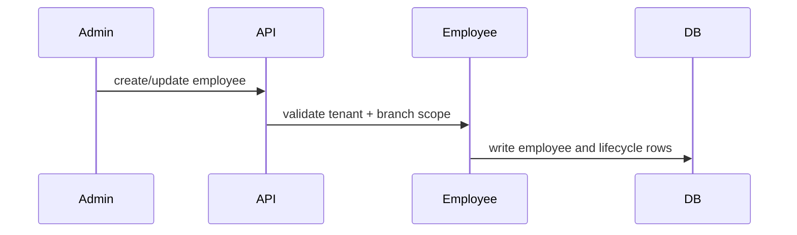

# Employee Workflow

## Purpose

Manage employee records, lifecycle events, transfers, promotions, confirmation, documents, status, and self-service profile data.

## Actors

HR/admins, branch admins, employees, managers, platform/customer admins.

## Entry Points

- Backend: `/api/v1/employees/*`, `/api/v1/employees/me/*`.
- Frontend: admin employee screens and employee profile/home screens.

## Business Workflow

## Backend Flow

Employee service owns employee CRUD, lifecycle, employee code history, status changes, transfer/promotion/confirmation, documents, and self-service endpoints.

## Frontend Flow

Admin UI manages employee records and documents. Employee portal displays profile, attendance, leave, shifts, payslips, requests, and documents.

## Database Interactions

Major tables include `employees`, `employee_lifecycle_events`, `employee_documents`, `employee_code_history`, `users`, `user_tenants`.

## Approval Workflow

Transfers and role/salary-like changes can integrate with approval workflow types where configured.

## Notification Workflow

Employee lifecycle events can emit notifications where services implement them. Future Enhancement for universal onboarding/lifecycle notification templates.

## Audit Workflow

Employee create/update/delete/status/access changes should be audit logged.

## Reports Impact

Headcount, attrition, lifecycle, branch/department reports, payroll/attendance context.

## Cross-Module Integration

Platform org setup, auth users, attendance, leave, payroll, performance, recruitment conversion, exit, assets, compliance, reports.

## Sequence Diagram

## API Endpoints

Representative endpoints: `/employees`, `/employees/count`, `/employees/me`, `/employees/:id`, `/employees/:id/status`, `/employees/:id/transfer`, `/employees/:id/promote`, `/employees/:id/confirm`, `/employees/:id/documents`.

## Important Validations

Tenant, branch scope, unique employee code/email, department/branch validity, status transitions, file validation.

## Failure Scenarios

Duplicate code, missing branch, unauthorized branch access, deleting employee with dependent records, invalid lifecycle transition.

## Future Enhancements

Unified onboarding workflow, employee master-data event stream, and stronger object authorization helper for every employee ID lookup.
