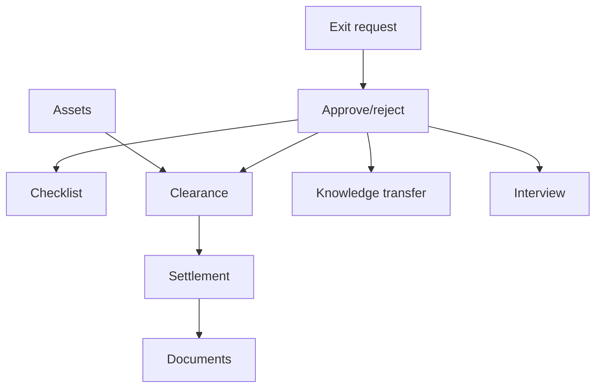
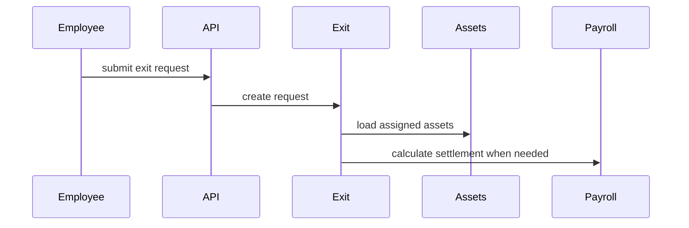

# Exit Management Workflow

## Purpose

Manage resignations/exits, approvals, clearance, checklists, knowledge transfer, interviews, final settlement, documents, and asset return.

## Actors

Employee, manager, HR/admin, finance/payroll, asset owner, approvers.

## Entry Points

- Backend: `/api/v1/exit-management/*`, `/api/v1/employees/me/exit/*`, `/api/v1/manager/exit-requests/*`.
- Frontend: employee exit pages and admin exit management components.

## Business Workflow

## Backend Flow

Exit services manage request lifecycle, offboarding orchestration, checklist, clearance, knowledge transfer, interview, settlements, documents, templates, and analytics.

## Frontend Flow

Employee self-service creates/withdraws requests and completes KT/interview flows. Admin UI manages requests, status, checklists, clearances, settlement, and documents.

## Database Interactions

Exit tables are defined in exit management migrations and extensions. Assets and payroll data are linked for clearance and settlement.

## Approval Workflow

Exit workflow types include `exit_clearance` and `ff_settlement`. Request approve/reject endpoints exist.

## Notification Workflow

Exit services emit notifications for request, approval, checklist, clearance, and offboarding milestones.

## Audit Workflow

Request decisions, settlement adjustments, payment status, clearance completion, and document generation should be audited.

## Reports Impact

Exit analytics, attrition reports, monthly/department/branch trends, settlement reports.

## Cross-Module Integration

Employees, approvals, notifications, assets, payroll, documents, reports.

## Sequence Diagram

## API Endpoints

Representative endpoints: `/exit-management/requests`, `/requests/:id/approve`, `/requests/:id/checklist`, `/clearances/:id`, `/requests/:id/interview`, `/requests/:id/settlement`, `/templates`, `/employees/me/exit`.

## Important Validations

Tenant, employee identity, notice date, existing active exit request, settlement status, asset return status, approval state.

## Failure Scenarios

Duplicate exit request, withdrawal after approval, settlement calculation error, missing clearance, unreturned assets.

## Future Enhancements

Deeper payroll ledger integration, automated document generation workflow, and predictive attrition analytics through future AI architecture.
