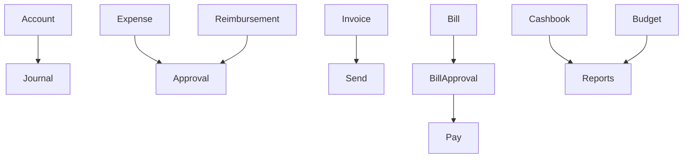
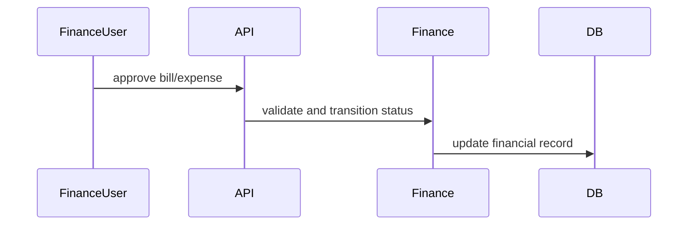

# Finance Workflow

## Purpose

Manage accounts, journal entries, expenses, invoices, bills, payments, cashbook, budgets, reimbursements, vendors, and finance reports.

## Actors

Finance admins, approvers, org admins, vendors, payroll users.

## Entry Points

- Backend: `/api/v1/finance/*`, `/api/v1/vendors/*`.
- Frontend: finance views where wired in dashboard.

## Business Workflow

## Backend Flow

Finance services expose summaries, P&L, aging, accounts, journals, expenses, invoices, bills, payments, cashbook, budgets, reimbursements, and vendors.

## Frontend Flow

Finance UI consumes finance API clients/components where implemented.

## Database Interactions

Finance migrations define accounts, journals, expenses, invoices, bills, payments, cashbook, budgets, reimbursements, vendors, and branch extensions.

## Approval Workflow

Expense, reimbursement, vendor approval, and bill approval can integrate with approval workflow types. Some finance endpoints currently have direct approve/reject actions.

## Notification Workflow

Future Enhancement for finance notification templates and payment reminders.

## Audit Workflow

Approvals, payments, invoice edits, bill payments, budget changes, and vendor changes should be audited.

## Reports Impact

Finance reports, P&L, aging, cashbook, budget reports, payroll/settlement financial impact.

## Cross-Module Integration

GST, billing, payroll, exit settlements, reports, approvals.

## Sequence Diagram

## API Endpoints

Representative endpoints: `/finance/summary`, `/finance/reports/pl`, `/finance/accounts`, `/finance/journal-entries`, `/finance/expenses`, `/finance/invoices`, `/finance/bills`, `/finance/payments`, `/finance/cashbook`, `/finance/budgets`, `/finance/reimbursements`, `/vendors`.

## Important Validations

Tenant, branch, financial period, amount precision, approval status, duplicate invoice/bill numbers, payment state.

## Failure Scenarios

Unauthorized approval, double payment, invalid accounting period, missing vendor, report timeout.

## Future Enhancements

Ledger-grade accounting controls, reconciliation, GST workflows, and stronger finance permission guard coverage.
