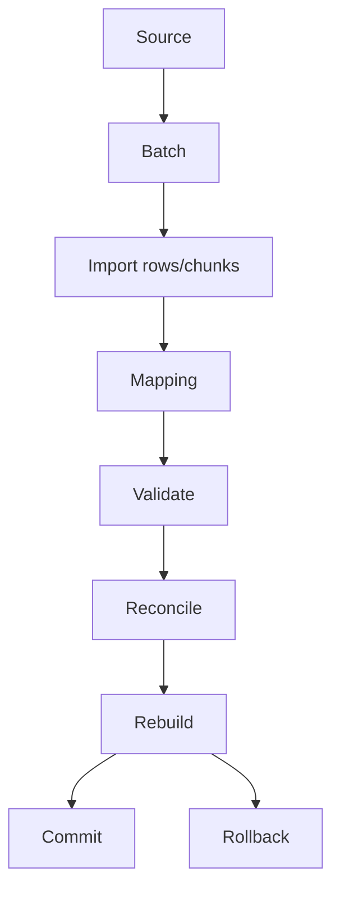
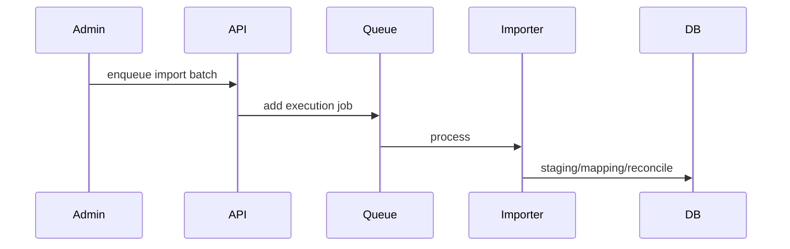

# Historical Attendance Import Workflow

## Purpose

Import historical attendance from files/connectors, map employees, validate and reconcile staging rows, rebuild attendance summaries, and commit or rollback safely.

## Actors

Admins, operations staff, HR users, background workers.

## Entry Points

- Backend: `/api/v1/historical-attendance-import/*`, `/api/v1/operations/historical-attendance-import/*`.
- Frontend: historical import admin UI where implemented.

## Business Workflow

## Backend Flow

Services handle sources, connectors, batches, execution queue, staging rows, mapping, validation, reconciliation, rebuild, dependency progress, logs, monitoring, and notifications.

## Frontend Flow

The UI can create sources/batches, upload rows, validate mappings, monitor progress, pause/resume/cancel/retry/rollback, preview, and view logs.

## Database Interactions

Major tables include `historical_attendance_import_sources`, `batches`, `staging_rows`, `mapping`, `progress`, `logs`, `audit`, connector tables.

## Approval Workflow

Future Enhancement for formal approval before commit/rollback if required by policy.

## Notification Workflow

Import execution emits notifications for completion/failure and operational milestones.

## Audit Workflow

Import audit tables capture batch actions and results.

## Reports Impact

Updates attendance history, payroll summaries, attendance reports, and dependent analytics after commit/rebuild.

## Cross-Module Integration

Attendance, employees, payroll summary, reports, notifications, operations.

## Sequence Diagram

## API Endpoints

Representative endpoints include sources, connectors, batches, execution, status, pause/resume/cancel/retry/rollback, staging rows, auto-match, manual mapping, validate, reconcile, rebuild, preview, logs, mappings.

## Important Validations

Tenant capability, source ownership, file/connector schema, employee mapping confidence, date range, duplicate rows, payroll dependencies.

## Failure Scenarios

Connector failure, invalid rows, unknown employees, queue failure, partial import, rollback dependency conflict.

## Future Enhancements

Formal approval gate before commit, connector marketplace, import dry-run reports, and automated rollback verification.
