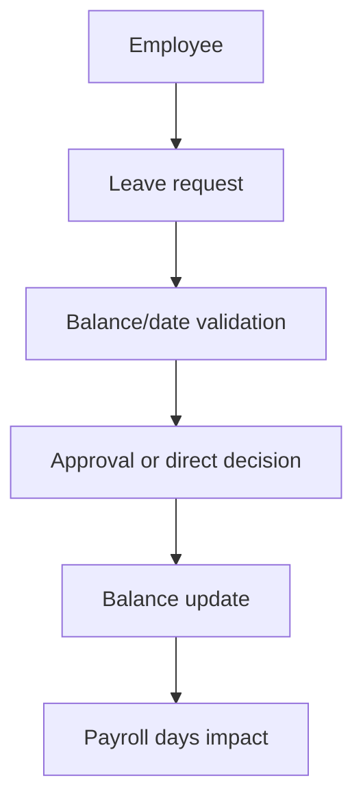
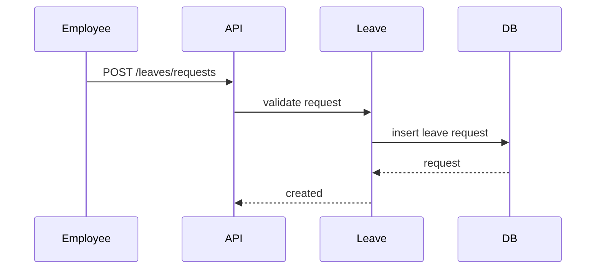

# Leave Workflow

## Purpose

Manage leave types, balances, requests, approvals/rejections, and encashment.

## Actors

Employees, managers, HR/admins, approvers, payroll users.

## Entry Points

- Backend: `/api/v1/leaves/*`, `/api/v1/employees/me/leaves/*`.
- Frontend: employee leave pages and admin leave views.

## Business Workflow

## Backend Flow

`LeaveService` reads leave types/balances and writes leave requests/encashment requests. Approval endpoints update status and should preserve tenant scope.

## Frontend Flow

Employee portal shows balances and requests. Admin/manager surfaces review and decide requests.

## Database Interactions

Major tables include `leave_types`, `leave_balances`, `leave_requests`, and `leave_encashment_requests`.

## Approval Workflow

Leave requests can integrate with approval workflow type `leave`. Encashment has approve/reject endpoints.

## Notification Workflow

Future Enhancement for centralized leave notification templates. Current notification behavior is module-specific where implemented.

## Audit Workflow

Approval/rejection and balance-impacting changes should be audit logged where sensitive.

## Reports Impact

Leave reports, payroll leave days, attendance/payroll summaries, and employee history.

## Cross-Module Integration

Employees, payroll, approvals, notifications, reports.

## Sequence Diagram

## API Endpoints

Representative endpoints: `/leaves/types`, `/leaves/balances`, `/leaves/requests`, `/leaves/requests/:id/approve`, `/leaves/requests/:id/reject`, `/leaves/encashment`.

## Important Validations

Tenant ownership, employee ownership, overlapping dates, leave balance, status transition, branch scope for approvers.

## Failure Scenarios

Insufficient balance, overlapping requests, unauthorized approval, stale balance, payroll period already processed.

## Future Enhancements

Centralized leave policy engine, accrual scheduler, holiday/weekend policy configuration, and notification templates.
