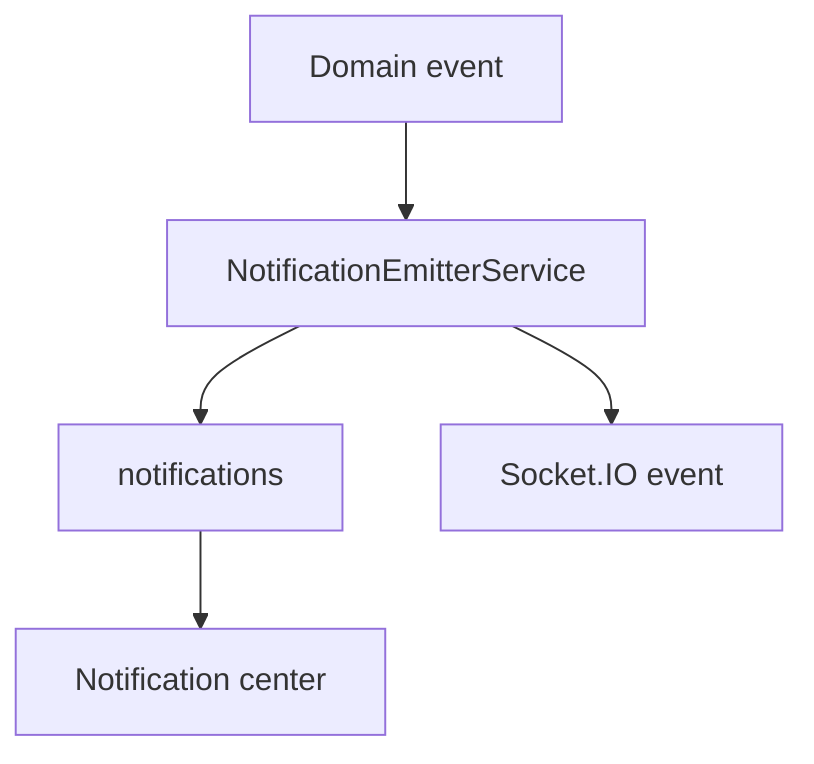
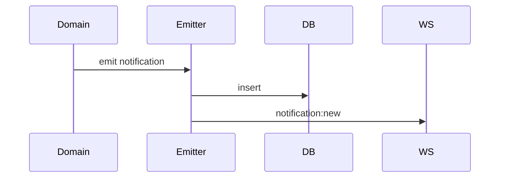

# Notifications Workflow

## Purpose

Persist and deliver in-app/realtime notifications across modules.

## Actors

Employees, admins, approvers, system schedulers, domain services.

## Entry Points

- Backend: `/api/v1/notifications/*`.
- Frontend: notification center, dropdown, module tabs, realtime event listeners.

## Business Workflow

## Backend Flow

Domain modules call notification emitter. Notifications service manages center data, preferences, and scheduled reminders.

## Frontend Flow

Notification components show overview, filters, action-required, system, attendance, payroll, document/compliance, and employee-event tabs.

## Database Interactions

Major tables include `notifications` and `notification_preferences`.

## Approval Workflow

Approval notifications are produced by approval services.

## Notification Workflow

This is the workflow owner.

## Audit Workflow

Security notifications usually pair with `audit_logs`; generic notifications are not themselves audit logs.

## Reports Impact

Future Enhancement for delivery metrics and notification analytics.

## Cross-Module Integration

Auth, approvals, recruitment, compliance, exit, payroll, biometrics, historical import, organization registration.

## Sequence Diagram

## API Endpoints

Representative endpoint root: `/notifications`.

## Important Validations

Tenant, recipient user IDs, preferences, source module, read/status transitions.

## Failure Scenarios

Recipient not found, realtime disconnected, preference suppression, duplicate notifications.

## Future Enhancements

Email/SMS/WhatsApp/push delivery router, templates, delivery logs, retries, and digests.
