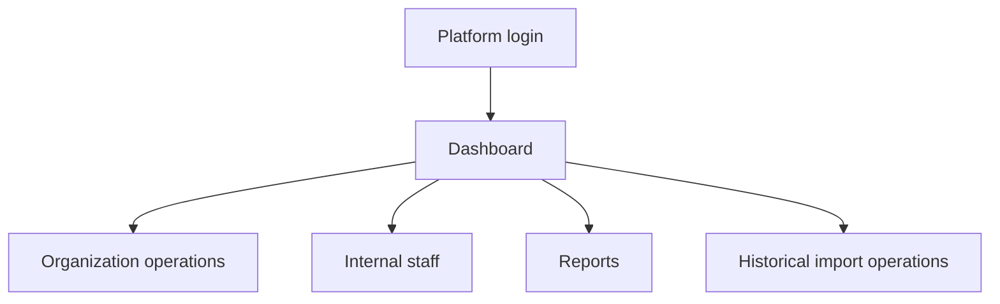
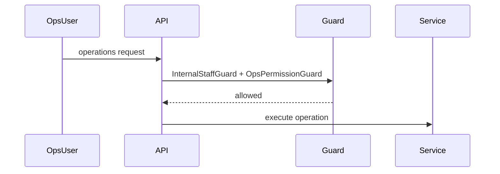

# Operations Workflow

## Purpose

Provide internal operations workflows for organization lifecycle, internal staff, reports, historical import operations, and support-like platform tasks.

## Actors

Internal platform staff with appropriate `internal_role` and ops permissions.

## Entry Points

- Frontend: `/operations/*`.
- Backend: `/api/v1/operations/*`, `/api/v1/operations/historical-attendance-import/*`.

## Business Workflow

## Backend Flow

Operations controllers use internal staff and ops permission guards. Services handle organization lifecycle and internal staff management.

## Frontend Flow

Operations shell presents sidebar items based on ops permissions.

## Database Interactions

Uses `users`, `tenants`, internal role fields, organization lifecycle fields, historical import capability fields, audit logs.

## Approval Workflow

Organization registration approval is adjacent to operations. Generic operations approval is Future Enhancement.

## Notification Workflow

Organization lifecycle and registration workflows emit notifications where implemented.

## Audit Workflow

Internal staff and organization lifecycle actions should be audited.

## Reports Impact

Operations dashboard and organization reports.

## Cross-Module Integration

Auth, platform, organization registration, historical attendance import, billing.

## Sequence Diagram

## API Endpoints

Representative endpoints: `/operations/dashboard`, `/operations/organizations`, `/operations/staff`, `/operations/reports`, `/operations/historical-attendance-import/jobs`.

## Important Validations

Internal staff only, required ops permission, lifecycle status, tenant existence.

## Failure Scenarios

Insufficient role, customer/platform identity confusion, organization in invalid lifecycle state.

## Future Enhancements

Operational runbooks, incident workflow, support ticket module, subscription operations module.
