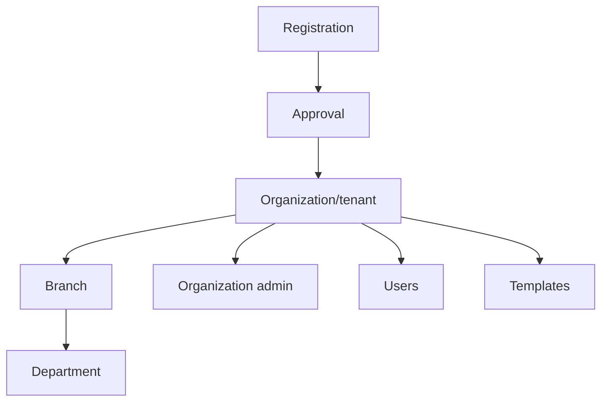
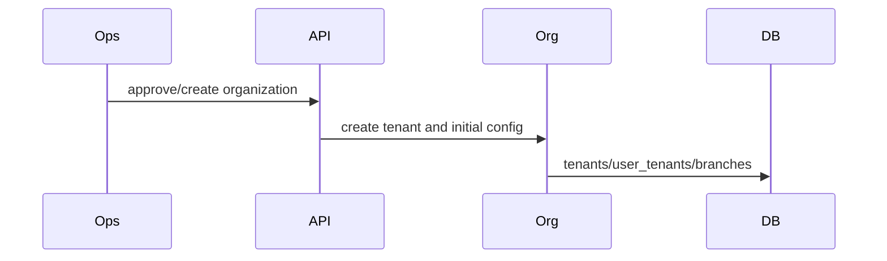

# Organization Workflow

## Purpose

Manage customer organizations, profiles, lifecycle, branches, departments, designations, roles/users, templates, and registration approvals.

## Actors

Platform operations staff, platform super admin, customer super/org admins, branch admins.

## Entry Points

- Backend: platform controllers, organization registration controllers, operations organization controllers.
- Frontend: `/operations/*`, `/dashboard/platform/*`, organization/profile settings.

## Business Workflow

## Backend Flow

Platform and operations services manage tenants, lifecycle, members, org admin assignment, profile, branches, departments, roles, users, templates, and audit logs.

## Frontend Flow

Operations portal manages platform-owned organization lifecycle. Customer admin dashboard manages tenant-local configuration.

## Database Interactions

Major tables include `tenants`, `user_tenants`, `branches`, `departments`, `designations`, `roles`, `users`, `templates`, `audit_logs`, organization registration/change request tables.

## Approval Workflow

Organization registration approval and change request approval exist through organization registration services.

## Notification Workflow

Registration and change request services emit notifications.

## Audit Workflow

Organization lifecycle, admin assignment, user access, and profile changes should be audited.

## Reports Impact

Organization lifecycle reports, operations reports, branch analytics, customer status dashboards.

## Cross-Module Integration

Auth, platform, operations, billing, HR modules, reports, notifications.

## Sequence Diagram

## API Endpoints

Representative endpoints include `/organizations`, `/organizations/:id`, `/organizations/:id/members`, `/operations/organizations/*`, `/organization-registration/*`, `/branches`, `/departments`, `/designations`, `/users`.

## Important Validations

Portal identity, internal staff permissions, tenant membership, org admin rank checks, unique codes, branch plan limits.

## Failure Scenarios

Duplicate organization, missing org admin, unauthorized lifecycle action, inactive organization, branch limit exceeded.

## Future Enhancements

Dedicated legal company entity, subdomain separation, and full organization provisioning checklist.
