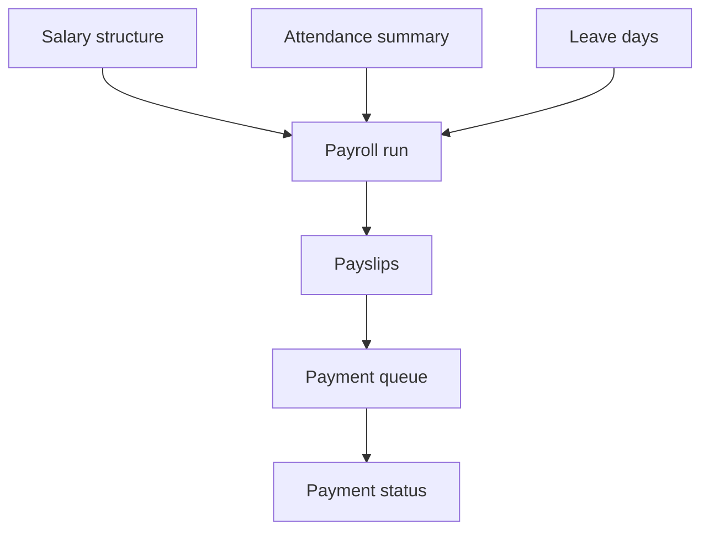
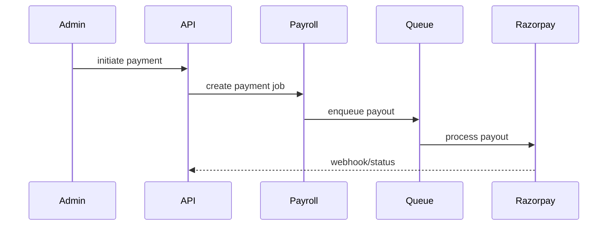

# Payroll Workflow

## Purpose

Manage salary structures, payroll runs, payslips, attendance summaries, locks, and payouts.

## Actors

HR/payroll admins, finance users, employees, approvers, Razorpay webhook sender.

## Entry Points

- Backend: `/api/v1/payroll/*`, `/api/v1/payslips/*`, `/api/v1/payroll/webhooks/razorpay`.
- Frontend: payroll dashboards, payslip views, employee payslips.

## Business Workflow

## Backend Flow

Payroll services compute structures/runs/payslips, attendance summaries, payment records, and enqueue payout jobs when Redis is enabled.

## Frontend Flow

Admins compute/review payroll, attendance summaries, locks, and payments. Employees view payslips.

## Database Interactions

Major tables include `salary_structures`, `payroll_runs`, `payslips`, `payroll_attendance_summaries`, `payroll_payments`, `employee_bank_accounts`.

## Approval Workflow

Payroll and payroll payment workflow types are supported by approval engine. Attendance summary has approve/reject/correction/lock/unlock flows.

## Notification Workflow

Payroll attendance summary state transitions emit notifications.

## Audit Workflow

Payment initiation/retry/reversal, bank verification, payroll locks, approvals, and webhook results should be audited.

## Reports Impact

Payroll reports, payslip reports, finance summaries, attendance summary KPIs.

## Cross-Module Integration

Employees, attendance, leave, finance, approvals, notifications, reports, Razorpay.

## Sequence Diagram

## API Endpoints

Representative endpoints: `/payroll/structure/:employee_id`, `/payroll/runs`, `/payroll/runs/generate`, `/payroll/runs/:id/process`, `/payroll/payslips/:id/pay`, `/payroll/attendance-summary`, `/payroll/attendance-summary/compute`, `/payroll/payslips/:id/initiate-payment`.

## Important Validations

Tenant, branch scope, employee active status, bank details, payroll period uniqueness, locked period, duplicate payouts, webhook signature.

## Failure Scenarios

Redis disabled, Razorpay failure, invalid bank details, attendance summary rejected, duplicate payroll run, webhook replay.

## Future Enhancements

Dedicated payroll ledger, stronger payout reconciliation, statutory compliance workflows, and queue worker scaling runbooks.
