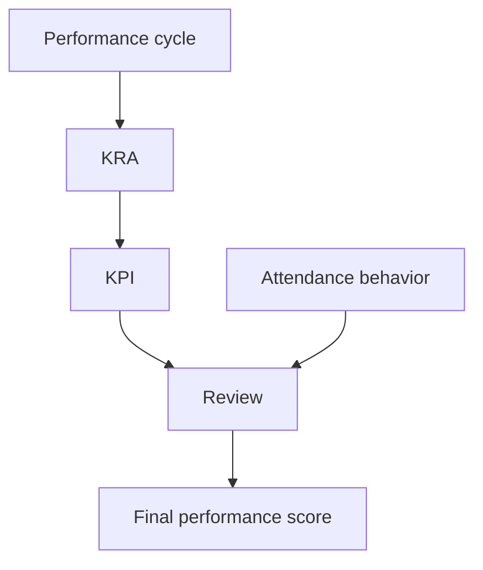
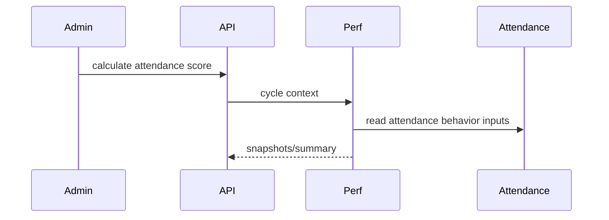

# Performance Workflow

## Purpose

Manage performance cycles, KRAs, KPIs, reviews, and attendance behavior score integration.

## Actors

Employees, managers, HR/admins, reviewers.

## Entry Points

- Backend: `/api/v1/performance/*`.
- Frontend: employee performance pages and admin performance components.

## Business Workflow

## Backend Flow

Performance services manage cycles/KRAs/KPIs/reviews. Attendance performance controller calculates/recalculates attendance behavior and allows overrides.

## Frontend Flow

Employees and managers view performance records; admins manage cycles and metrics.

## Database Interactions

Performance tables are introduced by compliance/performance migrations and attendance performance migrations. Attendance snapshots support attendance behavior scoring.

## Approval Workflow

Formal performance approval workflow was not confirmed as a central approval integration. Mark as Future Enhancement unless implemented in a specific service path.

## Notification Workflow

Future Enhancement for review reminders, cycle launch, and approval notifications through notification engine.

## Audit Workflow

Overrides to attendance score and final review edits should be audited.

## Reports Impact

Performance reports, attendance behavior summaries, employee review history.

## Cross-Module Integration

Employees, attendance, reports, notifications.

## Sequence Diagram

## API Endpoints

Representative endpoints: `/performance/cycles`, `/performance/kras`, `/performance/kpis`, `/performance/reviews`, `/performance/attendance-behaviour/config`, `/performance/cycles/:id/calculate-attendance`.

## Important Validations

Tenant, branch scope, cycle dates, KPI ownership, review status, override reason.

## Failure Scenarios

Missing attendance data, duplicate KPI, closed cycle edits, unauthorized override.

## Future Enhancements

Approval workflow for review finalization, calibrated review cycles, and AI-assisted review summaries through future AI architecture.
