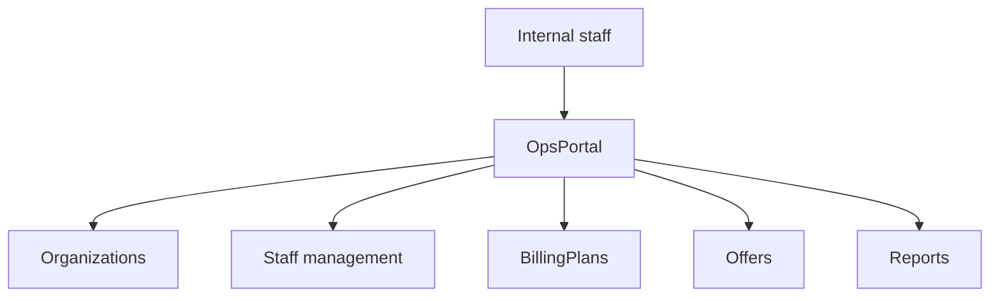
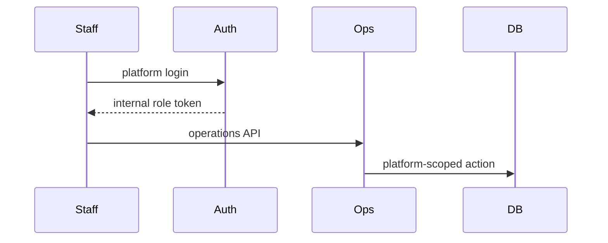

# Platform Workflow

## Purpose

Operate the AI-HRMS platform itself: internal staff, organization lifecycle, platform billing plan definitions, signup offers, and platform reports.

## Actors

Platform super admin, marketing, sales, finance, customer success, customer support, technical staff.

## Entry Points

- Frontend: `/operations/*`, `/platform-login`.
- Backend: operations controllers, internal staff controllers, signup offer controllers, guarded billing plan mutations.

## Business Workflow

## Backend Flow

Internal staff guards and ops permissions protect platform operations. Internal roles are independent of customer user types.

## Frontend Flow

Platform login authenticates internal staff. Operations layout and sidebar gate features by `internalRole`.

## Database Interactions

Uses `users.is_internal_staff`, `users.internal_role`, `tenants`, organization lifecycle data, audit logs, signup offers, billing plan tables.

## Approval Workflow

Organization registration approval exists. Other platform approvals are Future Enhancement unless implemented in specific operations services.

## Notification Workflow

Organization registration and change request notifications exist.

## Audit Workflow

Staff provisioning, organization lifecycle, billing plan mutation, and offer changes should be audited.

## Reports Impact

Operations reports and platform organization activity analytics.

## Cross-Module Integration

Operations, auth, platform, billing, organization registration, reports.

## Sequence Diagram

## API Endpoints

Representative endpoints: `/auth/login` with `portal=platform`, `/operations/staff`, `/operations/organizations`, `/operations/reports`, `/signup-offers`, guarded billing plan mutation endpoints.

## Important Validations

Internal staff identity, ops permission, platform super admin for staff management, portal mismatch rejection.

## Failure Scenarios

Customer account attempts platform login, insufficient internal role, stale portal cookie, missing bootstrap platform super admin.

## Future Enhancements

Dedicated platform subdomain, platform subscription operations module, ticketing/integration operations modules if needed.
