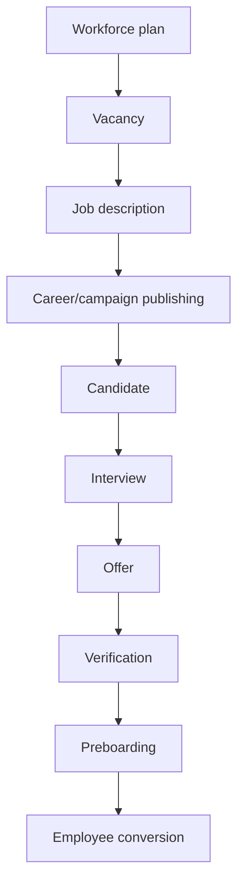
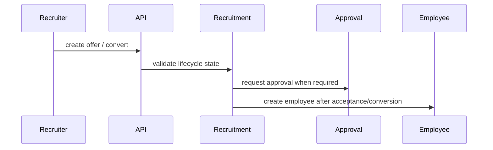

# Recruitment Workflow

## Purpose

Manage workforce plans, vacancies, job descriptions, campaigns, candidates, interviews, offers, verification, preboarding, probation, and employee conversion.

## Actors

Recruiters, hiring managers, approvers, candidates, HR admins.

## Entry Points

- Backend: `/api/v1/recruitment/*` and subcontrollers for vacancies, candidates, applications, interviews, offers, campaigns, career portal.
- Frontend: recruitment dashboard/components and public career portal.

## Business Workflow

## Backend Flow

Recruitment services own each lifecycle stage and use notifications plus approval-specific services for vacancy/JD/offer/probation/workforce plan workflows.

## Frontend Flow

Admin recruitment components use drawers, status badges, pipeline management, resumes, interviews, offers, and preboarding checklist UI.

## Database Interactions

Major tables include `job_postings`, `candidates`, `interviews`, and later vacancy, JD, pipeline, offer, verification, preboarding, campaign, and workforce planning tables.

## Approval Workflow

Implemented approval services exist for vacancies, job descriptions, offers, probation, and workforce plans.

## Notification Workflow

Recruitment services emit notifications for candidate/application/interview/offer/preboarding events.

## Audit Workflow

Approvals and candidate-to-employee conversion should be auditable.

## Reports Impact

Recruitment reports, open jobs, candidate pipeline, interview schedule, offer pending, joining schedule, recruiter workload.

## Cross-Module Integration

Platform org data, employees, approvals, notifications, reports, documents.

## Sequence Diagram

## API Endpoints

Representative endpoints: recruitment dashboard, vacancies, job descriptions, applications, candidates, interviews, offers, pipeline stages, campaigns, workforce plans, career portal.

## Important Validations

Tenant, branch/department, vacancy status, duplicate candidate, offer approval state, required preboarding items, employee conversion idempotency.

## Failure Scenarios

Candidate duplicate, approval rejected, missing documents, conversion collision with employee code/email, notification failure.

## Future Enhancements

AI-assisted drafting/summarization through a future AI gateway, external job board integrations, and structured candidate consent tracking.
