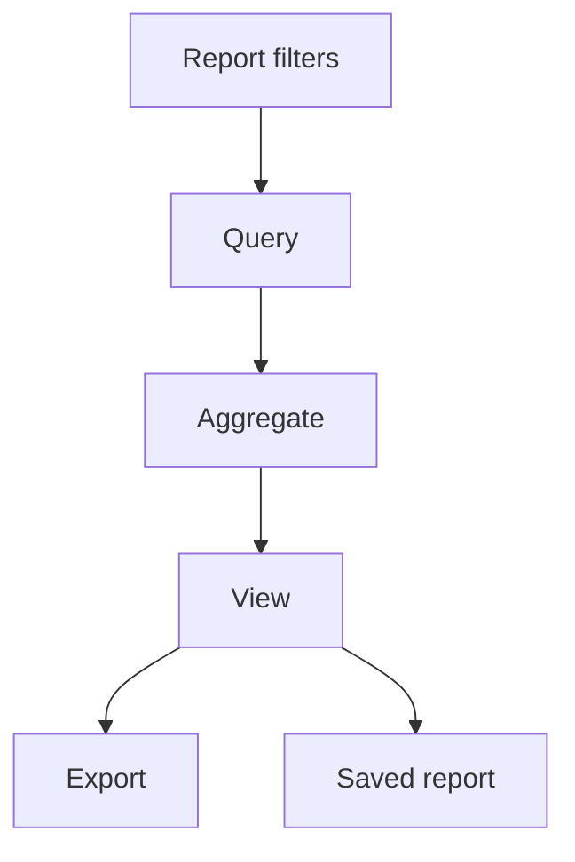
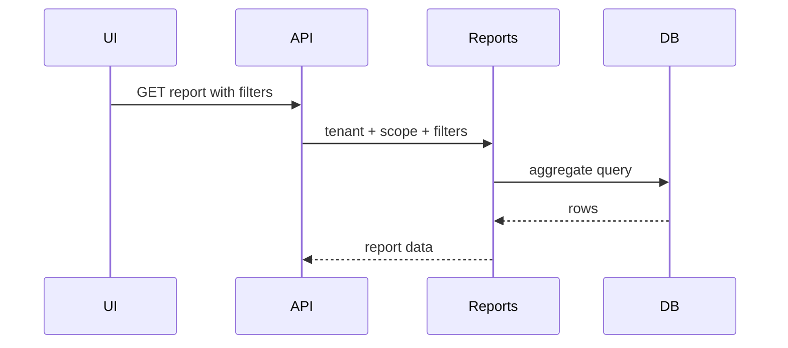

# Reports Workflow

## Purpose

Provide cross-module reports for attendance, payroll, HR, leave, performance, recruitment, finance, branches, biometrics, shifts, saved reports, and operational analytics.

## Actors

Admins, org admins, branch admins, finance users, HR users, operations users.

## Entry Points

- Backend: `/api/v1/reports/*`.
- Frontend: reports pages/components, export tools.

## Business Workflow

## Backend Flow

Reports controller delegates to specialized report services. Services query module tables with tenant/branch/date filters.

## Frontend Flow

Report shell, filters, tables, charts, KPI cards, export bars, and mobile filter sheet present data.

## Database Interactions

Reads from HR, attendance, leave, payroll, performance, recruitment, finance, biometric, branch, shift, and saved report tables.

## Approval Workflow

Reports are read-only. Approval impact is visible through source module status fields.

## Notification Workflow

Future Enhancement for scheduled report delivery.

## Audit Workflow

Report export/access audit exists where implemented for specific report endpoints. Future Enhancement for universal report audit.

## Reports Impact

This is the reporting owner.

## Cross-Module Integration

All major domain modules.

## Sequence Diagram

## API Endpoints

Representative root: `/reports` with attendance, leave, payroll, performance, recruitment, finance, branch, biometric, shift, operational, and saved report endpoints.

## Important Validations

Tenant, branch scope, date range, export permission, report ownership for saved reports.

## Failure Scenarios

Slow query, missing indexes, invalid filters, branch leakage, export timeout.

## Future Enhancements

Read replicas, materialized views, scheduled delivery, report builder, semantic analytics through future AI gateway.
