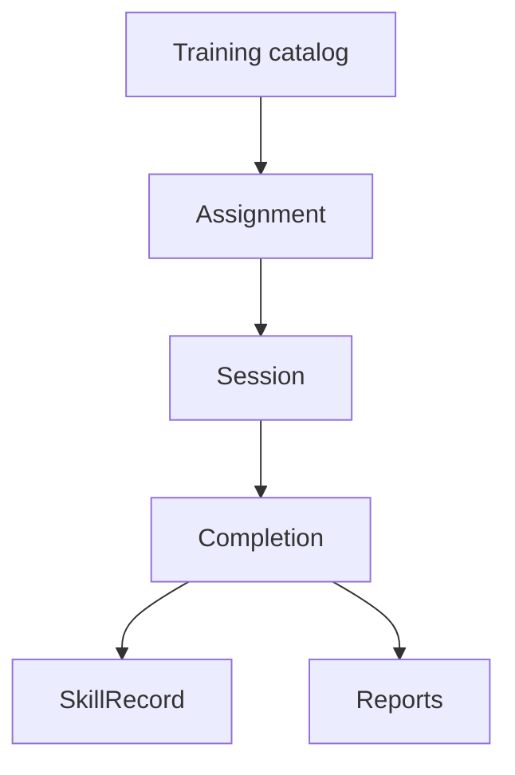
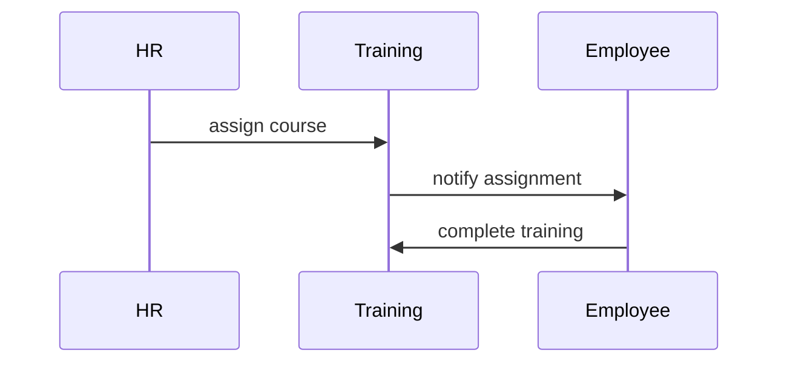

# Training Workflow

## Purpose

Document the target workflow for employee training and learning management.

## Current Implementation

No dedicated training module, backend controller, migration, or frontend route was identified in the inspected implementation.

Status: Future Enhancement.

## Actors

Future Enhancement: HR admins, trainers, managers, employees.

## Entry Points

Future Enhancement: training catalog, assignments, sessions, completion records, assessments.

## Business Workflow

## Backend Flow

Future Enhancement: create a `TrainingModule` with catalog, course/session, assignment, completion, assessment, and notification services.

## Frontend Flow

Future Enhancement: admin training management and employee learning portal.

## Database Interactions

Future Enhancement: training courses, sessions, assignments, completions, assessments, certificates.

## Approval Workflow

Future Enhancement: training approval for paid/external training requests.

## Notification Workflow

Future Enhancement: assignment, reminder, overdue, completion notifications.

## Audit Workflow

Future Enhancement: audit assignment and certification changes.

## Reports Impact

Future Enhancement: training completion, compliance training, skill gap reports.

## Cross-Module Integration

Future Enhancement: employees, performance, compliance, notifications, reports, AI-ready training recommendations.

## Sequence Diagram

## API Endpoints

Future Enhancement.

## Important Validations

Future Enhancement: tenant, employee eligibility, due dates, completion evidence.

## Failure Scenarios

Future Enhancement: missed training, duplicate assignment, invalid completion proof.

## Future Enhancements

Build training module only after data model, compliance requirements, and reporting needs are confirmed.
